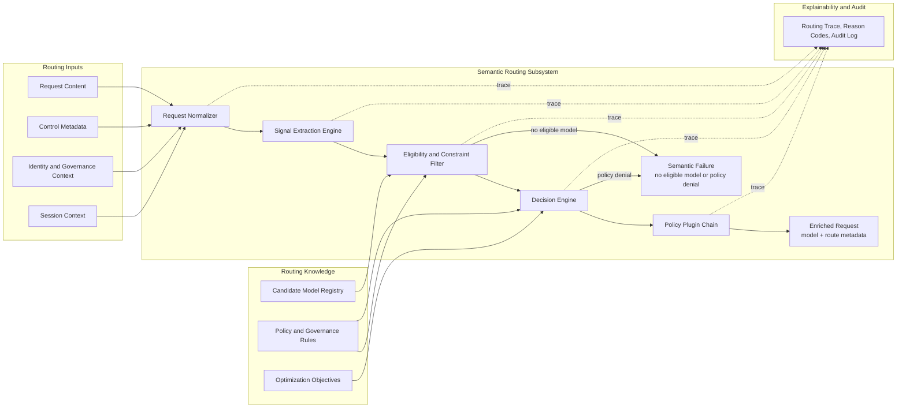

# ASE Semantic Routing Design

## Introduction

This document defines the design of the Semantic Routing subsystem in the ASE LLM gateway. Semantic Routing is the first decision layer in the request path and is responsible for deciding which model should serve a request before any backend instance is selected.

Its output is an enriched request that contains an authoritative `model` field plus optional routing metadata such as route reason, policy tags, or debug information. That output is the contract consumed by the downstream Load Balancing subsystem.

This document is intentionally focused on request-level model selection. It does not redefine gateway-wide architecture or instance-level traffic scheduling, which are described in `overview.md` and `load_balancer.md`.

## Background

### Problem Definition

Semantic Routing solves the following problem:

> Given an incoming LLM request, a heterogeneous set of candidate models, and a set of policy, deployment, and business constraints, determine the most appropriate target model for the request.

This is not the same as simple prompt classification. In production, the router must reason about multiple dimensions at once:

- task type and domain
- reasoning complexity
- context-window requirements
- modality support
- cost and latency preference
- privacy, safety, and compliance constraints
- tenant or deployment restrictions
- session continuity across multi-turn interactions

### Why Semantic Routing Is a Separate Layer

If semantic model choice is mixed directly into load balancing or endpoint scheduling, the system becomes difficult to explain and operate. Model selection needs request semantics and policy context. Instance scheduling needs runtime infrastructure state. These are different concerns and should remain separate.

Within ASE, Semantic Routing therefore owns only model selection. It must not become a hidden endpoint scheduler, and it must not rely on per-instance runtime signals such as queue depth or connection pressure to make model-level decisions under normal operation.

### Design Goals

The Semantic Routing subsystem is designed to satisfy the following goals:

- select a model that is semantically appropriate and policy-compliant
- keep a strict separation from backend instance scheduling
- enforce governance before expensive model invocation
- produce explainable routing outcomes
- remain extensible as new models, signals, and policies are introduced
- keep routing latency bounded through selective signal computation

### Design Principles

The subsystem follows these design principles:

- model-centric rather than server-centric decision making
- apply hard constraints before optimization
- compose decisions from multiple heterogeneous signals instead of one opaque classifier
- keep policy and routing behavior configuration-driven
- preserve a reason trail for every final routing outcome
- evaluate safety and governance controls before execution

ASE draws on the signal-driven design direction described in the vLLM Semantic Router work, especially its emphasis on heterogeneous signals, decision logic, and per-decision plugin handling. ASE adopts those ideas at the gateway level while preserving a strict handoff to downstream Load Balancing. See [R3].

## Scope

### In Scope

This document covers:

- semantic model selection
- request normalization for routing
- routing signal extraction
- model eligibility filtering
- policy-aware decision evaluation
- request enrichment with resolved model metadata
- routing explainability and debug outputs
- session-level routing continuity
- semantic failure handling
- routing-related observability
- configuration and governance considerations specific to model selection

### Out of Scope

This document does not define:

- backend instance scheduling
- endpoint health checks
- queue-aware dispatch
- retry or redispatch mechanics
- pool-level failover
- transport-level traffic distribution

Those concerns belong to `load_balancer.md`.

## Design

### Architectural Position

Semantic Routing is the first decision layer in the ASE request path:

`Client Request -> Semantic Routing -> Request Enrichment (model=...) -> Load Balancing`

Its contract is strict:

- input: a normalized client request plus gateway identity and policy context
- output: a request enriched with a resolved `model` and optional routing metadata

Semantic Routing may choose the model, but it may not choose the serving instance. That ownership boundary is fundamental to the overall ASE architecture.

### System Design Diagram

The diagram below shows the detailed internal flow of the Semantic Routing subsystem.



### Internal Architecture

The subsystem is composed of five logical components.

#### Request Normalizer

This component converts northbound API traffic into a canonical internal routing representation.

Responsibilities:

- normalize request shape
- extract control parameters
- canonicalize message content
- attach tenant, user, and session metadata needed for routing

#### Signal Extraction Engine

This component computes the structured routing context used by downstream decision logic.

Responsibilities:

- run heuristic extractors
- run optional ML-based extractors
- reuse cached features when possible
- avoid unnecessary high-cost signal computation

#### Eligibility and Constraint Filter

This component removes models that are impossible or disallowed for the current request.

Responsibilities:

- filter by context window
- filter by modality support
- filter by policy boundary
- filter by tenant restriction
- filter by compliance or deployment zone

#### Decision Engine

This component selects the final model from the remaining eligible candidates.

Responsibilities:

- apply routing policy
- score or rank candidate models
- select the final model
- produce routing rationale and reason codes

#### Policy Plugin Chain

This component executes decision-coupled controls that should run once a routing outcome is known.

Responsibilities:

- apply safety gating
- attach audit tags
- handle PII-sensitive routing annotations
- trigger optional semantic cache checks
- trigger optional retrieval or augmentation hooks

### Routing Inputs

Semantic Routing consumes four classes of input.

#### Request Content

Examples:

- messages
- prompt text
- system instructions
- multimodal payload metadata
- expected output structure

#### Request Control Metadata

Examples:

- requested model or `model=auto`
- user preference hints
- route override requests
- debug flags
- structured-output hints

#### Identity and Governance Context

Examples:

- tenant identity
- user or application identity
- authorization class
- privacy classification
- data-handling boundary
- compliance tags

#### Session Context

Examples:

- session ID
- previous selected model
- conversation continuity policy
- escalation and downgrade history

### Routing Signals

Routing decisions should be based on explicit signals rather than ad hoc prompt matching.

#### Semantic Signals

These signals describe what the request is about.

Examples:

- domain classification
- language detection
- intent detection
- coding or tool-use indicators
- extraction or structured-output indicators

#### Complexity Signals

These signals describe how difficult the request is likely to be.

Examples:

- reasoning depth estimate
- expected chain length
- ambiguity level
- long-context requirement

#### Capability-Requirement Signals

These signals describe what the selected model must support.

Examples:

- context window size
- multimodal capability
- tool-calling support
- structured-output reliability
- deterministic-output preference

#### Safety and Policy Signals

These signals determine whether a model is even eligible to run.

Examples:

- privacy sensitivity
- jailbreak suspicion
- PII detection
- restricted-domain handling
- provider or region restrictions

#### Preference Signals

These signals influence optimization among already eligible models.

Examples:

- cost preference
- latency preference
- quality preference
- private deployment preference
- continuity preference with prior session state

### Candidate Model Registry

Semantic Routing requires a structured model registry rather than a flat list of model names. Each candidate model should expose enough metadata for the router to evaluate constraints and optimization criteria.

Recommended registry attributes include:

- model ID
- model family
- supported modalities
- context window
- tool and structured-output capabilities
- quality tier
- latency tier
- cost tier
- deployment boundary
- tenant allow or deny rules
- safety or governance tags

This registry is the source of truth for model eligibility and ranking. It should be declarative so that new models can be added without rewriting routing logic.

### Routing Pipeline

The subsystem should process requests through the following pipeline.

#### Step 1: Normalize Request

Transform the incoming API request into a canonical routing object.

#### Step 2: Build Routing Context

Attach tenant metadata, user hints, session metadata, and route-control flags.

#### Step 3: Extract Signals

Run the minimum set of signal extractors required for the current routing path.

#### Step 4: Filter Ineligible Models

Remove models that cannot satisfy hard capability requirements or deployment constraints.

#### Step 5: Apply Policy Gates

Enforce tenant, privacy, safety, and governance rules before optimization begins.

#### Step 6: Optimize Among Eligible Candidates

Rank or score remaining models according to configured routing objectives such as quality within budget or latency within policy.

#### Step 7: Execute Routing Plugins

Run decision-coupled plugins such as safety tagging, cache lookup, or augmentation triggers.

#### Step 8: Enrich Request

Write the final `model` value and any associated routing metadata to the request contract.

#### Step 9: Emit Routing Trace

Record enough trace information to explain the selected model and the discarded alternatives.

### Decision Model

Semantic Routing should make decisions in layers instead of one undifferentiated scoring pass.

#### Hard Constraints

Hard constraints determine whether a model can serve the request at all.

Examples:

- context window too small
- missing modality support
- model unavailable in the required deployment zone
- tenant not permitted to use the model

#### Policy Constraints

Policy constraints determine whether a model may serve the request under governance rules.

Examples:

- private data must stay on approved infrastructure
- regulated tenants may use only allowlisted providers
- sensitive prompts may require hardened or audited models

#### Optimization Criteria

Optimization applies only after hard and policy constraints are satisfied.

Examples:

- maximize quality within budget
- minimize latency within policy
- preserve previous model when continuity is preferred
- escalate only when current model is insufficient

This sequence keeps routing behavior predictable and easier to explain.

### Session and Multi-Turn Semantics

Session continuity is important because users often expect stable behavior across turns.

#### Session Continuity Goal

The router should preserve the previous model when doing so remains semantically valid and operationally reasonable.

#### Allowed Escalation

The router may move to a stronger model if a new turn exceeds the capability or context limits of the previous model.

#### Downgrade Policy

Downgrades should be conservative. A lower-cost model should not replace a stronger model in the middle of a session unless policy explicitly allows it and the continuity cost is acceptable.

#### Session Metadata

Useful metadata includes:

- session ID
- previous model
- last escalation reason
- continuity preference
- conversation classification history

### Output Contract

The output of Semantic Routing must be stable enough for downstream systems and operators to rely on it.

#### Required Output

The subsystem must always produce:

- resolved `model`
- request ID
- route decision status

#### Optional Output

The subsystem may also produce:

- route reason
- policy tags
- debug trace ID
- continuity metadata
- route confidence or ranking detail

#### Example

```json
{
  "model": "code-large",
  "route_reason": "domain=code;complexity=high;policy=allowed",
  "policy_tags": ["tenant:default", "privacy:standard"],
  "messages": [
    {
      "role": "user",
      "content": "Write a C epoll example"
    }
  ]
}
```

### Explainability and Debuggability

Routing decisions must be auditable after the fact.

#### Required Debug Artifacts

The subsystem should retain or emit:

- request ID
- session ID when present
- selected model
- candidate set after eligibility filtering
- reason codes for excluded models
- final route reason

#### Reason Codes

Reason codes should separate structural causes from policy causes.

Examples:

- `context_too_small`
- `modality_unsupported`
- `tenant_not_allowed`
- `private_boundary_required`
- `quality_preferred`
- `session_continuity_preserved`

#### Debug Mode

ASE may expose a controlled debug mode for trusted callers or operators, but it must not leak internal policy logic or sensitive model metadata to untrusted users.

### Failure Semantics

Semantic Routing should classify failures precisely.

#### No Eligible Model

No model satisfies the hard capability or deployment constraints.

#### Policy Denial

At least one technically capable model exists, but policy or governance rules forbid all of them for this request.

#### Invalid Routing Request

The request is malformed or missing routing-relevant metadata needed for evaluation.

#### Decision Engine Failure

The routing subsystem itself fails unexpectedly while processing the request.

#### Deferred Infrastructure Failure

Semantic Routing may succeed but downstream dispatch may still fail later. This is not a Semantic Routing failure and should be classified separately by Load Balancing.

### Observability

Semantic Routing should expose first-class metrics, logs, and trace fields.

#### Core Metrics

- routing decision count
- selected-model distribution
- no-eligible-model count
- policy-denial count
- signal extraction latency
- total routing latency
- session continuity preservation count
- escalation count

#### Optional Metrics

- per-signal extractor latency
- model-rank frequency
- debug-mode usage
- plugin execution frequency

#### Audit Log Fields

- request ID
- tenant ID
- session ID
- selected model
- route reason
- policy tags
- failure code when applicable

### Configuration Model

The subsystem should be configured through declarative policy rather than code changes.

#### Configuration Domains

- model registry
- signal extractors
- policy rules
- optimization objectives
- session continuity policy
- plugin-chain bindings
- debug verbosity

#### Example Logical Structure

```yaml
semantic_routing:
  default_mode: auto
  objectives:
    default: quality_within_budget
  session_policy:
    preserve_previous_model: true
    allow_escalation: true
    allow_downgrade: conservative
  models:
    - id: general-small
      family: general
      cost_tier: low
      latency_tier: low
      context_window: 32000
    - id: code-large
      family: code
      cost_tier: high
      latency_tier: medium
      context_window: 128000
  policies:
    - name: code_high_complexity
      when:
        domain: code
        complexity: high
      select: code-large
    - name: long_context_private
      when:
        context_requirement: long
        policy_tag: private_only
      allowed_models: [reasoning-private-long]
```

The exact configuration DSL does not need to match any external system, but the principle should remain the same: routing policy must be declarative, reviewable, and versioned.

### Security and Governance Considerations

Semantic Routing is one of the earliest enforcement points in the LLM request path and should therefore be treated as a governance boundary.

It should support at least:

- authorization-aware model restrictions
- deployment-boundary restrictions
- PII-sensitive routing
- jailbreak-sensitive routing
- tenant-specific provider restrictions
- audit tagging for regulated traffic

These controls are part of the design, not optional add-ons, because they determine whether a request may be sent to a model at all.

## References

- [R1] `overview.md`, ASE LLM Gateway Architecture Overview
- [R2] `load_balancer.md`, ASE Load Balancing Design
- [R3] vLLM Semantic Router: Signal Driven Decision Routing for Mixture-of-Modality Models, https://arxiv.org/abs/2603.04444
