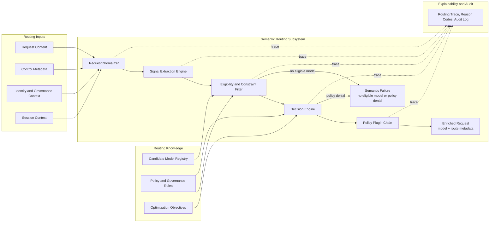

# ASE Semantic Routing Design

## Introduction

This document defines the design of the Semantic Routing subsystem in the ASE LLM gateway. Semantic Routing is the first decision layer in the request path and is responsible for resolving which model should serve a request before any backend instance is selected.

This document is not a general discussion of prompt classification. It is the governing design for a production routing subsystem that must convert an incoming request into an authoritative, policy-compliant, explainable model decision. Its output is a request enriched with `model=<resolved-model>` plus the routing metadata required by downstream systems and operators.

Within the overall document set, this file defines the model-selection subsystem only. Gateway-wide architecture is defined in `overview.md`, and instance-level dispatch is defined in `load_balancer.md`.

## Background

### Subsystem Problem

Semantic Routing solves the following problem:

> Given an incoming LLM request, a set of candidate models, and a set of policy, capability, deployment, and business constraints, determine the most appropriate target model for the request.

This problem is broader than intent classification. A production router must simultaneously account for request semantics, capability requirements, context limits, governance boundaries, tenant restrictions, cost and latency preferences, and multi-turn continuity. A router that ignores any of these dimensions will eventually make decisions that are either operationally unsafe or business-incorrect.

### Why This Layer Must Exist

Semantic Routing exists because model choice and endpoint choice are different decisions.

Model choice depends on request meaning and governance context. Endpoint choice depends on runtime fleet state. If those concerns are collapsed into one opaque routing step, the system loses explainability and ownership boundaries. It becomes difficult to tell whether a bad outcome was caused by the wrong model being chosen or the right model being dispatched poorly.

ASE therefore isolates Semantic Routing as the layer that owns model selection and only model selection. It may constrain downstream execution by selecting a model and attaching route metadata, but it does not choose a machine and it does not consume per-endpoint runtime signals as part of normal model resolution.

### Design Objectives

The subsystem is designed to achieve the following outcomes:

- select a model that is semantically appropriate and policy-compliant
- keep model resolution separate from backend scheduling
- enforce governance before expensive model invocation
- produce routing outcomes that remain explainable after the fact
- support heterogeneous signals, policies, and model families without redesign
- keep decision latency bounded through selective signal computation

### Governing Principles

The subsystem follows five governing principles.

First, Semantic Routing is model-centric, not server-centric. Second, hard constraints and policy constraints must be applied before optimization. Third, routing should be composed from explicit signals and declarative policy, not hidden heuristics embedded in code paths. Fourth, every final decision must leave a recoverable reason trail. Fifth, governance-sensitive checks must happen before the request reaches an inference backend.

ASE is aligned with the signal-driven design direction described in the vLLM Semantic Router work, especially its emphasis on heterogeneous signals, policy-aware decision logic, and post-decision plugin execution. ASE adopts that direction at the gateway level while preserving a strict handoff to downstream Load Balancing. See [R3].

## Scope

### In Scope

This document defines:

- request-level model selection
- normalization of routing-relevant request context
- signal extraction and routing-context construction
- model eligibility filtering
- policy-aware decision evaluation
- request enrichment with resolved model metadata
- session continuity behavior for multi-turn routing
- explainability, audit, and routing-trace requirements
- semantic failure classification
- configuration and governance requirements specific to model selection

### Out of Scope

This document does not define:

- backend instance scheduling
- endpoint health checks
- queue-aware dispatch
- transport retries or redispatch mechanics
- pool-level failover
- generic API gateway concerns unrelated to model selection

Those responsibilities belong to `load_balancer.md` or to broader gateway infrastructure outside this subsystem.

## Design

### Subsystem Summary

Semantic Routing is the authoritative model-selection layer in ASE. It receives a normalized request plus tenant, policy, and session context; evaluates that request against the routable model universe; and produces an explicit model decision that downstream Load Balancing must honor.

The key property of the subsystem is that it resolves a model, not an endpoint. Its value comes from making that decision explicit, policy-safe, and observable.

### Architectural Position

Semantic Routing appears in the request path as follows:

`Client Request -> Semantic Routing -> Request Enrichment (model=...) -> Load Balancing`

Its contract is:

- input: canonical request plus identity, policy, and session context
- output: request enriched with resolved `model` and routing metadata

That contract is normative. Semantic Routing may decide what model the request should use, but it may not decide where that model runs.

### System Design Diagram

The diagram below shows the internal flow of the Semantic Routing subsystem and the knowledge sources it depends on.



### Architectural Invariants

The following invariants are mandatory for this subsystem.

1. Semantic Routing must resolve a model before any instance-level dispatch begins.
2. Model selection must be based on explicit routing context, not implicit downstream fallback behavior.
3. Hard capability constraints and policy constraints must be evaluated before optimization among candidates.
4. The subsystem must emit enough decision metadata to explain both acceptance and rejection outcomes.
5. Session continuity may influence optimization, but it may not override hard capability or policy constraints.

These invariants define the acceptable behavior of the subsystem even as implementation details evolve.

### Internal Architecture

The subsystem is composed of five logical components.

| Component | Primary Responsibility | Architectural Output |
| --- | --- | --- |
| Request Normalizer | convert inbound API traffic into a canonical routing object | normalized request and routing context skeleton |
| Signal Extraction Engine | compute semantic, capability, and policy-relevant features | structured routing signals |
| Eligibility and Constraint Filter | eliminate impossible or disallowed models | eligible candidate set plus exclusion reasons |
| Decision Engine | resolve the final model from the eligible set | authoritative model decision plus rationale |
| Policy Plugin Chain | execute decision-coupled controls after model resolution | request annotations, safety tags, audit signals, optional augmentation hooks |

The architecture is deliberately linear. Normalization produces a stable routing object, signal extraction enriches it, filtering constrains the candidate set, decision logic selects the model, and plugins attach any post-decision controls required before handoff.

### Routing Context

Semantic Routing consumes more than prompt text. It requires a structured routing context assembled from four input classes.

| Input Class | Purpose | Representative Examples |
| --- | --- | --- |
| Request Content | describe what the request is asking for | messages, prompt text, system instructions, multimodal metadata, expected output shape |
| Control Metadata | express caller intent or routing hints | `model=auto`, explicit preference hints, debug flags, route override requests |
| Identity and Governance Context | constrain what the caller is allowed to use | tenant identity, user class, authorization scope, privacy classification, compliance tags |
| Session Context | preserve continuity across turns when appropriate | session ID, previous model, escalation history, continuity preference |

Without this context, model selection becomes guesswork. With it, routing becomes a controlled decision problem.

### Candidate Model Registry

Semantic Routing depends on an authoritative model registry. This registry is not a convenience layer; it is the substrate against which capability constraints and policy rules are evaluated.

Each routable model entry should expose, at minimum:

- model ID and family
- supported modalities
- context-window limit
- tool-calling and structured-output capabilities
- quality, latency, and cost tier
- deployment boundary and provider class
- tenant allow and deny rules
- safety or governance tags

The registry should be declarative and versioned. Adding a new model should usually mean changing registry and policy configuration, not changing routing code.

### Routing Signals

Signals are the intermediate representation between raw request context and final model selection. They should be explicit, inspectable, and typed closely enough that policy and optimization logic can consume them predictably.

The signal set naturally falls into five groups.

| Signal Group | Purpose | Representative Signals |
| --- | --- | --- |
| Semantic Signals | describe what the request is about | domain classification, language detection, intent detection, coding indicators, extraction indicators |
| Complexity Signals | estimate how demanding the request is | reasoning depth, ambiguity, expected chain length, long-context requirement |
| Capability Signals | define what the model must support | modality need, context size, tool use, structured-output reliability, determinism preference |
| Safety and Policy Signals | define whether a model is even eligible | privacy sensitivity, PII detection, jailbreak suspicion, provider restriction, region restriction |
| Preference Signals | guide optimization among valid choices | cost preference, latency preference, quality preference, private deployment preference, continuity preference |

The subsystem should compute only the signals needed for the current decision path. Cheap signals should remain cheap, and expensive signals should be invoked only when they materially affect the outcome.

### Reasoning Budget and Cost Model

Reasoning budget is a routing concern because reasoning-oriented models may consume substantially more tokens, wall-clock time, and infrastructure resources than lightweight models.

The subsystem should therefore estimate, when useful:

- input-token volume
- requested or inferred output length
- expected reasoning depth
- likely tool-use or structured-output overhead
- caller latency preference and cost preference

These signals exist to improve optimization, not to bypass hard constraints. More compute is not automatically better. A simple fact lookup should not be sent to a heavyweight reasoning model by default, but a later turn in the same session may still require escalation if the request becomes materially more complex.

### Decision Framework

The routing decision should be understood as a staged reduction process, not a monolithic score.

#### Stage 1: Normalize and Build Routing Context

The subsystem first produces a canonical routing object from the raw request and attaches tenant, policy, and session metadata. This establishes the input contract for all later stages.

#### Stage 2: Extract Routing Signals

The subsystem computes the signals needed to reason about semantics, capability requirements, and governance. This stage transforms request content into structured routing evidence.

#### Stage 3: Apply Hard Constraints

Models that cannot possibly serve the request are removed first. Typical examples include insufficient context window, missing modality support, unavailable deployment boundary, or missing required feature support.

#### Stage 4: Apply Policy Constraints

From the technically eligible set, the subsystem removes models that may not be used due to governance rules. Typical examples include private-data restrictions, tenant-specific provider restrictions, or regulated-traffic allowlists.

#### Stage 5: Optimize Among Remaining Candidates

Only after hard and policy constraints are satisfied does the subsystem optimize among remaining candidates. Optimization may consider quality, latency, cost, continuity, or other approved objectives, but it may not re-admit ineligible models.

#### Stage 6: Execute Post-Decision Controls

After the model decision is made, the subsystem executes decision-coupled plugins such as safety tagging, audit annotation, or optional semantic cache and augmentation hooks.

This staged model is central to explainability. It allows the system to say not only which model was selected, but also why other models were excluded.

### Session Continuity Model

Session continuity is an optimization concern with architectural consequences. Users often expect stable behavior across related turns, and uncontrolled model churn makes conversations difficult to understand and operate.

The subsystem should therefore preserve the previous model when doing so remains semantically valid and policy-safe. It may escalate to a stronger model when a later turn exceeds the capability or context limits of the current model. Downgrades should be conservative and should require explicit policy support, because a mid-session downgrade often harms continuity more than it saves cost.

Useful session metadata includes the previous model, the last escalation reason, continuity preference, and any conversation classification history that materially affects routing.

### Request-Level Routing Semantics

ASE should route at request granularity, not by pinning an entire session to a single model decision.

Session context exists to improve continuity, not to suppress re-evaluation. Each inbound request must still pass through capability checks, policy checks, and optimization. This prevents an early low-cost routing decision from locking later high-complexity turns to an underpowered model, and it prevents an early high-cost decision from forcing later trivial turns to remain expensive without justification.

The expected behavior is:

- each request is independently evaluated against current capability and policy constraints
- previous-model continuity is treated as an optimization preference, not a hard binding
- escalation is allowed when later turns exceed the capability, context, or quality envelope of the current model
- downgrade is conservative and requires explicit policy support
- a caller-supplied override applies to the current request unless a separate session-pinning feature is explicitly defined and authorized

If semantic cache or response reuse is employed, cache lookup must remain subordinate to governance and capability validation. A cache hit must not become an implicit bypass around policy or model-eligibility checks.

### Output Contract

The output of Semantic Routing is the formal handoff artifact to downstream Load Balancing and to operators who need to understand what decision was made.

The contract should contain the following fields.

| Field | Requirement Level | Purpose |
| --- | --- | --- |
| `model` | required | authoritative model decision consumed by Load Balancing |
| `request_id` | required | stable request identity across routing, dispatch, and observability |
| `route_decision_status` | required | distinguish successful routing from semantic rejection paths |
| `route_reason` | optional | preserve human- and operator-readable routing rationale |
| `policy_tags` | optional | carry governance annotations that may matter to downstream handling and audit |
| `debug_trace_id` | optional | correlate routing decisions with internal traces and debug artifacts |
| `continuity_metadata` | optional | preserve session-related context such as continuity or escalation state |
| ranking or confidence detail | optional | support diagnostics where ranked-candidate output is useful |

The contract should be stable across implementations. The downstream load-balancing layer should consume the model decision directly rather than reconstructing it.

An illustrative output shape is shown below.

```json
{
  "model": "code-large",
  "route_reason": "domain=code;complexity=high;policy=allowed",
  "policy_tags": ["tenant:default", "privacy:standard"],
  "messages": [
    {
      "role": "user",
      "content": "Write a C epoll example"
    }
  ]
}
```

### Northbound API and Routing Extensions

ASE should remain broadly compatible with OpenAI-style request shapes while exposing a narrow set of routing-aware controls.

The following caller-visible controls are recommended.

| Field | Purpose | Constraint |
| --- | --- | --- |
| `model=auto` | request semantic model selection | default path for routed traffic |
| `model=<explicit-model>` | request a specific model directly | still subject to policy and capability validation |
| `routing_hint` | provide a coarse semantic hint such as `code`, `reasoning`, or `extract` | advisory only; must not bypass policy |
| `route_override` | request a specific route or model alias | restricted to authorized callers; must not bypass hard constraints |
| `preference` | express latency, cost, or quality bias | optimization input only |
| `input_tokens_estimate` | provide a caller-side prompt-size estimate | advisory signal that may improve token-aware routing |
| `session_id` | preserve multi-turn continuity context | optional unless continuity policy requires it |
| `debug` or `explain` | request routing diagnostics | restricted and redacted for trusted callers only |

The precedence order should be explicit. Hard capability and policy constraints are evaluated first. Authorized explicit model requests or route overrides are evaluated next. Session continuity and optimization preferences are applied only after the request is proven eligible.

An illustrative northbound request shape is shown below.

```json
{
  "model": "auto",
  "messages": [
    {
      "role": "user",
      "content": "Write a C epoll example"
    }
  ],
  "routing_hint": "code",
  "preference": {
    "cost": "low",
    "latency": "medium",
    "quality": "high"
  },
  "input_tokens_estimate": 120,
  "session_id": "conv-123",
  "debug": true
}
```

When debug mode is authorized, ASE may return controlled routing detail such as the chosen model, high-level reason codes, and a trace identifier. It must not expose raw internal policy rules or sensitive model metadata to unauthorized callers.

### Explainability and Audit Requirements

Explainability is not optional for this subsystem. Since Semantic Routing is the point where model choice is made, it must leave enough evidence for debugging, audit, and policy review.

For each request, the subsystem should be able to recover at least:

- request ID
- session ID when present
- selected model
- candidate set after eligibility filtering
- exclusion reasons for removed models
- final route reason

Reason codes should distinguish structural causes from policy causes. Representative codes include `context_too_small`, `modality_unsupported`, `tenant_not_allowed`, `private_boundary_required`, `quality_preferred`, and `session_continuity_preserved`.

ASE may expose a controlled debug mode for trusted operators or callers, but that mode must not reveal internal policy logic or sensitive model metadata to unauthorized consumers.

### Failure Semantics

Semantic Routing must classify failures precisely so they are not confused with downstream serving failures.

| Failure Class | Meaning | Typical Cause |
| --- | --- | --- |
| No Eligible Model | no model satisfies hard capability or deployment constraints | insufficient context window, missing modality support, unavailable deployment zone |
| Policy Denial | one or more models are technically capable, but all are forbidden by policy | tenant restriction, private-boundary rule, provider allowlist |
| Invalid Routing Request | the request is malformed or missing required routing context | malformed payload, missing required metadata, unsupported request shape |
| Decision Engine Failure | the subsystem itself failed unexpectedly during routing | internal evaluation failure, policy engine error, signal extraction failure |
| Deferred Infrastructure Failure | Semantic Routing succeeded, but downstream execution later failed | endpoint unavailable, dispatch failure, retry exhaustion in Load Balancing |

The last category is included to preserve boundary clarity: it is observable to operators, but it is not owned by this subsystem.

### Observability

Semantic Routing should expose first-class metrics, logs, and trace fields because this is where the gateway's model-level decision is made.

Core metrics should include:

- routing decision count
- selected-model distribution
- no-eligible-model count
- policy-denial count
- signal extraction latency
- total routing latency
- session continuity preservation count
- escalation count

Useful audit fields include request ID, tenant ID, session ID, selected model, route reason, policy tags, and failure code where applicable.

The minimum routing trace should preserve enough state to reconstruct the decision path from normalized request, to extracted signals, to filtered candidates, to final model selection.

### Configuration Model

The subsystem should be configured declaratively rather than through code changes. This is necessary both for operational agility and for policy reviewability.

The configuration surface should at least cover:

- model registry
- signal extractor bindings
- policy rules
- optimization objectives
- northbound routing extension policy
- session continuity policy
- plugin-chain bindings
- debug verbosity and trace controls

An illustrative logical configuration is shown below.

```yaml
semantic_routing:
  default_mode: auto
  objectives:
    default: quality_within_budget
  session_policy:
    preserve_previous_model: true
    allow_escalation: true
    allow_downgrade: conservative
  models:
    - id: general-small
      family: general
      cost_tier: low
      latency_tier: low
      context_window: 32000
    - id: code-large
      family: code
      cost_tier: high
      latency_tier: medium
      context_window: 128000
  policies:
    - name: code_high_complexity
      when:
        domain: code
        complexity: high
      select: code-large
    - name: long_context_private
      when:
        context_requirement: long
        policy_tag: private_only
      allowed_models: [reasoning-private-long]
```

The exact DSL is implementation-specific. The architectural requirement is that routing policy remain declarative, reviewable, and versioned.

### Security and Governance Implications

Semantic Routing is one of the earliest governance enforcement points in the LLM request path. That makes it a security-relevant subsystem, not just a convenience layer for picking a cheaper or better model.

At minimum, it must support:

- authorization-aware model restrictions
- deployment-boundary restrictions
- PII-sensitive routing
- jailbreak-sensitive routing
- tenant-specific provider restrictions
- audit tagging for regulated traffic

These controls are part of the subsystem's core purpose because they determine whether a request may be sent to a model at all.

### Architectural Consequences

This design makes model selection explainable and governable, but it also imposes obligations on the implementation.

The subsystem must maintain a stable model registry, preserve a stable output contract, and keep decision traces rich enough for operators to use. It must also resist architectural drift. If queue depth, endpoint availability, or retry behavior begin to drive model selection directly, the subsystem has absorbed responsibilities that belong to Load Balancing and the design has degraded.

## References

- [R1] `overview.md`, ASE LLM Gateway Architecture Overview
- [R2] `load_balancer.md`, ASE Load Balancing Design
- [R3] vLLM Semantic Router: Signal Driven Decision Routing for Mixture-of-Modality Models, https://arxiv.org/abs/2603.04444
