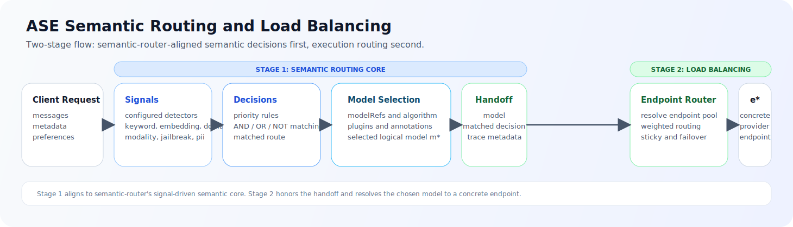
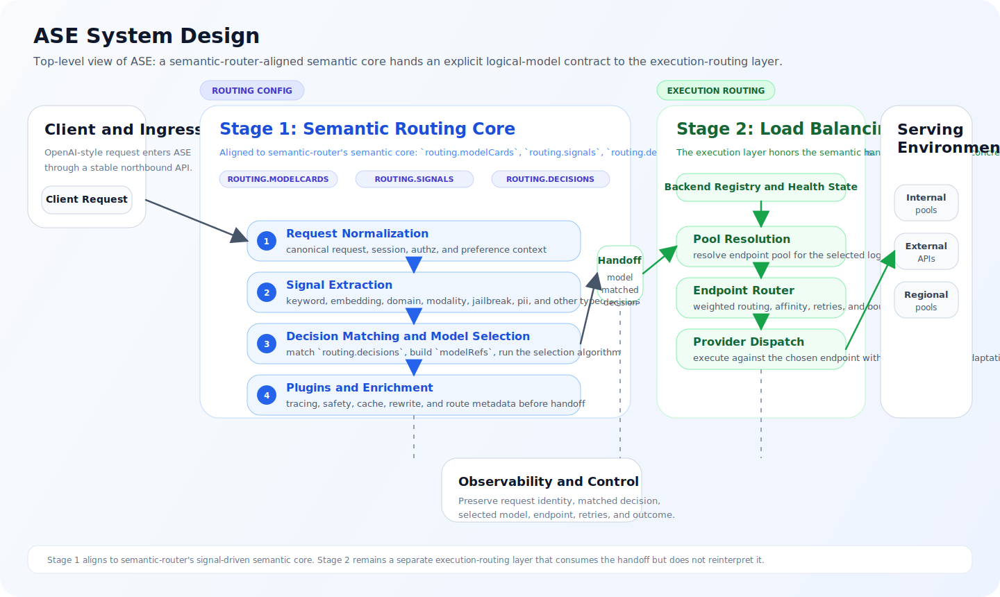

# ASE Semantic Routing and Load Balancing Architecture

## Introduction

This document defines the top-level architecture of the ASE Semantic Routing and Load Balancing system. It is the governing design document for ASE as a whole: it explains what problem ASE is solving, why the system is structured as two functional modules, what responsibilities belong to each module, and what contract connects them.

The intended audience is platform architects, gateway engineers, AI infrastructure engineers, security engineers, and operations teams. The document is written to establish a common architectural model before readers go into module-level detail.

In this document set, `ASE` is the canonical name of the Semantic Routing and Load Balancing system. The word `gateway` is used only to describe ASE's deployment role at the northbound boundary; it is not the primary architectural name of the design.

This overview is also the entry point to the design set:

- `architecture.md` defines the overall ASE architecture and the authoritative module boundary.
- `semantic_routing_module.md` defines the Semantic Routing Module.
- `load_balancing_module.md` defines the Load Balancing Module.

## Background

### Architectural Problem

An enterprise semantic routing and load balancing system is not just a reverse proxy in front of inference endpoints. For every incoming request, ASE must answer two separate questions.

The first question is semantic: which logical model should handle this request, given its intent, capability requirements, policy constraints, tenant restrictions, and business objectives. The second question is operational: which concrete serving endpoint should execute that already selected logical-model request, given current health, capacity, locality, and reliability conditions.

These questions are related, but they are not the same problem. They depend on different inputs, they optimize for different outcomes, and they fail for different reasons. Treating them as a single routing decision produces a design that is difficult to reason about and difficult to operate.

### Why a Single Smart Router Is the Wrong Abstraction

If prompt interpretation, policy enforcement, endpoint health, retries, and traffic scheduling are collapsed into one opaque router, the system loses architectural clarity. ASE can no longer cleanly answer operational questions such as:

- whether a bad outcome was caused by incorrect logical-model selection or unstable backend placement
- whether a policy change should be made in the semantic layer or the dispatch layer
- whether a latency regression is a logical-model-choice problem or an instance-scheduling problem

That design also makes change management harder. Semantic policy tends to evolve with product and governance requirements, while traffic engineering evolves with fleet topology, runtime behavior, and SRE practice. Those concerns should not be coupled without a compelling reason.

### Architectural Decision

ASE therefore adopts a two-module, two-stage request-processing model.

The first module, Semantic Routing, resolves the target logical model. The second module, Load Balancing, resolves the serving provider endpoint within the endpoint pool for that logical model. The handoff between the two modules is explicit and materialized in the request itself through an authoritative `model` assignment and associated routing metadata.

This is the central architectural decision in ASE. Everything else in this document exists to make that decision operationally precise.

### Canonical Terms

The following terms are normative in this document set.

| Term | Meaning |
| --- | --- |
| logical model | the provider-neutral model identity or capability target selected by the Semantic Routing Module; this is the meaning carried in the normalized `model` field at the module boundary |
| endpoint pool | the set of concrete provider endpoints eligible to serve a given logical model |
| provider endpoint | the concrete execution target selected by the Load Balancing Module, such as a specific vendor API endpoint or internal serving instance |

ASE may expose provider-specific model names at external interfaces, but the internal contract between the two modules should remain centered on logical models and endpoint pools.

### Architecture Objectives

The architecture is designed to achieve the following outcomes:

- correct logical-model selection under semantic, policy, and business constraints
- reliable dispatch to a healthy provider endpoint that can serve the chosen logical model
- clear separation between policy-driven logical-model choice and runtime traffic engineering
- explainable request handling, including why a logical model was chosen and why a provider endpoint was chosen
- operational resilience under partial failure, overload, recovery, and mixed backend topologies
- independent evolution of the Semantic Routing Module and the Load Balancing Module

### Governing Principles

The architecture follows a small set of governing principles.

First, logical-model choice and provider-endpoint choice are separate decisions and should remain separate in code, configuration, and observability. Second, policy and authorization should be enforced before expensive model execution begins. Third, the handoff from the Semantic Routing Module to the Load Balancing Module must be explicit rather than implicit. Fourth, semantic failures and infrastructure failures are different classes of failure and must remain distinguishable to operators. Fifth, ASE should preserve the same architectural shape across internal, external, and hybrid deployment modes.

## Scope

### In Scope

This document defines:

- the system boundary of ASE
- the two-module processing model used for request handling
- the contract between the Semantic Routing Module and the Load Balancing Module
- the major logical components in ASE
- the end-to-end request path at the architectural level
- the ownership boundary between semantic and infrastructure decisions
- the top-level failure model and observability expectations
- the relationship between this overview and the module design documents

### Out of Scope

This document does not define:

- detailed semantic signal extraction logic
- detailed logical-model selection policy rules
- detailed endpoint scheduling algorithms
- concrete health-check thresholds, retry limits, or failover parameters
- full request and response schemas
- full configuration schemas
- implementation-specific controller, cache, or state-storage mechanisms

Those details belong in the module design documents.

## Design

### Architecture Summary

ASE is a semantic routing and load balancing system positioned between client applications and a heterogeneous serving environment. Northbound, it presents a stable gateway interface to internal applications and services. Southbound, it can route to internal inference clusters, external provider APIs, region-specific deployments, or compliance-scoped model pools.

ASE does not treat all downstream targets as interchangeable. Instead, it resolves each request in two stages. The Semantic Routing Module determines what logical model should run through a semantic-router-aligned signal-driven core: request normalization, configured signal extraction, decision matching, model selection, and per-decision plugins. The Load Balancing Module then acts as the endpoint router: it resolves that logical model to a concrete provider endpoint and applies execution-time routing behavior. The architecture deliberately separates quality optimization from infrastructure optimization so that policy reasoning and traffic engineering can each remain coherent.

ASE therefore follows a `select -> route` process. More precisely, the semantic stage owns `signals -> decisions -> model selection -> plugins`, while the route stage owns endpoint-pool resolution, endpoint routing, provider adaptation, and recovery behavior.

### Architecture at a Glance

The diagram below gives the shortest possible reading of ASE.

### System Design Diagram

The diagram below shows the overall system structure and the explicit handoff between the two decision stages. Stage 1 is aligned to semantic-router's semantic core, while Stage 2 remains ASE's execution-routing layer.

### System Context

From an architectural perspective, ASE sits at the boundary between enterprise applications and a mixed LLM serving estate. That serving estate may include self-hosted inference systems, vendor-hosted APIs, model-specific clusters, and deployments that exist for regional or regulatory reasons.

This position gives ASE two roles. It operates as a gateway because it terminates and mediates access to downstream LLM services. It is also a control point because it is the place where model-selection policy, dispatch policy, and request observability are unified.

### Architectural Invariants

The following invariants are mandatory for the architecture and should be treated as design constraints rather than implementation suggestions.

1. Model resolution must complete before endpoint scheduling begins.
2. The handoff from the Semantic Routing Module to the Load Balancing Module must be explicit and carried in the request contract.
3. The Load Balancing Module must not reinterpret or rewrite the semantic logical-model decision under normal operation.
4. Semantic failures and infrastructure failures must remain distinguishable in logs, metrics, and user-visible outcomes.
5. Every request must be traceable across both decision stages.

### Logical Architecture

The logical architecture is composed of six major elements. Each element exists to support the two-module decision model and the explicit contract between the modules.

#### Northbound Interface

The northbound interface receives requests from applications, performs gateway-level admission functions, and normalizes inbound traffic into the internal processing path. It is the stable entry point into the ASE system.

#### Semantic Routing Module

The Semantic Routing Module is the first decision stage. It evaluates request content, control metadata, policy context, tenant context, and business objectives through configured signals, decision rules, model-selection algorithms, and per-decision plugins in order to produce an authoritative logical-model decision. Its output is not a backend host; its output is a routing decision expressed as `model=<resolved-logical-model>` plus optional routing metadata.

#### Request Enrichment Boundary

The request enrichment boundary is the formal contract between the two modules. Once the Semantic Routing Module finishes, the request carries the selected logical model explicitly. Downstream components do not have to infer the routing decision; they consume it directly.

This boundary is what prevents hidden coupling. The Load Balancing Module receives a resolved logical model and operates within that constraint. Under normal operation it does not reinterpret prompt semantics and it does not rewrite the logical-model decision.

#### Load Balancing Module

The Load Balancing Module is the second decision stage. It resolves the endpoint pool associated with the selected logical model, evaluates provider-endpoint eligibility and health, applies scheduling policy, and dispatches the request to a concrete execution target. It is responsible for runtime traffic engineering, not semantic reasoning.

#### Backend Registry and Health State

ASE requires a representation of backend inventory and current runtime state. This includes endpoint identity, model support, topology metadata, drain state, health state, and other scheduler-relevant signals. That information feeds the Load Balancing Module and is not itself a replacement for the semantic decision.

#### Observability and Control

Observability is a first-class architectural component, not an afterthought. ASE must emit enough information to reconstruct the request path from ingress to logical-model selection to endpoint selection to final outcome. Without that visibility, the two-module design would be theoretically clean but operationally weak.

The role of each major element can be summarized as follows.

| Element | Primary Role | Architectural Output |
| --- | --- | --- |
| Northbound Interface | Admit and normalize client requests | canonical request entering the gateway pipeline |
| Semantic Routing Module | Resolve the target logical model under semantic and policy constraints | authoritative logical-model decision carried in `model` plus routing metadata |
| Request Enrichment Boundary | Materialize the handoff between the two decision stages | stable module contract carried in the request |
| Load Balancing Module | Resolve a serving provider endpoint for the selected logical model | concrete dispatch target and runtime dispatch behavior |
| Backend Registry and Health State | Provide scheduler-relevant runtime knowledge | backend inventory and current eligibility signals |
| Observability and Control | Preserve explainability and operational control | traces, metrics, logs, and control-plane visibility |

### Request Processing Model

At a high level, request handling proceeds as follows.

1. A client sends a request to ASE.
2. ASE performs gateway-level ingress handling and request normalization.
3. The Semantic Routing Module evaluates the request and resolves the target logical model.
4. The request is enriched with the authoritative `model` assignment, matched semantic decision, and associated route metadata.
5. The Load Balancing Module resolves the endpoint pool for that logical model.
6. The Load Balancing Module filters ineligible endpoints, applies scheduling policy, and dispatches the request.
7. ASE returns the response and records the decision and execution trace needed for audit and operations.

This sequence is important because it establishes dependency order. Logical-model resolution is upstream of endpoint scheduling, and endpoint scheduling is downstream of logical-model resolution. The architecture should not blur that module boundary.

### Module Contract and Responsibility Boundary

The most important contract in the system is the one between the Semantic Routing Module and the Load Balancing Module:

> The Semantic Routing Module resolves the target logical model. The Load Balancing Module resolves the serving provider endpoint within that logical model's endpoint pool.

That sentence is the authoritative boundary for ownership.

The minimum handoff contract between the two modules should be treated as follows.

| Field | Produced By | Consumed By | Purpose |
| --- | --- | --- | --- |
| `request_id` | gateway ingress and Semantic Routing Module path | Load Balancing Module and observability systems | preserve request identity across both decision stages |
| `model` | Semantic Routing Module | Load Balancing Module | carry the authoritative logical-model identifier that defines the only endpoint pool the dispatch module may schedule within |
| `route_decision_status` | Semantic Routing Module | Load Balancing Module and operators | distinguish successful logical-model resolution from semantic rejection |
| `matched_decision` | Semantic Routing Module | operators, audit, optional downstream diagnostics | preserve which semantic decision rule matched before model selection completed |
| `route_reason` | Semantic Routing Module | operators, audit, optional downstream diagnostics | preserve why the logical-model decision was made |
| `policy_tags` | Semantic Routing Module | Load Balancing Module and audit systems | carry governance-relevant annotations that may constrain dispatch |
| `trace_id` or equivalent | observability path | both layers and operators | correlate semantic and infrastructure decisions in one trace |

The ownership boundary should be interpreted as follows.

| Module | Owns | Explicitly Does Not Own |
| --- | --- | --- |
| Semantic Routing Module | request understanding; configured `routing.signals` evaluation; `routing.decisions` matching; logical-model eligibility and policy evaluation; model selection over `modelRefs`; per-decision plugins; request enrichment with the resolved `model`; semantic rationale and routing trace | per-endpoint health management; queue-aware scheduling; connection retry mechanics; pool-level failover sequencing |
| Load Balancing Module | logical-model-to-pool resolution; endpoint discovery and eligibility; health-aware filtering; provider-endpoint scheduling; retry, redispatch, and dispatch-time failover; runtime dispatch telemetry | prompt interpretation; task classification; policy-driven logical-model choice under normal operation; semantic optimization across model families |

This table is normative. If future changes cause either layer to absorb responsibilities from the other without revisiting this overview, the architecture has drifted.

### Architectural Consequences

The two-module decision model has several direct consequences for the system.

It improves explainability because a routing outcome can be decomposed into two auditable decisions rather than one opaque result. It improves operability because policy tuning and traffic tuning can proceed independently. It improves extensibility because new routing decisions, model cards, and model-selection algorithms can be introduced at the semantic layer without redesigning endpoint scheduling, and new endpoint-routing strategies can be introduced without rewriting semantic routing policy.

It also separates optimization concerns. The Semantic Routing Module performs request-understanding-driven optimization over logical-model capability, policy fit, and quality envelope. The Load Balancing Module performs execution-layer optimization over provider choice, endpoint availability, affinity, locality, and equivalent-route cost within the already selected logical model.

The design also imposes constraints. The request contract between the modules must be stable. Observability must capture both decisions rather than only the final backend target. Finally, exception paths must preserve the module boundary instead of using hidden fallback logic that silently changes the logical-model decision during dispatch.

### Failure Model

The architecture separates failures by the module that owns the failed decision.

#### Semantic Failure

Semantic failure occurs before dispatch, when ASE cannot normalize the request, cannot match a valid semantic decision, cannot identify an eligible logical model, or denies the request based on policy or governance rules. These failures belong to the semantic decision path and should be surfaced as such.

#### Infrastructure Failure

Infrastructure failure occurs after a logical model has already been selected but the system cannot successfully execute the request on a provider endpoint. Typical cases include pool exhaustion, endpoint unavailability, dispatch failure, or retry exhaustion.

#### Operational Importance

This distinction is not cosmetic. It is necessary so that operators can tell the difference between "the wrong logical model could not be chosen" and "the right logical model was chosen but could not be served." Without that separation, incident response, policy tuning, and service-level reporting all become harder.

At the overview level, the required failure classification is:

| Failure Class | Decision Point | Representative Causes | Operational Meaning |
| --- | --- | --- | --- |
| Semantic Failure | before dispatch | invalid request, no matching decision, no eligible logical model, policy denial | the request could not be lawfully or correctly mapped to a logical model |
| Infrastructure Failure | after logical-model selection | no healthy endpoint, dispatch failure, retry exhaustion | the logical-model decision was made, but the serving system could not execute it |

### Deployment Model

The two-module architecture is stable across several deployment modes.

In a centralized-gateway deployment, one logical ASE gateway fronts multiple logical-model endpoint pools. In a hybrid deployment, ASE may dispatch some traffic to internal inference systems and other traffic to external provider APIs. In a compliance-scoped deployment, the Semantic Routing Module and the Load Balancing Module may both operate under additional regional or tenant constraints, but the fundamental handoff between the two modules remains unchanged.

This is an important property of the design. Deployment topology may change over time, but the architectural contract should not.

### Deployment Profiles

The architecture should remain stable across several concrete deployment profiles.

| Profile | Typical Environment | Architectural Implication |
| --- | --- | --- |
| Centralized gateway | one ASE control point in front of multiple logical-model endpoint pools | simplest place to enforce a single semantic-policy layer and a single dispatch layer |
| Single-node or appliance deployment | one host or chassis with multiple GPUs and local model processes | the two modules may be implemented in one runtime, but the logical-model-selection and endpoint-selection decisions should still remain separate |
| Distributed cluster | multiple serving nodes across zones or racks | Load Balancing requires stronger health, locality, and redispatch policy, but the semantic handoff contract remains unchanged |
| Kubernetes-native deployment | gateway pods in front of service meshes, autoscaling pools, or inference CRDs | control-plane integration may change, but the Semantic Routing Module still resolves the logical model before any pod- or service-level dispatch |
| Hybrid internal and external deployment | some traffic served by internal clusters and some by vendor APIs | the Semantic Routing Module may enforce provider or privacy boundaries while the Load Balancing Module chooses among the execution domains that remain |

These profiles differ operationally, but they should not require ASE to collapse the Semantic Routing Module into the Load Balancing Module.

### Serving Compatibility Model

ASE is not itself a serving engine. It should front heterogeneous serving stacks while keeping a stable northbound API and a stable contract between the Semantic Routing Module and the Load Balancing Module.

| Backend Class | Typical Strength | Dispatch Implication |
| --- | --- | --- |
| self-hosted inference stack with rich metrics | detailed queue, token, and cache telemetry | enables least-queue, token-aware, and cache-aware scheduling |
| self-hosted stack optimized for multi-turn locality | strong prefix reuse or warm-state preservation | affinity and consistent-placement policy become more valuable |
| enterprise serving platform behind service abstractions | stronger operational controls, more indirection | dispatch may rely more on pool-level policy and less on per-engine internals |
| external provider API | limited runtime visibility and provider-owned scheduling | ASE should favor policy enforcement, weighted failover, and conservative retry behavior |

The compatibility model matters because backend differences should change scheduler sophistication, not the architectural boundary. ASE should degrade from rich metrics-aware scheduling to simpler failover-oriented dispatch without rewriting the semantic decision model.

### Observability Model

The overview-level observability requirement is straightforward: operators must be able to reconstruct how a request moved through the gateway and where it failed if it failed.

At minimum, ASE should expose enough telemetry to answer the following questions:

- what request entered the system
- which semantic decision matched
- which logical model was selected
- which endpoint pool was resolved
- which provider endpoint was chosen
- whether retry or redispatch occurred
- whether the final outcome was success, semantic denial, or infrastructure failure

These signals are required for explainability, SRE operations, capacity analysis, and policy debugging. The module design documents define the detailed fields and metrics, but the architectural requirement originates here.

The minimum cross-layer trace should therefore preserve, for each request, the request identity, matched semantic decision, selected logical model, resolved endpoint pool, selected provider endpoint, retry or redispatch history, and final outcome classification.

### Relationship to Module Documents

This overview intentionally stops at the boundary where module-level detail begins.

`semantic_routing_module.md` specifies how the Semantic Routing Module extracts configured signals, matches decisions, resolves `modelRefs`, and emits a logical-model handoff. `load_balancing_module.md` specifies how the Load Balancing Module resolves pools, evaluates endpoint state, and selects a serving provider endpoint. Those documents are free to evolve internally, but they must continue to honor the architectural contract defined in this overview.

## References

- [R1] `semantic_routing_module.md`, ASE Semantic Routing Module Design
- [R2] `load_balancing_module.md`, ASE Load Balancing Module Design
