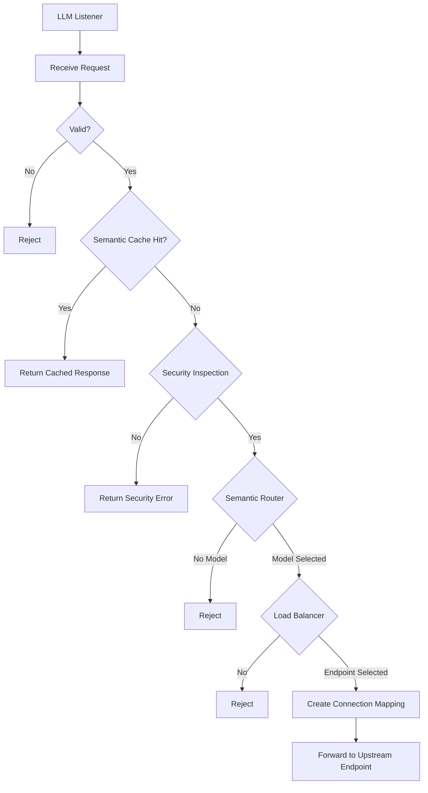
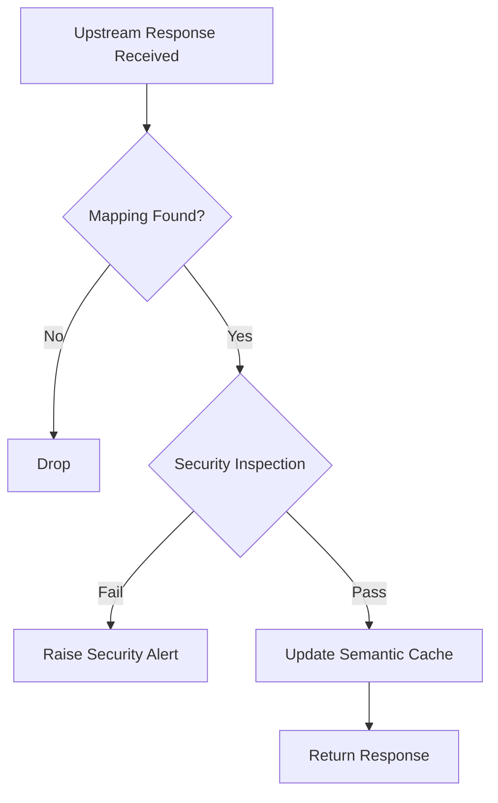
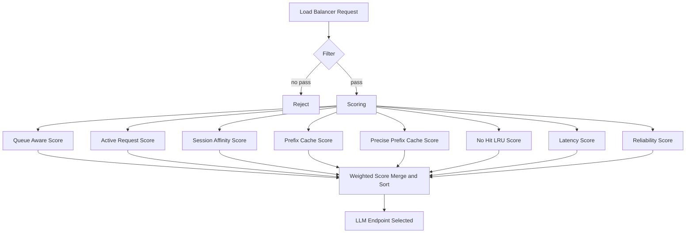
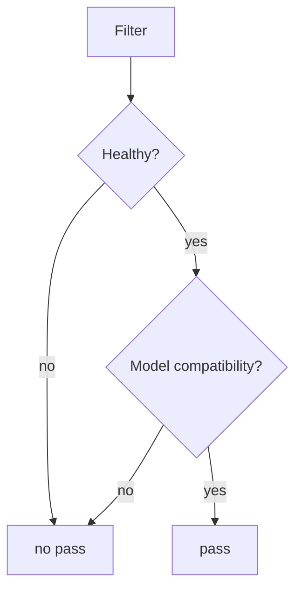

ASE LLM Load Balancer

# Introduction

LLM inference traffic behaves very differently from traditional web traffic. Request cost depends on prompt and generation token volume, responses are often long-lived because of token streaming, GPU memory is stateful because of KV-cache locality, and overall throughput is strongly influenced by batching efficiency and queue state rather than by simple request counts. Because of these characteristics, conventional load-balancing strategies that only observe connections or request rates cannot consistently deliver good utilization, latency, and resilience for LLM backends.

ASE LLM Load Balancer is designed as an LLM-aware scheduling component that works together with the ASE semantic router and security gateway. It selects backend LLM endpoints by combining local request context with upstream engine health, capabilities, and runtime metrics, so that routing decisions can reflect real inference conditions instead of generic proxy statistics alone. The design goal is to provide secure, cost-efficient, resilient, and performance-aware routing across heterogeneous LLM servers.

This document describes the problem background, the architecture of the ASE LLM router and load balancer, the core endpoint and connection abstractions, the vendor adapter layer used to normalize health, capability, and metrics data from different LLM engines, and the scheduling model used to make engine-aware balancing decisions. The first development stage focuses on HTTP/2-based LLM inference APIs.

## Background

Current LLM routing solutions often solve only part of the problem. Some extend general-purpose API gateways with AI-related policies and plugins, which is useful for traffic governance but does not make the gateway natively inference-aware. Some focus on semantic routing and model selection, but do not provide a real load-balancing layer for distributing requests across multiple LLM endpoints. Others are coupled to a specific proxy or inference stack, so backend scheduling still depends heavily on generic L4 or L7 balancing with limited visibility into queue state, cache locality, batching behavior, and other engine-level signals.

ASE starts from a different deployment position. As a security gateway between internal clients and external or internal LLM services, ASE already acts as a web proxy and enforcement point for authentication, policy, and traffic inspection. That makes it a natural place to combine semantic routing and LLM-aware load balancing in one control plane, while also providing stronger security handling for LLM request and response traffic than a standalone router typically does.

There is also a clear product gap: there is still no broadly adopted, engine-agnostic LLM load balancer with a normalized view of backend health, capabilities, and scheduling metrics. ASE LLM Load Balancer is designed to address that gap and provide a practical foundation for secure and efficient LLM traffic management.

## A Big Challenge

The biggest technical challenge is that there is no unified standard for LLM endpoint capabilities, health signals, or runtime metrics. An LLM-aware load balancer needs this information to score backend endpoints correctly, but each engine vendor exposes a different set of APIs, metric names, update intervals, and operational semantics. In practice, this means a production-ready load balancer cannot rely on a single common interface and must normalize engine-specific data before it can make consistent scheduling decisions.

This creates a fundamental tradeoff in current deployments. A broadly compatible gateway can support many kinds of backends, but usually with only limited inference awareness. A deeply engine-aware scheduler can make better balancing decisions, but often only for a small set of supported engines. ASE addresses this challenge through a vendor adapter layer that converts heterogeneous backend signals into a normalized model for routing and load-balancing logic.

## Scope

The first development stage focuses on HTTP/2-based RESTful APIs. HTTP/1.1 and gRPC are out of scope for this stage. Unless otherwise specified, all references to HTTP in this document mean HTTP/2.

# System Architecture

This section defines the major functional components and normative behavior of ASE LLM Load Balancer. In the text below, capitalized terms such as `MUST`, `SHOULD`, and `MAY` indicate requirement strength in the customary specification sense.

## ASE LLM Router and Load Balancer Block Diagram

<div align="center">

</div>

## Major LLM Request Processing Flow



A request MUST be processed in the following logical order: request validation, optional semantic cache lookup, security inspection, semantic route selection, endpoint load balancing, connection mapping creation, and upstream forwarding. An implementation MAY collapse these stages internally, but it MUST preserve the same externally observable behavior.

## Major LLM Response Processing Flow



An upstream response MUST be correlated with the corresponding client-side request context before it is emitted. If no valid mapping exists, the response MUST be discarded or handled according to implementation-specific error policy; it MUST NOT be forwarded to an unrelated client stream. Successful responses MAY be written back into semantic cache subject to cache policy.

## LLM Listener

The LLM Listener is the client-facing entry point for inference traffic. It MUST accept requests on configured service ports and bind them to the LLM service processing pipeline.

Routing decisions MUST be made per request rather than per transport connection. Accordingly, two requests received on the same client connection MAY be forwarded to different backend LLM endpoints.

The listener MUST preserve enough request metadata for validation, policy enforcement, semantic routing, load balancing, and response correlation. The externally visible service surface is defined by the LLM RESTful Service Interface and LLM Service RESTful APIs sections of this document.

## Auxiliary Service Ports

Auxiliary ports MAY be used for TLS termination, HTTP processing, authentication, administrative access, or other deployment-specific functions.

Their detailed internal behavior is out of scope for this document unless explicitly referenced by the LLM service path.

## LLM RESTful Service Interface

From the client perspective, ASE exposes a single logical LLM inference service. That service MUST provide, at minimum, the following control interfaces:

- Model list
  The model list MUST be derived from ASE configuration. It MUST NOT be synthesized by merging all models advertised by upstream endpoints. If a request names an explicit model that is not configured in ASE, the request MUST be rejected before semantic routing or load balancing.

- Health status
  The service MUST expose a liveness endpoint representing the health of the ASE LLM service itself.

- Readiness status
  The service MUST expose a readiness endpoint indicating whether the service is able to accept inference traffic.

All other inference requests are treated as relay traffic. They MUST be forwarded only after validation, security inspection, semantic route selection, and endpoint scheduling have succeeded.

## Semantic Router

The semantic router determines the target model or endpoint pool that satisfies request semantics, capability constraints, and policy requirements.

That function is specified separately in [ASE Semantic Router](./ase_semantic_router.md). The load balancer defined here operates after semantic routing and assumes that a candidate cluster has already been selected.

## Semantic Caching

Semantic caching MAY short-circuit backend execution when a sufficiently similar prior request has a reusable response.

After a request/response exchange completes successfully, ASE MAY persist a semantic representation of the request together with response metadata and payload in a vector-capable store. On a subsequent request, ASE MAY compare the new request against cached entries before upstream forwarding.

Any cache hit MUST satisfy configured similarity, freshness, and policy constraints before the cached response is returned. A dedicated vector store such as Milvus or Redis MAY be used for storage, retrieval, and aging. Storage topology, eviction policy, and multi-tier cache design are outside the scope of this document.

## Load Balancer

The load balancer selects one upstream endpoint from the candidate cluster chosen by the semantic router. Endpoint selection MUST consider endpoint eligibility, transport capacity, connection state, engine capabilities, and runtime metrics.

The following subsections define the required data model and scheduling behavior.

### Core Data Model

#### LLM Cluster

An LLM cluster is the unit of backend scheduling for one advertised model. In the current design, one logical model maps to exactly one cluster, and one cluster contains one or more LLM endpoints.

This separation allows semantic routing to resolve model selection first and endpoint scheduling second.

#### LLM Endpoint

An LLM endpoint is an individual upstream inference target. It MAY represent a directly configured IP address, a resolved DNS address, or a provider-specific service instance.

Endpoint scheduling SHOULD consider health, connection pool state, queue pressure, cache affinity, failure history, and configured local weight.

##### Connection Pool

Each endpoint MUST maintain protocol-specific connection pools. HTTP/1.1 and HTTP/2 pools are logically distinct. The first development stage only requires HTTP/2 support.

The following cluster-scoped parameters control upstream connection reuse:

- `max_connections`
  Maximum persistent transport connections to the endpoint.

- `max_concurrent_streams`
  Maximum concurrent HTTP/2 streams per connection.

- `max_requests_per_connection`
  Maximum requests served on a single transport connection before graceful drain and close.

Connections MAY be pre-established and reused. Streams MUST be allocated per request and MUST be released when the corresponding response completes or terminates.

##### Failover and Fault Isolation

When health probing marks an endpoint unhealthy, the scheduler MUST stop assigning new requests to that endpoint.

The implementation SHOULD drain or clear the affected connection pool according to configured failure policy. When the endpoint returns to healthy state, the pool MAY be recreated and the endpoint MAY re-enter the eligible scheduling set.

##### DNS Resolution

An endpoint MAY be configured as either an IP address or a domain name. If a domain name is used, the DNS subsystem is responsible for resolving one or more IP addresses.

Each resolved address MAY be materialized as a schedulable endpoint according to the configured DNS mode:

- `strict_dns`
  All currently resolved addresses MUST be treated as distinct endpoints. The resolver SHOULD poll periodically so that newly added addresses are admitted and removed addresses are withdrawn.

- `logical_dns`
  The configuration maps to one logical endpoint, and only one currently preferred resolved address is used for scheduling at a time.

Resolved endpoints MUST inherit the logical endpoint's policy, credentials, and protocol settings.

##### API Key

An endpoint configuration MAY include an upstream API key or equivalent credential. Such credentials are typically used for upstream authentication, authorization, tenant identification, or billing.

#### Connection Mapping Table

| Client IP | Client Port | Client Stream ID | Upstream IP | Upstream Port | Upstream Stream ID |
| --------- | ----------- | ---------------- | ----------- | ------------- | ------------------ |
| 1.1.1.1   | 1000        | 100              | 10.10.10.10 | 2000          | 300                |
| 2.2.2.2   | 3000        | 200              | 20.20.20.20 | 4000          | 500                |

The Connection Mapping Table binds client-side request context to the selected upstream transport context.

A mapping MUST be created after endpoint selection and before the request is forwarded upstream. The response path MUST consult this table to locate the correct client-side connection and stream.

The mapping MUST be removed when the request completes, fails terminally, or is cancelled.

### Vendor Adapter Layer

The Vendor Adapter Layer normalizes backend-specific interfaces for health, capability discovery, and runtime metrics. Each adapter MUST translate engine-native data into ASE's internal schema without inventing values that are not actually available from the upstream engine.

#### Health Checking

Health checking determines whether an endpoint is eligible for scheduling. Probes MAY use HTTP, gRPC, TCP connection establishment, or provider-native methods.

Probe method, interval, timeout, and failure thresholds MUST be configurable. Health state transitions SHOULD be propagated to the scheduler promptly enough to avoid continued routing to failed endpoints.

#### LLM Engine Capability Discovery

Adapters SHOULD discover and normalize the capabilities required by semantic routing and load balancing. Relevant capability fields MAY include:

- model list
- semantic capabilities: completion, chat, embedding, rerank, classify, tool calling, structured output, vision, audio, transcription
- operational capabilities: context length, maximum input tokens, maximum total tokens, maximum concurrency, streaming support, quantization mode

Capabilities SHOULD be fetched during startup and MAY be refreshed periodically. The refresh interval SHOULD be configurable and is expected to be on the order of hours rather than seconds.

#### LLM Engine Metrics

Runtime metrics are used for dynamic scheduling. Because different engines expose different signals, an adapter MUST publish only metrics that are available and sufficiently fresh. Missing metrics MUST be represented as unknown rather than fabricated.

##### Metric Categories

The scheduler MAY consume the following metric categories when available:

- Queue metrics: `num_running_requests`, `num_waiting_requests`, `num_swapped_requests`
- Resource utilization: KV cache usage, memory usage, cache hit rate, prefix cache hit rate
- Latency metrics: time to first token (TTFT), time per output token (TPOT), end-to-end latency
- Throughput metrics: prompt tokens, generation tokens, iteration tokens
- Reliability metrics: request success rate, request error rate, request cancellation rate

##### Metrics Scraper

The metrics scraper MUST poll or subscribe to backend metrics at a configurable interval. The sampling interval SHOULD balance freshness against scrape cost.

Metrics older than a configured freshness threshold SHOULD be treated as stale and SHOULD receive reduced or zero weight in the scheduler.

### Scheduling Model

The scheduler evaluates candidate endpoints in two stages: filter and score. The filter stage removes endpoints that are not eligible for selection. The scoring stage ranks eligible endpoints using normalized local and remote signals.

#### Scheduler Inputs

The scheduler SHOULD combine the following data sources:

- Local request context, such as requested model, session affinity keys, prompt-prefix features, and tenant or policy attributes
- Local scheduling state, such as current connection occupancy, recent failures, and cache affinity indexes
- Static endpoint configuration, such as local weight and administrative enablement
- Remote engine signals, such as health, capabilities, queue depth, cache efficiency, and latency

#### Adaptive Scoring

Because no single metric model is portable across all engines, scoring MUST be adaptive. Only signals that are available and fresh SHOULD participate in the final score.

Each scoring component SHOULD be normalized to a common range such as `[0, 1]`, and its contribution SHOULD be weighted by configuration. If a metric is unavailable, the scheduler MUST NOT infer a synthetic value unless explicitly configured to do so.

The load balancer scheduling flow is as follows:



#### Filter Stage

An endpoint MUST be filtered out if it is unhealthy or incompatible with the request. The implementation MAY also reject endpoints for exhausted transport capacity, missing required capabilities, policy violations, or stale mandatory metrics.



The filter stage SHOULD execute before any scoring logic so that hard constraints are enforced independently of soft preference weights.

#### Scoring Pseudocode

All component scores SHOULD produce larger values for more desirable endpoints. One illustrative formulation is shown below:

```text
queue_aware_score =
    if num_waiting_requests == 0:
        0.5
    else:
        0.5 * (1 - min(num_waiting_requests, queue_threshold) / queue_threshold)

active_request_score = 1 - normalize(num_running_requests)
session_affinity_score = normalize(session_affinity_match)
prefix_cache_score = normalize(prefix_cache_affinity)
precise_prefix_cache_score = normalize(precise_prefix_match)
no_hit_lru_score = 1 - normalize(cold_prefix_eviction_risk)
latency_score = 1 - normalize(ttft_or_tpot)
reliability_score = normalize(success_rate - error_penalty)

final_score =
    sum(weight_i * score_i for each available scoring component i)
```

The normalization method, weight set, freshness policy, and fallback behavior for missing metrics are implementation-defined but MUST be configurable.


# LLM Service RESTful APIs

This section defines the minimum management and observability endpoints exposed by the ASE LLM service. Unless otherwise specified, request examples are shown as HTTP `GET` operations and successful control responses are represented as JSON bodies.

## Management Endpoints

### Models

The `GET /v1/models` endpoint returns the model catalog advertised by ASE. The response MUST include only models configured in ASE and eligible for routing.

- Request

```http
GET /v1/models
```

- Response

```json
{
  "data": [
    {
      "id": "meta-llama/Llama-2-7b-chat-hf"
    }
  ]
}
```

### Health Check

The `GET /health` endpoint reports the liveness of the ASE LLM service.

- Request

```http
GET /health
```

- Healthy response

```json
{
  "status": "ok"
}
```

- Unhealthy response

```http
HTTP/1.1 500 Internal Server Error
```

### Readiness

The `GET /ready` endpoint reports whether the ASE LLM service is ready to accept inference traffic.

- Request

```http
GET /ready
```

- Ready response

```json
{
  "status": "ok"
}
```

- Not-ready response

```http
HTTP/1.1 500 Internal Server Error
```

### Metrics

The `GET /metrics` endpoint exposes router and load-balancer observability data. The exact response schema is implementation-defined and MAY follow Prometheus, OpenMetrics, JSON, or another deployment-standard format.

- Request

```http
GET /metrics
```

- Response

```text
<metrics payload>
```

## Operational Debuggability

The implementation SHOULD provide end-to-end traceability for validation, security inspection, semantic routing, endpoint scheduling, upstream forwarding, and response handling.

The implementation SHOULD also define dedicated debug log categories and configurable verbosity levels for both the semantic router and the load balancer so that route decisions and endpoint-selection outcomes can be audited during troubleshooting.

# Configuration

This section illustrates the major configuration surfaces required by ASE LLM Load Balancer. Field names are illustrative; an implementation MAY use different names provided that it preserves equivalent semantics.

```yaml
config:
  listeners:
    - name: http-8899
      address: 0.0.0.0
      port: 8899
      timeout_seconds: 300

  providers:
    models:
      - name: base-model
        reasoning_family: qwen3
        provider_model_id: qwen3-8b
        backend_endpoints:
          - name: primary-vllm
            endpoint: vllm-llama3-8b-instruct.default.svc.cluster.local:8000
            vendor: vLLM
            dns_type: STRICT_DNS
            dns_lookup_family: AUTO
            protocol: http2
            api_key: xxxxxxxxxxxxxxxxxxxxxxxxxxxx
            weight: 100

  load_balancer:
    strategies:
      - adaptive_llm_aware

  capability_poll_interval_seconds: 3600
  metrics_poll_interval_ms: 1000
```

# References

[1] vLLM v1 LLM Engine Metrics: https://docs.vllm.ai/en/v0.8.5/design/v1/metrics.html
