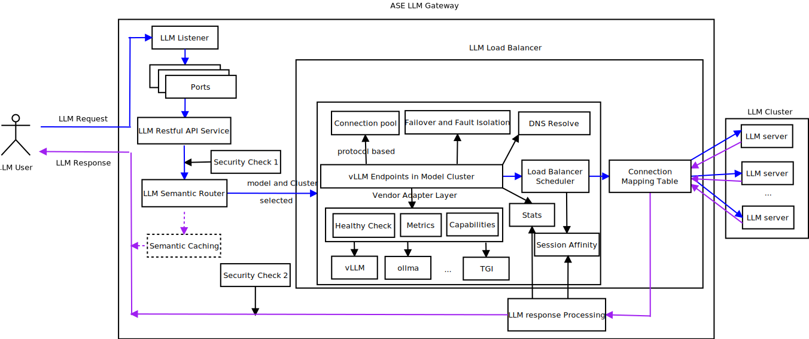
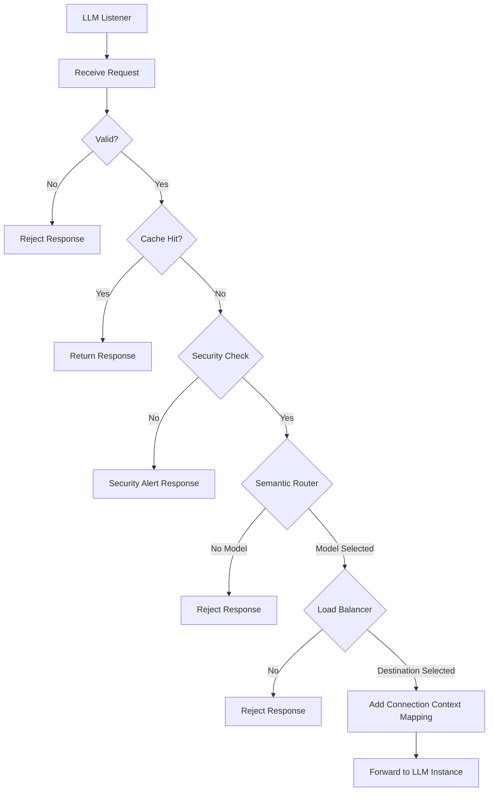
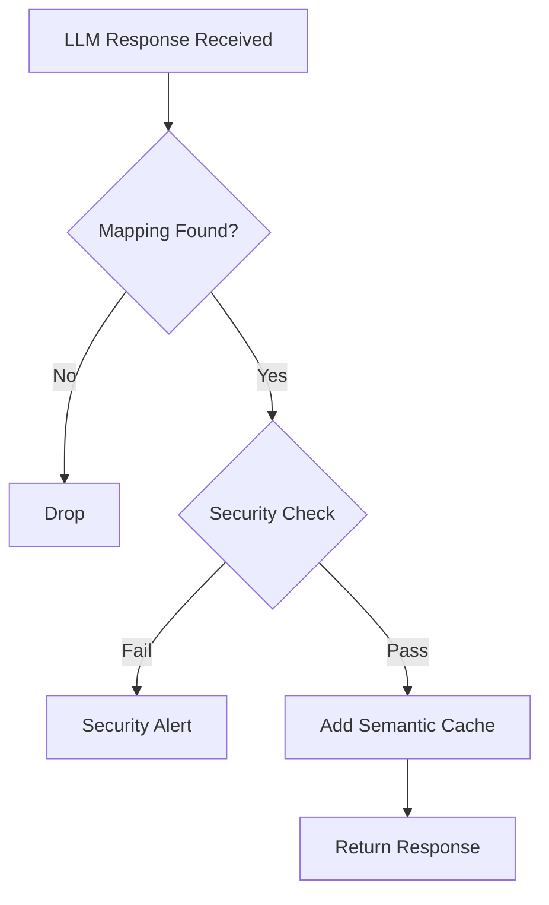
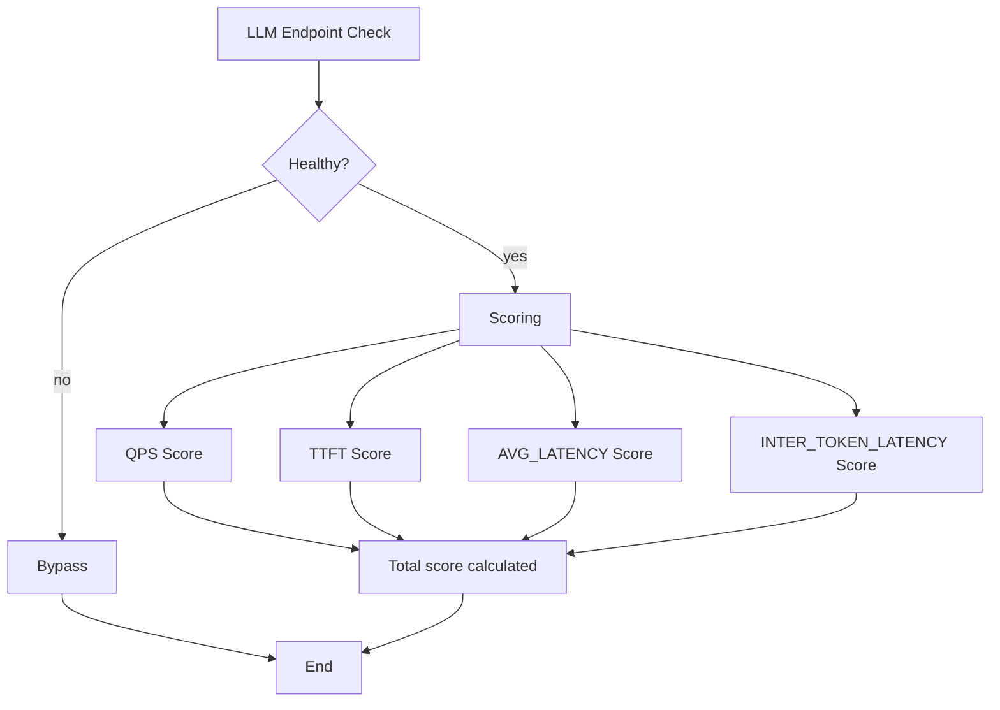

ASE LLM Load Balancer

# Introduction

With the booming AI technology development and deployments across the world, there are some core problems coming up in the LLM inference network.

The workload of LLM inference is fundamentally different from traditional web workloads, for example:

- Compute cost on length of prompt tokens and length of generated tokens
- LLM requests/respponses are long-lived for streaming tokens
- GPU memory is stateful (KV cache affinity)
- Throughput is governed by batching efficiency, not just request count

And traditional load balancing algorithms(e.g., round-robin, least-conection, etc.) fails because :

- Ignores request queues' status
- Ignores KV-Cache affinity
- Ignores batching processing of GPU nature
- Causes GPU imbalance and poor resource utilization

So high performance LLM load balancer tends to use means of LLM engine-aware to efficiently do the resource schedule, not just based on the LLM statistics observed by LLM load balancer.

There are some open-sourced, partially open-sourced and commercial LLM routers exist in the market like open-sourced vLLM semantic router, semantic-router and RouteLLM；Partially open-sourced Kong AI Gateway; commercial Cloudflare AI Gateway.

The ASE LLM load balancer, together with ASE semantic LLM router is designed to address the core problems that exist in AI inference network, and to provide cost-efficient, secure, resilient and performance-aware of inference workloads across LLM servers.

## Background

The problems in current LLM routers are: 

- Semantic router enhancements based on current API gateways like Kong AI Gateway and Cloudflare AI Gateway，not natively designed as semantic router, use policy/rules and plugins to do partially semantic router enhancements. 
- Designed and focused on semantic router model selection, no load balancer function like semantic-router and RouteLLM.
- Designed as semantic router and works as a plugin in web proxy (e.g. Envoy ) for  like vLLM semantic router. load balancer function mostly depends on web proxy L4/L7 load balancer with limited LLM-aware scheduler.
- vLLM production stack, llm-d and nvidia Dynamo add a load balancer and resource scheduler layer over LLM engines, generally used in a Kubernetes-native cluster, and function as engine-aware scheduler to achieve better peformance. The problem is all the three can onlys support limited vendors of LLM engines because of compatibility of metrics/KV event of different LLM engine vendors.

ASE works as an important component of security gateway between internal network and external network, it mostly works as a web proxy and naturely can serve as a LLM semantic router and load balancer. There is some key competitive differentiations that ASE can provide more advanced security features on the LLM request and response traffics.

What's more, currently there are no mature LLM load balancers in the market，and no unified LLM endpoint interfaces of capabilities, metrics and KV events used in LLM load balancer algorithms, so it's a good product opportunity.  

## Scope

The first development stage will support HTTP/2 Restful APIs, HTTP/1.1 and gRPC not planned in this stage.

Hereafter if not specified, all HTTP mentioned is refered as HTTP/2.

# System Architecture

# ASE LLM Router and Load balancer Block Diagram

<div align="center">

</div>

## Major LLM Request Processing Flow



# Major LLM Response Processing Flow



## LLM Listener

A dedicated LLM listener is used to listen LLM requests on a specified L4 port. When received a new LLM request, a new local LLM service L4 port is set up to serve the client.

To be noted, LLM router is per LLM request based, so even two LLM requests go through the same client and same HTTP connection, it could be routed to different backend LLM endpoints.

## Ports

These ports represent the miscellaneous SSL/HTTP/Authentication processing modules.

Not describered further in this document.

## LLM Restful API Servicve

From LLM reference user's point of view, LLM inference services are provided by ASE LLM semantic router. 

There are some basic restful APIs must be implemented in ASE LLM semantic router:

- Model list
  The returned models listed in configuration file.
  
  Please note:
  This model list is not a merged model list of all LLM endpoints. If an explicit model in request is not in the configured  models, it must be rejected. 

- Healthy status
  This is the healthy status of ASE LLM service.

- Readiness status
  <<<<<<< HEAD
    This is the Readiness status of ASE LLM service.

As to the other kinds of LLM infererence requests, ASE LLM semantic router works as a relay point.
=======

  This is the Readiness status of ASE LLM service.

As to the other kinds of LLM infererence requests,  ASE LLM semantic router works as a relay point.

> > > > > > > ea9a8c930051f758835ed3b8aa121723beebd174

## Semantic Router

Please refer to ASE LLM router design document(./ase_llm_load_router.md).

## Semantic Caching

Semantic caching is used to enhance the performace of LLM services.

When a LLM request/response is sucessfully processed, the request semantic vector is saved as key together with the response in the vector database. When the subsequent LLM request is received, will firstly check by semantic distance (with a match threshold, e.g. 0.7) whether there is approciate match response, if matched, then directly reply the LLM response, no need to forward to LLM endpoint. 

By the way, a dedicated vector database like Milvus or redis may be needed to handle the vector saving，retrieval and aging.

Please refer to Categlory-Aware semantic cache with two-level storage(../Design/llm_gateway/semantic_cache.md).

## Load Balancer

### Core Data Structures

#### LLM Cluster

A LLM cluster is configured to serve a specified LLM model. And in a LLM cluster, there are one or more LLM endpoints configured.

So it's a one-to-one mapping relationship between LLM model and LLM cluster.

it's a one-to-multiple mapping relationship between a LLM cluster and multiple LLM endpoints.

##### LLM Endpoint

LLM endpoint is an upstream LLM service provider. And most of schedule factors are based on LLM service endpoint like healthy check, connection pool, metrics, token/queue aware, failover and fault isolation, etc.

###### Connection pool

The connection pool is protocol based. For example, HTTP/1.1 and HTTP/2 used independent connection pools.

There are three configurable parameters used in LLM cluster scope. 

- max_connections
  Maximum connection to backend LLM server.

- max_concurrent_streams
  Maximum streams in a connection to backend LLM server.

- max_requests_per_connection
  How many requests ASE will send over a single upstream TCP connection before closing it. Reuses a connection until it has handled “max_requests_per_connection” requests, then gracefully drains and closes it.

By the way, TCP and HTTP/2 connections are preallocated and reuseable in the pool. 

Streams are dynamically allocated when a LLM request service is requested and freed when a LLM response completed.

<<<<<<< HEAD

###### Session Affinity

Normally there are cookie-based and header-based session affinity. 

These are common used in the web reverse proxy systems, so will not add more detailed descriptions in this document. 

###### DNS Resolve

The configured LLM endpoint could be IP address or domain name. The DNS module is responsible for resolving one or more IP addresses from the domain name, and each serves as an independent LLM endpoint.       

There is a DNS service discovery type configurable in LLM cluster scope.

- Strict DNS type
  DNS service is used as a means of load balancing in some large service deployments, which means a domain name may be bounded to multiple IP addresses.   

An asynchronous task shall be scheduled to poll domain name multiple times to get all the IP addresses, and each endpoints will taken as an independent LLM endpoint.

A periodic poll shall be scheduled to make sure new IP addresses added or old IP addresses removed from DNS domain name bounded list.

In this type, each domain name could map to multiple LLM endpoints.

- Logical DNS type

In this type, only the first IP address which DNS returned and used for LLM endpoint.

In this mode, each domain name maps to one LLM endpoint.

=======

> > > > > > > ea9a8c930051f758835ed3b8aa121723beebd174

###### Failover and Fault Isolation

When a healthy check failure is detected on a LLM endpoint, the corresponding connection pool is cleared and isolated for LLM service.

When a failed LLM endpoint is back from unhealthy to healthy, the corresponding connection pool will be setup and back for LLM service.

<<<<<<< HEAD
=======

###### DNS Resolve

The configured LLM endpoint could be IP address or domain name. The DNS module is responsible for resolve one or more IP addresses from the domain name, and each serves as a independent LLM endpoint.       

There is a DNS service discovery mode configurable in LLM cluster scope.

- Strict DNS mode
  DNS service is used as a means of load balancing in some large service deployments, which means a domain name may be bounded to multiple IP addresses.   

An asyn task shall be scheduled to poll domain name multiple times to get all the IP addresses, and each endpoints will taken as an independent LLM endpoint.

A periodic poll shall be scheduled to make sure new IP addresses added or old IP addresses removed from DNS domain name bounded list.

In this mode, each domain name could map to multiple LLM endpoints.

- Logical DNS mode

In this mode, only the first IP address which DNS retured is used for LLM endpoint.

About description means that one domain name could map to multiple LLM endpoints.

In this mode, each domain name maps to one LLM endpoint.

> > > > > > > ea9a8c930051f758835ed3b8aa121723beebd174

###### API Key

API key is popularly used as user identification, authorization token and billing for LLM requests to LLM endpoint.

It is a configurable parameter used in LLM endpoint configuration scope. 

#### LLM Connection Mapping Table

This table is the key table which is used to maintain the relationship between LLM request connection and LLM response connection like:

| Client IP | Src L4 port | Stream ID | LLM Instance IP | Dst L4 port |
| --------- | ----------- | --------- | --------------- | ----------- |
| 1.1.1.1   | 1000        | 100       | 10.10.10.10     | 2000        |
| 2.2.2.2   | 3000        | 200       | 20.20.20.20     | 4000        |

It's created after load balancer schedues a destination HTTP/2 connection and stream ID in a LLM endpoint connection pool to serve a LLM request.

It's used by LLM response to find the LLM request connection, so that it can be forwarded to the right LLM request side.

It is removed after LLM response is completed.

### Vendor Adapter Layer

<<<<<<< HEAD
Because there are no unified APIs and formats across different LLM engine verdors to poll the capabilities, health, metrics and KV events of remote LLM engines, so need a vendor adapter layer to adapt and normalize the informations.
=======
Because there are no unified APIs across different LLM engine verdors to poll the capability, health and metrics of remote LLM engines, so need a vendor adapter layer to adapt and normalize the informations.

#### Health Check

Healthy check method is used to detect the Healthy conditions of a remote LLM engine.

There are multiple healthy check methods to use like HTTP/gRPC/TCP 3 stage Connection, etc.

A healthy check routine shall be scheduled in a configurable period of interval, so that it can keep Healthy status upgraded as soon as possible.

#### LLM Engine Capability

The capabilities that LLM LLM engine may have:

> > > > > > > ea9a8c930051f758835ed3b8aa121723beebd174

#### Health Check

Healthy check method is used to detect the Healthy conditions of a remote LLM engine.

There are multiple healthy check methods to use like HTTP/gRPC/TCP 3 stage Connection, etc.

A healthy check routine shall be scheduled in a configurable period of interval, so that it can keep healthy status updated as soon as possible.

#### LLM Engine Capabilities

The capabilities of LLM engine can be generally categorized into supported model list, semantic capabilities and operational capabilities:

- Semantic capabilities
  - completion
  - chat
  - embedding
  - rerank
  - classify
  - tool_calling
  - structured_output
  - vision
  - audio
  - transcription
- Operational capabilities
  - context_length
  - max_input_tokens
  - max_total_tokens
  - max_concurrency
  - streaming
  - quantization

<<<<<<< HEAD
If LLM engine capabilities are used for load balancer, normally ASE only need to poll the capabilities of a LLM engine at the startup time, but considering the dynamical change may happen on the LLM engines, a peridic routing shall be scheduled to poll from LLM engines.
=======
Normally ASE only need to poll the capabilities of a LLM engine at the startup time, but considering the dynamical change may happen on the LLM engines, a peridic routing shall be scheduled to poll from LLM engines.

> > > > > > > ea9a8c930051f758835ed3b8aa121723beebd174

The suggested capabilities polling interval is in hours and configurable. 

#### LLM Engine Metrics

<<<<<<< HEAD
The metrics from LLM engine is an important source for engine-aware load balancer scheduler. Generally there are queue-level，resource utilization, latency, throughput and other miscellaneous statistics.   
=======

##### Major Metrics

> > > > > > > ea9a8c930051f758835ed3b8aa121723beebd174

- Queue-level Metrics
  - Number of running requests (refered as "num_running_requests")
  - Number of waiting requests (refered as "num_waiting_requests")
  - Number of swapped requests (refered as "num_swapped_requests")
- Resource utilization
  - KV cache usage percentage
  - Memory usage percentage
  - Cache hit rate
  - Prefix cache hit rate
- Latency Metrics
  - Time To First Token(TTFT)
  - Time Per Output Token(TPOT)
  - End to end request latency
- Throughput Metrics
  - Prompt tokens total
  - Generation tokens total
  - Iteration tokens total
- Other Statistics
  - Request success rate
  - Request error rate
  - Request cancel_rate total

##### Metrics Scraper

<<<<<<< HEAD
If LLM engine metrics is used for load balancer, then a metrics scraper is used to poll realtime metrics of LLM endpoints periodically, and this module only focuses on the metrics which can be used for LLM load balancer.
=======
A metrics scraper is used to poll realtime metrics of LLM endpoints periodically, and this module only focuses on the metrics which can be used for LLM load balancer.

> > > > > > > ea9a8c930051f758835ed3b8aa121723beebd174

To make the metrics meanful in a realtime manner, a configurable parameter needed to define and configurable for this time interval. 

### Schedule Algorithsm

<<<<<<< HEAD
As mentioned before, there are no unified LLM engine capabilities, metrics and KV events defined across the industry.

Considering the compatibility requirement, ASE will use a general and reliable way to do load balancer, which will be based on the local LLM statistics of what load balancer can collect, refered as light-LLM-aware,  as to the metrics and capabilities of remote LLM engine, will not be considered currently.
=======

#### Prefix-Cache

To be LLM-engine-aware load balancer, the scheduler must be based on three categories of data sources: 

- Local request context

- Local schedule state and statistics
  
  - prefix-cache
  - 

- Local LLM engine configuration
  Local weight is configurable and used for local preference.

- Remote LLM engine capability/metrics/healthy status   
  These parts needs to be polled from LLM engine remotely.

#### Prefix-Cache

> > > > > > > ea9a8c930051f758835ed3b8aa121723beebd174

So the proposal schedule Algorithsms are: round robin/weighted round robin/IP-Hash/light-LLM-aware.

As to the algorithsm of light-LLM-aware, it's based on the local statistics of LLM requests and responses :

- Query per second(QPS)
- Time To First Token(TTFT)
- average latency
- average inter-token latency

```C
#define ASE_LLM_LB_QPS_WEIGHT 0.2
#define ASE_LLM_LB_TTFT_WEIGHT 0.15
#define ASE_LLM_LB_AVG_LATENCY_WEIGHT 0.15
#define ASE_LLM_LB_INTER_TOKEN_LATENCY_WEIGHT 0.10

qps_score = 1 - normalize(qps)
ttft_score = 1 - normalize(ttft)
latency_score = 1 - normalize(latency)
inter_token_latency_score = 1 - normalize(inter_token_latency)

total_score =
    ASE_LLM_LB_QPS_WEIGHT * qps_score
  + ASE_LLM_LB_TTFT_WEIGHT * ttft_score
  + ASE_LLM_LB_AVG_LATENCY_WEIGHT * latency_score
  + ASE_LLM_LB_INTER_TOKEN_LATENCY_WEIGHT * inter_token_latency_score

The highest total_score is the choice. 
```

The load balancer schedule algorthism processing flowchart as below:



Finally the highest total score LLM endpoint is selected, if all unhealthy, then reject this request. 

# LLM Service Restful APIs

# Request APIs

## ## Models

- Request

```
GET /v1/models
```

- Response

```
{
  "data": [
    {
      "id": "meta-llama/Llama-2-7b-chat-hf"
    }
  ]
}
```

## ## Health Check

This is the health check of ASE LLM inferencer service. 

- Request

```
GET /health
```

Resonse

1. Healthy

```
{
  "status": "ok"
}
```

2. Not healthy

```
HTTP/1.1 500 Internal Server Error
```

## Readiness

This is the readiness check of ASE LLM inferencer service.

- Request

```
GET /ready
```

Resonse

1. Ready
   
   ```
   {
   "status": "ok"
   }
   ```

2. Not ready
   
   ```
   HTTP/1.1 500 Internal Server Error
   ```

## Metrics

This is the metrics of ASE LLM semantic router service.

- Request

```
GET /metrics
```

- Resonse

```
{
 tbd   
}
```

### Debuggability

Shall support log traceable for the LLM router and load balancer processing throughout ASE.

Add new LLM router and load balancer debug logs and levels.

# Configuration

This part describers the major configurations used for ASE LLM load balancer.

```
config:
  listeners:
    - name: http-8899
      address: 0.0.0.0
      port: 8899
      timeout: 300
  providers:
    models:
      - name: base-model
        reasoning_family: qwen3
        provider_model_id: qwen3-8b
        backend_endpoints:
          - name: primary-vllm
            endpoint: vllm-llama3-8b-instruct.default.svc.cluster.local:8000
            vendor:vLLM/Ollama/TGI/TGI/NVIDIA-Triton
            dns_type: STATIC/STRICT_DNS/LOGICAL_DNS
            dns_lookup_family: V4_ONLY/V6_ONLY/AUTO
            protocol: http2
            api_key: xxxxxxxxxxxxxxxxxxxxxxxxxxxx 
            weight: xxx
  load-balancer:
    strategies: 
      - round robin/weighted round robin/IP-Hash/Least-conn/light-LLM-aware
  capability-poll-interval: xxx seconds
  metrics-poll-interval: xxx ms
```

References
==========

[1] vLLM v1 LLM Engine Metrics https://docs.vllm.ai/en/v0.8.5/design/v1/metrics.html
[2] Envoy Load Balancing Overview https://docs.vllm.ai/en/v0.8.5/design/v1/metrics.html
