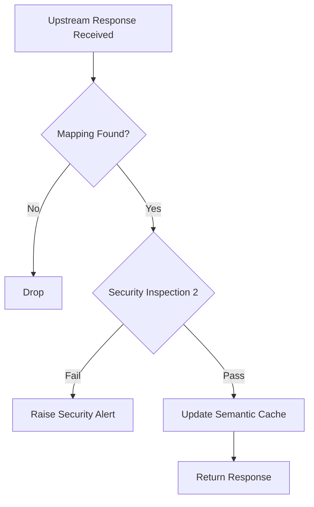
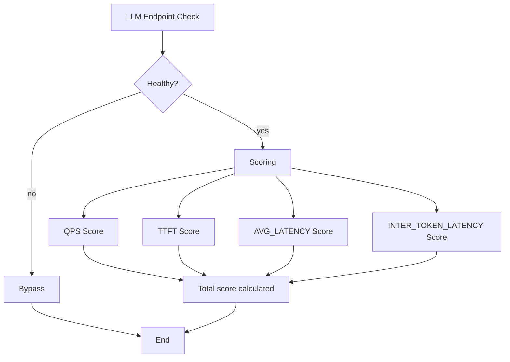

ASE LLM Load Balancer

# Introduction

LLM inference traffic behaves very differently from traditional web traffic. Request cost depends on prompt and generation token volume, responses are often long-lived because of token streaming, GPU memory is stateful because of KV-cache locality, and overall throughput is strongly influenced by batching efficiency and queue state rather than by simple request counts. Because of these characteristics, conventional load-balancing strategies that only observe connections or request rates cannot consistently deliver good utilization, latency, and resilience for LLM backends.

There are some LLM-aware load balancers in the market like lld-d, vLLM production stack and nvidia Dynamo which are mostly based on Kubernetes-native cluster, and can support limited vendors of LLM engines, and generally have LLM engine pool included in the cluster, so the schedulers can be aware of the metrics of LLM engine and KV cache events. vLLM production stack supports "static-backends" which means the LLM engines are not in the Kubernetes-native cluster. In this case, the scheduler is down-graded to a light-LLM-aware scheduler which only is based on LLM engine remote metrics and local LLM request and response statistics.

ASE LLM Load Balancer is designed as a light-LLM-aware scheduling component that works together with the ASE semantic router and security gateway to load balance the LLM requests to external LLM enignes. It selects backend LLM endpoints by combining local request context with upstream engine health, and request and response local statistics. The design goal is to provide secure, cost-efficient, resilient, and performance-aware routing across heterogeneous LLM servers.

This document describes the problem background, the architecture of the ASE LLM router and load balancer, the core endpoint and connection abstractions, the vendor adapter layer used to normalize health, capability, and metrics data from different LLM engines, and the scheduling algorthism used to make light-engine-aware balancing decisions. The first development stage focuses on HTTP/2-based LLM inference APIs.

## Background

The problems in current LLM routers are: 

- Semantic router enhancements based on current API gateways like Kong AI Gateway and Cloudflare AI Gateway，not natively designed as semantic router, use policy/rules and plugins to do partially semantic router enhancements. 
- Designed and focused on semantic router model selection, no load balancer function like semantic-router and RouteLLM.
- Designed as semantic router and works as a plugin in web proxy (e.g. Envoy)like vLLM semantic router. load balancer function mostly depends on web proxy L4/L7 load balancer with limited LLM-aware scheduler.
- vLLM production stack, llm-d and nvidia Dynamo add a load balancer and resource scheduler layer over LLM engines, generally used in a Kubernetes-native cluster, and function as engine-aware scheduler to achieve better peformance. The problem is all the three can onlys support limited vendors of LLM engines because of compatibility of metrics/KV event of different LLM engine vendors.

ASE works as an important component of security gateway between internal network and external network, it mostly works as a web proxy and naturely can serve as a LLM semantic router and load balancer. There is some key competitive differentiations that ASE can provide more advanced security features on the LLM request and response traffics.

## Scope

The first development stage focuses on HTTP/2-based RESTful APIs. HTTP/1.1 and gRPC are out of scope for this stage. Unless otherwise specified, all references to HTTP in this document mean HTTP/2.

# System Architecture

This section defines the major functional components and normative behavior of ASE LLM Load Balancer. In the text below, capitalized terms such as `MUST`, `SHOULD`, and `MAY` indicate requirement strength in the customary specification sense.

## ASE LLM Router and Load Balancer Block Diagram

<div align="center">

</div>

## Major LLM Request Processing Flow


A request MUST be processed in the following logical order: request validation, optional semantic cache lookup, security inspection, semantic route selection, endpoint load balancing, connection mapping creation, and upstream forwarding. An implementation MAY collapse these stages internally, but it MUST preserve the same externally observable behavior.

## Major LLM Response Processing Flow



An upstream response MUST be correlated with the corresponding client-side request context before it is emitted. If no valid mapping exists, the response MUST be discarded or handled according to implementation-specific error policy; it MUST NOT be forwarded to an unrelated client stream. Successful responses MAY be written back into semantic cache subject to cache policy.

## LLM Listener

The LLM Listener is the client-facing entry point for inference traffic. It MUST accept requests on configured service ports and bind them to the LLM service processing pipeline.

Routing decisions MUST be made per request rather than per transport connection. Accordingly, two requests received on the same client connection MAY be forwarded to different backend LLM endpoints.

## Ports

Ports MAY be used for TCP, TLS and HTTP processing, authentication, administrative access, or other deployment-specific functions.

Their detailed internal behavior is out of scope for this document unless explicitly referenced by the LLM service path.

## LLM RESTful Service Interface

From the client perspective, ASE exposes a single logical LLM inference service. That service MUST provide, at minimum, the following control interfaces:

- Model list
  The model list MUST be derived from ASE configuration. It MUST NOT be synthesized by merging all models advertised by upstream endpoints. If a request names an explicit model that is not configured in ASE, the request MUST be rejected before semantic routing or load balancing.

- Health status
  The service MUST expose a liveness endpoint representing the health of the ASE LLM service itself.

- Readiness status
  The service MUST expose a readiness endpoint indicating whether the service is able to accept inference traffic.

All other inference requests are treated as relay traffic. They MUST be forwarded only after validation, security inspection, semantic route selection, and endpoint scheduling have succeeded.

## Semantic Router

The semantic router determines the target model or endpoint pool that satisfies request semantics, capability constraints, and policy requirements.

That function is specified separately in [ASE Semantic Router](./ase_semantic_router.md). The load balancer defined here operates after semantic routing and assumes that a candidate cluster has already been selected.

## Semantic Caching

Semantic caching MAY short-circuit backend execution when a sufficiently similar prior request has a reusable response.

After a request/response exchange completes successfully, ASE MAY persist a semantic representation of the request together with response metadata and payload in a vector-capable store. On a subsequent request, ASE MAY compare the new request against cached entries before upstream forwarding.

Any cache hit MUST satisfy configured similarity, freshness, and policy constraints before the cached response is returned. A dedicated vector store such as Milvus or Redis MAY be used for storage, retrieval, and aging. Storage topology, eviction policy, and multi-tier cache design are outside the scope of this document.

## Load Balancer

The load balancer selects one upstream endpoint from the candidate cluster chosen by the semantic router.

The following subsections define the required data structures and scheduling behavior.

### Core Data Structures

#### LLM Cluster

An LLM cluster is the unit of backend scheduling for one advertised model. In the current design, one logical model maps to exactly one cluster, and one cluster contains one or more LLM endpoints.

This separation allows semantic routing to resolve model selection firstly and endpoint scheduling secondly.

#### LLM Endpoint

An LLM endpoint is an upstream LLM service provider. And most of schedule factors are based on LLM service endpoint like healthy check, connection pool, statistics,  failover and fault isolation, etc.

##### Connection Pool

Each endpoint MUST maintain protocol-specific connection pools. HTTP/1.1 and HTTP/2 pools are logically distinct. The first development stage only requires HTTP/2 support.

The following cluster-scoped parameters control upstream connection reuse:

- `max_connections`
  Maximum persistent transport connections to the endpoint.

- `max_concurrent_streams`
  Maximum concurrent HTTP/2 streams per connection.

- `max_requests_per_connection`
  Maximum requests served on a single transport connection before graceful drain and close.

Connections MAY be pre-established and reused. Streams MUST be allocated per request and MUST be released when the corresponding response completes or terminates.

##### Failover and Fault Isolation

When health probing marks an endpoint unhealthy, the scheduler MUST stop assigning new requests to that endpoint.

The implementation SHOULD drain or clear the affected connection pool according to configured failure policy. When the endpoint returns to healthy state, the pool MAY be recreated and the endpoint MAY re-enter the eligible scheduling set.

##### DNS Resolution

An endpoint MAY be configured as either an IP address or a domain name. If a domain name is used, the DNS subsystem is responsible for resolving one or more IP addresses.

Each doamin name MAY be resolved as one or multiple schedulable endpoints according to the configured DNS type:

- `strict_dns`
  All currently resolved addresses MUST be treated as distinct endpoints. The resolver SHOULD poll periodically so that newly added addresses are admitted and removed addresses are withdrawn.

- `logical_dns`
  In this type, only the first IP address which DNS returned and used for LLM endpoint.

In this mode, each domain name maps to one LLM endpoint.

##### API Key

An endpoint configuration MAY include an upstream API key or equivalent credential. Such credentials are typically used for upstream authentication, authorization, tenant identification, or billing.

#### Connection Mapping Table

| Client IP | Client Port | Client Stream ID | Upstream IP | Upstream Port | Upstream Stream ID |
| --------- | ----------- | ---------------- | ----------- | ------------- | ------------------ |
| 1.1.1.1   | 1000        | 100              | 10.10.10.10 | 2000          | 300                |
| 2.2.2.2   | 3000        | 200              | 20.20.20.20 | 4000          | 500                |

The Connection Mapping Table binds client-side request context to the selected upstream transport context.

A mapping MUST be created after endpoint selection and before the request is forwarded upstream. The response path MUST consult this table to locate the correct client-side connection and stream.

The mapping MUST be removed when the request completes, fails terminally, or is cancelled.

### Vendor Adapter Layer

The Vendor Adapter Layer normalizes backend-specific interfaces for health, capability discovery, and runtime metrics. Each adapter MUST translate engine-native data into ASE's internal schema without inventing values that are not actually available from the upstream engine.

#### Health Checking

Health checking determines whether an endpoint is eligible for scheduling. Probes MAY use HTTP, gRPC, TCP connection establishment, or provider-native methods.

Probe method, interval, timeout, and failure thresholds MUST be configurable. Health state transitions SHOULD be propagated to the scheduler promptly enough to avoid continued routing to failed endpoints.

#### LLM Engine Capability Discovery

Adapters SHOULD discover and normalize the capabilities required by semantic routing and load balancing. Relevant capability fields MAY include:

- model list
- semantic capabilities: completion, chat, embedding, rerank, classify, tool calling, structured output, vision, audio, transcription
- operational capabilities: context length, maximum input tokens, maximum total tokens, maximum concurrency, streaming support, quantization mode

If LLM engine capabilities are used for load balancer, capabilities SHOULD be fetched during startup and MAY be refreshed periodically. The refresh interval SHOULD be configurable and is expected to be on the order of hours rather than seconds.

#### LLM Engine Metrics

The metrics from LLM engine is an important source for engine-aware load balancer scheduler. Generally there are queue-level，resource utilization, latency, throughput and other miscellaneous statistics.   

##### Metric Categories

The scheduler MAY consume the following metric categories when available:

- Queue metrics: `num_running_requests`, `num_waiting_requests`, `num_swapped_requests`
- Resource utilization: KV cache usage, memory usage, cache hit rate, prefix cache hit rate
- Latency metrics: time to first token (TTFT), time per output token (TPOT), end-to-end latency
- Throughput metrics: prompt tokens, generation tokens, iteration tokens
- Reliability metrics: request success rate, request error rate, request cancellation rate

##### Metrics Scraper

If LLM engine metrics are used for load balancer, then a metrics scraper is used to poll realtime metrics of LLM endpoints periodically.

The metrics scraper MUST poll or subscribe to backend metrics at a configurable interval. The sampling interval SHOULD balance freshness against scrape cost.

Metrics older than a configured freshness threshold SHOULD be treated as stale and SHOULD receive reduced or zero weight in the scheduler.

### Schedule Algorithsm

As mentioned before, there are no unified LLM engine capabilities, metrics and KV events defined across the industry.

Considering the compatibility requirement, ASE uses a general and reliable way to do load balancing, which is be based on the local LLM request and response statistics, refered as light-LLM-aware, as to the metrics and capabilities of remote LLM engine, will not be considered currently.

So the proposal schedule algorithms are: round robin/weighted round robin/IP-Hash/light-LLM-aware.

As to the algorithsm of light-LLM-aware, it's based on the following local statistics of LLM requests and responses:

- Query per second(QPS)
- Time To First Token(TTFT)
- average latency
- average inter-token latency

```C
#define ASE_LLM_LB_QPS_WEIGHT 0.2
#define ASE_LLM_LB_TTFT_WEIGHT 0.15
#define ASE_LLM_LB_AVG_LATENCY_WEIGHT 0.15
#define ASE_LLM_LB_INTER_TOKEN_LATENCY_WEIGHT 0.10

# Gain normalization, the bigger, the better
gain_normalize(val) = (val - val_min) / max(val_max - val_min, eps)

# Cost normalization, the smaller, the better
gain_normalize(val) = (val_max - val) / max(val_max - val_min, eps)

Note: eps is a very small positive number used to prevent division by zero or numerical instability.

qps_score = 1 - gain_normalize(qps)
ttft_score = 1 - cost_normalize(ttft)
latency_score = 1 - cost_normalize(latency)
inter_token_latency_score = 1 - cost_normalize(inter_token_latency)

total_score =
    ASE_LLM_LB_QPS_WEIGHT * qps_score
  + ASE_LLM_LB_TTFT_WEIGHT * ttft_score
  + ASE_LLM_LB_AVG_LATENCY_WEIGHT * latency_score
  + ASE_LLM_LB_INTER_TOKEN_LATENCY_WEIGHT * inter_token_latency_score

The highest total_score is the choice. 
```

The load balancer schedule algorthism processing flowchart as below:



Finally the highest total score LLM endpoint is selected, if all unhealthy, then reject this request. 

# LLM Service RESTful APIs

This section defines the minimum management and observability endpoints exposed by the ASE LLM service. Unless otherwise specified, request examples are shown as HTTP `GET` operations and successful control responses are represented as JSON bodies.

## Management Endpoints

### Models

The `GET /v1/models` endpoint returns the model catalog advertised by ASE. The response MUST include only models configured in ASE and eligible for routing.

- Request

```http
GET /v1/models
```

- Response

```json
{
  "data": [
    {
      "id": "meta-llama/Llama-2-7b-chat-hf"
    }
  ]
}
```

### Health Check

The `GET /health` endpoint reports the liveness of the ASE LLM service.

- Request

```http
GET /health
```

- Healthy response

```json
{
  "status": "ok"
}
```

- Unhealthy response

```http
HTTP/1.1 500 Internal Server Error
```

### Readiness

The `GET /ready` endpoint reports whether the ASE LLM service is ready to accept inference traffic.

- Request

```http
GET /ready
```

- Ready response

```json
{
  "status": "ok"
}
```

- Not-ready response

```http
HTTP/1.1 500 Internal Server Error
```

### Metrics

The `GET /metrics` endpoint exposes router and load-balancer observability data. The exact response schema is implementation-defined and MAY follow Prometheus, OpenMetrics, JSON, or another deployment-standard format.

- Request

```http
GET /metrics
```

- Response

```text
<metrics payload>
```

## Operational Debuggability

The implementation SHOULD provide end-to-end traceability for validation, security inspection, semantic routing, endpoint scheduling, upstream forwarding, and response handling.

The implementation SHOULD also define dedicated debug log categories and configurable verbosity levels for both the semantic router and the load balancer so that route decisions and endpoint-selection outcomes can be audited during troubleshooting.

# Configuration

This section illustrates the major configuration surfaces required by ASE LLM Load Balancer. Field names are illustrative; an implementation MAY use different names provided that it preserves equivalent semantics.

```yaml
config:
  listeners:
    - name: http-8899
      address: 0.0.0.0
      port: 8899
      timeout_seconds: 300

  providers:
    models:
      - name: base-model
        reasoning_family: qwen3
        provider_model_id: qwen3-8b
        backend_endpoints:
          - name: primary-vllm
            endpoint: vllm-llama3-8b-instruct.default.svc.cluster.local:8000
            vendor: vLLM
            dns_type: STATIC/STRICT_DNS/LOGICAL_DNS
            dns_lookup_family: V4_ONLY/V6_ONLY/AUTO
            protocol: http2
            api_key: xxxxxxxxxxxxxxxxxxxxxxxxxxxx
            weight: 100

  load_balancer:
    strategies:
      - round robin/weighted round robin/IP-Hash/Least-conn/light-LLM-aware
```

# References

[1] vLLM v1 LLM Engine Metrics https://docs.vllm.ai/en/v0.8.5/design/v1/metrics.html

[2] Envoy Load Balancing Overview https://docs.vllm.ai/en/v0.8.5/design/v1/metrics.html

[3] llm-d architecture https://llm-d.ai/docs/architecture

[4] nvidia dynamo architecture https://docs.nvidia.com/dynamo/v-0-8-0/design-docs/overall-architecture

[5] vLLM Production Statck Request Stats https://docs.vllm.ai/projects/production-stack/en/vllm-stack-0.1.3/dev_guide/dev_api/request-stats.html

[6] vLLM metrics https://docs.vllm.ai/en/stable/design/metrics.html

[7] SGLang metrics https://docs.sglang.ai/references/production_metrics.html

[8] TGI metrics https://huggingface.co/docs/text-generation-inference/main/en/reference/metrics

[9] ollama metrics https://github.com/ollama/ollama/blob/main/docs/api/usage.mdx and https://github.com/ollama/ollama/blob/main/docs/api.md#list-running-models


