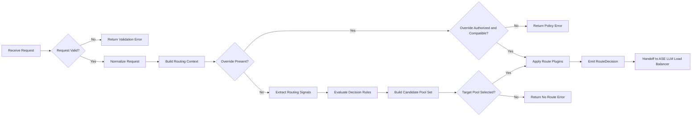
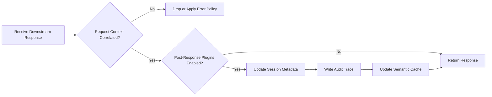
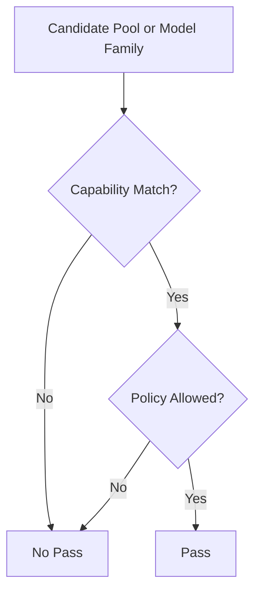
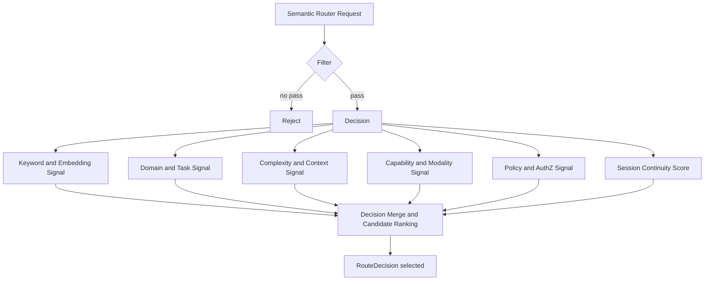

# ASE Semantic Router

## Introduction

In the inference control plane, semantic routing and load balancing are distinct decisions. Semantic routing selects a legal capability path, model family, or target pool from normalized request context and governance constraints. Load balancing selects a healthy backend endpoint within that pool. ASE Semantic Router therefore operates on request semantics rather than transport metadata and MUST emit an explainable, auditable `RouteDecision`.

Static model pinning and transport-only routing are insufficient for LLM workloads. Prompt content may imply modality, reasoning depth, context-window, privacy, tenant, or compliance constraints before inference begins. ASE Semantic Router resolves those constraints before dispatch and hands a stable `RouteDecision` contract to ASE LLM Load Balancer. The design follows the general direction of signal-driven routing systems such as vLLM semantic-router, semantic-router, RouteLLM, Kong AI Gateway, and Cloudflare AI Gateway, while keeping semantic selection separate from endpoint scheduling so that policy and audit controls are enforced before execution.

## Background

Many LLM routing systems extend API gateways with prompt classification or provider selection, but they often interleave semantic interpretation, policy enforcement, and backend dispatch. That coupling makes route selection harder to explain, govern, and audit. ASE treats semantic routing as a separate request pipeline whose output is a pool-level decision, not an endpoint choice.

## Conventions and Terminology

The uppercase keywords `MUST`, `SHOULD`, and `MAY` in this document indicate normative requirements. When those words appear in lowercase, they are used in their ordinary descriptive sense.

In this document, Semantic Router refers to the stage that selects a legal capability path and target pool. Load Balancer refers to the downstream stage that selects a concrete backend endpoint within that pool. A target pool is therefore a semantic dispatch domain rather than an individual provider endpoint or replica.

## Scope

The first development stage supports OpenAI-compatible HTTP/2 REST APIs only. HTTP/1.1 and gRPC northbound interfaces are outside the scope of this stage. Unless otherwise specified, all references to HTTP in this document mean HTTP/2.

Within this scope, the module owns request normalization, signal extraction, capability and policy filtering, target-pool selection, continuity-aware semantic escalation, post-decision plugin execution, and emission of the `RouteDecision` handoff contract. It does not own backend health checks, queue-aware dispatch, connection pooling, retry behavior, or endpoint scoring; those responsibilities belong to ASE LLM Load Balancer.

## System Architecture

### ASE Semantic Router Block Diagram

<div align="center">

</div>

The end-to-end request path is `Client -> Semantic Router -> Load Balancer -> Model Pool / Endpoint -> vLLM Server`. At the semantic control-plane boundary, the same path is `Request -> SR: semantic decision -> LB: instance selection -> Backend: inference execution`.

The following flows describe the stages owned by ASE Semantic Router. They do not restate endpoint scheduling, backend health evaluation, or transport-level dispatch, which are responsibilities of ASE LLM Load Balancer.

### Semantic Router Request Path



The request path MUST normalize the inbound payload into a canonical routing context before semantic selection begins. When an explicit model or route override is present, the override MAY bypass rule evaluation, but it MUST still pass authorization, capability, and policy compatibility checks. When no override applies, the router MUST extract routing signals, evaluate decision rules, derive a legal candidate pool set, and emit a single explainable `RouteDecision` for downstream scheduling.

### Semantic Router Response and Post-Processing Path



The response path begins only after the downstream response has been correlated with the original request context. If no valid correlation exists, the router MUST drop the response or apply implementation-specific error policy; it MUST NOT attach post-processing state to an unrelated request. Post-response plugins MAY update session continuity metadata, audit trace state, and semantic cache entries before the response is returned to the caller.

### LLM Listener

The LLM listener terminates northbound API traffic and constructs the request context required by semantic routing. Routing is evaluated per request, not per connection; requests on the same transport session MAY resolve to different pools when prompt meaning, policy state, or session metadata differs. The service SHOULD preserve a stable request identifier across routing, dispatch, and response handling.

### Port Model

The architecture includes transport-adjacent modules for TLS termination, HTTP handling, authentication, and operational management. These modules are dependencies of the service, but their internal design is outside the scope of this document.

### Northbound LLM REST API Service

The router MUST expose model discovery and standard management endpoints such as model listing, health, readiness, and metrics. The exposed model list represents configured semantic entry models or route aliases, not a full inventory of backend provider models. An explicit `model` value outside that entry surface MUST be rejected or mapped explicitly to a legal target pool by policy.

Inference requests are handled as routed relay traffic. The router resolves the semantic route, enriches the request with routing metadata, and forwards the result to ASE LLM Load Balancer for endpoint-level scheduling.

### Semantic Router

#### Core Data Structures

##### Routing Context

A routing context is the canonical object used by semantic routing.

| Routing Context Class | Major fields | Purpose |
| --------------------- | ------------ | ------- |
| Request Content | messages, prompt text, system instructions, tool requirements, multimodal metadata, output format requirement | Describe what the request is asking for |
| Control Metadata | `model`, `routing_hint`, `route_override`, `preference`, `input_tokens_estimate`, debug flags | Express caller routing intent or optimization hints |
| Identity and Governance Context | tenant identity, user class, authorization scope, privacy tags, compliance tags, provider restrictions | Constrain what the caller is allowed to use |
| Session Context | `session_id`, previous route class or target pool, continuity preference, escalation history | Preserve continuity across multiple turns when appropriate |

##### Model Card

A model card is the route-visible model-family definition used by semantic routing to derive a pool decision.

Each routable semantic entry or model family SHOULD expose an identifier, capability class, target-pool mapping, routing tags, supported capabilities and modalities, context-window limits, optional quality/latency/cost attributes, optional reasoning or LoRA variants, and any governance or tenant restrictions relevant to route selection.

A semantic entry or model family is not a concrete backend endpoint. A target pool MAY map to multiple provider models and downstream replicas, while endpoint health and queue metrics remain outside the ownership of model cards.

##### Decision Rule

A decision rule is the semantic route rule defined in `routing.decisions`.

Each decision rule SHOULD contain a name, priority, typed conditions with logical composition, a candidate `modelRefs` set, a selection algorithm, and optional plugins. Decision rules define the legal route space for a request; they do not select the final backend endpoint.

##### Major Interface Objects

The module boundary consists of four major objects:

| Object | Owned by | Major fields | Purpose |
| ------ | -------- | ------------ | ------- |
| Request | Client or gateway | prompt, messages, metadata, identity, session | Original request entering semantic routing |
| RouteDecision | Semantic Router | `route_class`, `target_pool`, `model_family`, `safety_profile`, `cache_policy`, `routing_confidence`, `fallback_pools` | Formal SR to LB handoff contract |
| SchedulingContext | Load Balancer | pool members, health, load, latency, locality, admission status | Runtime scheduling state owned by LB only |
| DispatchResult | Load Balancer | selected endpoint, replica, region, dispatch reason | Final execution result after scheduling |

##### Signal Set

A signal is a typed routing feature extracted from the request context.

Depending on deployment requirements, ASE Semantic Router MAY use keyword, embedding, domain, language, complexity, context, modality, preference, authorization, jailbreak, and PII signals. Not every deployment requires every signal family, and not every request requires every extractor to run.

##### Session Continuity Metadata

Session continuity metadata MAY include `session_id`, the previous route class or target pool, the last escalation reason, a continuity preference, and conversation history. It is an optimization input rather than a hard override and MUST NOT bypass hard capability or policy constraints.

#### Request Normalization

The request normalizer converts inbound OpenAI-compatible API traffic into a canonical routing object consumed by later stages.

ASE Semantic Router SHOULD support the following semantic-routing-aware controls:

| Field | Purpose | Constraint |
| ----- | ------- | ---------- |
| `model=auto` | Request semantic route selection | Default path for routed traffic |
| `model=<explicit-model>` | Request a specific semantic entry model or model family directly | Still subject to capability and policy validation, then mapped to a legal target pool |
| `routing_hint` | Provide a coarse semantic hint such as `code`, `reasoning`, `extract`, `vision` | Advisory only; MUST NOT bypass policy |
| `route_override` | Request a specific capability path or target-pool alias | Restricted to authorized callers |
| `preference` | Express latency, cost or quality bias | Optimization input only |
| `input_tokens_estimate` | Provide a caller-side prompt-size estimate | Advisory signal only |
| `session_id` | Preserve multi-turn continuity context | Optional unless continuity policy requires it |
| `debug` or `explain` | Request routing diagnostics | Restricted and redacted for trusted callers only |

The precedence order MUST be explicit. Hard capability and policy constraints are evaluated first, authorized explicit model requests or route overrides second, and continuity or optimization preferences only after eligibility is established. ASE SHOULD route at request granularity rather than pinning an entire session to one pool.

#### Signal Extraction Layer

The signal extraction layer SHOULD compute cheap signals first, invoke expensive extractors only when they materially affect the decision, keep outputs explicit and typed, and avoid hidden heuristic logic in the request path. Supporting modules MAY include an embedding service, classifier service, token estimator, jailbreak detector, PII detector, tool catalog, and semantic cache. These services are subordinate to the routing pipeline; the explicit signal set remains the source of truth for semantic decisions.

Within `routing.decisions`, `modelRefs` remains the canonical upstream configuration term. In ASE split mode, `modelRefs` is an input to semantic route selection, while `RouteDecision.target_pool` is the primary output consumed by ASE LLM Load Balancer.

#### Hard Constraint and Policy Filter

Before any optimization among candidate pools or model families, the request MUST pass hard capability and policy checks.

The filter evaluates request validity, explicit-override authorization, capability and modality matching, context-length and token-limit constraints, tenant restrictions, provider allowlists or denylists, privacy and compliance tags, jailbreak policy, and PII-sensitive routing restrictions.

The filter processing flowchart is below:



#### Decision Engine and Pool Selection

The route-decision algorithm MUST use normalized request context, extracted signals, configured decision rules and candidate pools or `modelRefs`, logical model capabilities and pool mappings, and any applicable continuity or caller preferences. Unlike ASE LLM Load Balancer, semantic routing MUST NOT use backend queue depth, endpoint health, or connection-pool runtime state to choose the target pool.

The semantic routing processing flowchart is below:



In this flow, the Filter module evaluates request validity, hard capability constraints, and policy constraints. The Decision Merge and Candidate Ranking phase is bounded by the matched `routing.decisions` rule and the legal candidate pools and `modelRefs` associated with that rule.

Supported route-selection strategies MAY include static priority, quality-first selection, cost-aware selection, latency-aware selection based on model-level attributes, and hybrid policy-aware ranking.

For specification and design review, the route decision SHOULD be modeled as constrained selection over legal candidate pools rather than as a chain of implementation helper functions.

Let `r` denote the normalized request context and let `P = {p1, p2, ..., pn}` denote the candidate serving pools derived from the matched routing rule. For each request-pool pair `(r, p)`, the router evaluates two hard-feasibility predicates:

- `capability_feasible(r, p)`: true only when modality, context-window, and required capability constraints are satisfied.
- `policy_feasible(r, p)`: true only when tenant, compliance, privacy, and abuse-policy constraints are satisfied.

The legal candidate set is therefore:

```text
F(r) = { p in P | capability_feasible(r, p) and policy_feasible(r, p) }
```

For each `p in F(r)`, the router computes a bounded utility score:

```text
U(r, p) = w1*S_sem(r, p) + w2*S_cont(r, p) + w3*S_pref(r, p) + w4*S_pool(r, p)

S_sem(r, p)  = a1*s_keyword(r, p)
             + a2*s_embedding(r, p)
             + a3*s_domain(r, p)
             + a4*s_complexity(r, p)

S_cont(r, p) = 1, if a valid previous session exists and p remains valid
             = 0, otherwise

S_pref(r, p) = b1*s_latency(r, p) + b2*s_cost(r, p) + b3*s_quality(r, p)
```

The selected pool is the maximizer over the legal candidate set:

```text
p* = argmax_{p in F(r)} U(r, p)
```

If `F(r)` is empty, the router MUST return a semantic rejection or an explicitly configured fallback outcome. Once `p*` is selected, the router constructs a `RouteDecision` containing the chosen `route_class`, `target_pool`, `model_family`, and `safety_profile`.

A clear non-normative pseudocode form is shown below:

```text
Algorithm: Constraint-Aware Route Selection

Input:
    request r
    candidate pools P

Output:
    RouteDecision or rejection/fallback

1. F <- empty set
2. for each p in P do
3.     if not capability_feasible(r, p) then
4.         continue
5.     end if
6.     if not policy_feasible(r, p) then
7.         continue
8.     end if
9.     score(p) <- w1*S_sem(r, p)
10.               + w2*S_cont(r, p)
11.               + w3*S_pref(r, p)
12.               + w4*S_pool(r, p)
13.     add p to F
14. end for
15. if F is empty then
16.     return reject_or_fallback(r)
17. end if
18. p* <- argmax score(p) over p in F
19. return build_route_decision(r, p*)
```

This formulation makes the module boundary explicit: hard capability and policy constraints define the feasible set first; semantic, continuity, and preference signals optimize only within that legal set; and the output of the module is a `RouteDecision` rather than a backend endpoint selection. Semantic Router selects the capability pool; Load Balancer selects the concrete serving replica.

#### Plugin Chain and Handoff Contract

After route selection, the module MAY execute per-decision plugins such as safety tagging, audit annotation, semantic-cache hooks, prompt rewrite, tracing, or retrieval augmentation.

The module then emits a formal `RouteDecision` plus any compatibility fields required by downstream execution. This object is the handoff artifact to ASE LLM Load Balancer.

| Field | Requirement level | Purpose |
| ----- | ----------------- | ------- |
| `route_class` | Required | Capability path chosen by semantic routing |
| `target_pool` | Required | Primary dispatch contract consumed by ASE LLM load balancer |
| `model_family` | Optional | Preferred model family inside the selected pool |
| `latency_tier` | Optional | Scheduling hint for latency class |
| `cost_tier` | Optional | Scheduling hint for cost class |
| `safety_profile` | Optional | Required safety posture for downstream handling |
| `cache_policy` | Optional | Cache and reuse policy hint |
| `routing_confidence` | Optional | Confidence of the semantic decision |
| `fallback_pools` | Optional | Explicit cross-pool fallback policy allowed by semantic or gateway policy |
| `request_id` | Required | Stable request identity across routing, dispatch and observability |
| `route_decision_status` | Required | Distinguish successful routing from semantic rejection |
| `matched_decision` | Optional | Identify which semantic decision rule matched |
| `route_reason` | Optional | Preserve operator-readable routing rationale |
| `policy_tags` | Optional | Carry governance annotations that may matter downstream |
| `debug_trace_id` | Optional | Correlate routing decisions with trace and logs |
| `continuity_metadata` | Optional | Preserve session-related context |
| `model` or projected route header | Optional | Compatibility field only; not the sole dispatch contract in ASE split mode |

At a minimum, every emitted `RouteDecision` MUST include `route_class`, `target_pool`, `request_id`, and `route_decision_status`. Optional fields MAY be omitted when not applicable or when withheld by policy.

At this boundary, `target_pool` is the primary dispatch contract. `model_family` or a normalized `model` value are compatibility hints only. ASE LLM Load Balancer MUST schedule within the selected pool and MUST NOT reinterpret prompt semantics.

An example `RouteDecision` object is shown below.

```json
{
  "route_class": "reasoning",
  "target_pool": "reasoning_pool",
  "model_family": "qwen3-32b",
  "latency_tier": "standard",
  "cost_tier": "medium",
  "safety_profile": "default",
  "cache_policy": "allow",
  "routing_confidence": 0.91,
  "fallback_pools": ["general_large_pool", "review_pool"],
  "request_id": "req-123456",
  "route_decision_status": "ok",
  "matched_decision": "computer_science_reasoning",
  "route_reason": "domain=code;complexity=high;policy=allowed",
  "policy_tags": ["tenant:default", "privacy:standard"]
}
```

#### Interaction with ASE LLM Load Balancer

The interaction with the downstream load-balancing module is intentionally narrow. ASE Semantic Router MUST emit a `RouteDecision` whose primary dispatch contract is `target_pool`. ASE LLM Load Balancer MUST consume that pool directly and perform instance-level scheduling only within the declared pool. Policy tags and route metadata MAY constrain dispatch behavior, but they MUST NOT reopen semantic route selection during normal operation.

Two deployment modes MAY be supported. In upstream-compatible integrated mode, the service MAY project route headers or destination hints for gateway integration. In ASE split mode, the semantic router emits `RouteDecision` plus routing metadata and delegates final endpoint selection to ASE LLM Load Balancer. ASE split mode is preferred.

Fallback behavior MUST preserve the same boundary. Infrastructure fallback keeps the target pool fixed while ASE LLM Load Balancer switches to another healthy replica within that pool. Cross-pool fallback is allowed only when semantic routing or gateway policy declares it explicitly, for example through `fallback_pools`.

#### Semantic Failure Classes

| Failure class | Meaning | Typical cause |
| ------------- | ------- | ------------- |
| No Matching Decision | No configured semantic route matched the request signal set | Missing fallback route, unsupported workload shape, insufficient signal confidence |
| No Eligible Pool | No legal capability pool or model family satisfies hard capability or deployment constraints | Missing modality support, insufficient context window, no legal pool mapping |
| Policy Denial | One or more pools or model families are technically capable, but all are forbidden by policy | Tenant restriction, provider denylist, privacy or compliance rule |
| Invalid Routing Request | The request is malformed or missing required routing context | Malformed payload, unsupported request shape, invalid override |
| Decision Engine Failure | The module failed unexpectedly during routing | Internal evaluation failure, signal extraction failure, plugin error |
| Deferred Infrastructure Failure | Semantic routing succeeded, but downstream execution later failed | Endpoint unavailable, dispatch failure, retry exhaustion in ASE LLM Load Balancer |

## Management and Discovery APIs

ASE Semantic Router exposes the following non-inference endpoints for discovery, liveness, readiness, and telemetry.

### Models

The service MUST expose `GET /v1/models` for discovery of semantic entry models and route aliases.

```text
GET /v1/models
```

```json
{
  "data": [
    {
      "id": "general-small"
    },
    {
      "id": "code-large"
    }
  ]
}
```

### Health Check

The service MUST expose `GET /health` as the liveness probe for ASE Semantic Router.

```text
GET /health
```

When healthy, it SHOULD return:

```json
{
  "status": "ok"
}
```

When unhealthy, it MAY return:

```text
HTTP/1.1 500 Internal Server Error
```

### Readiness

The service MUST expose `GET /ready` as the readiness probe for ASE Semantic Router.

```text
GET /ready
```

When ready, it SHOULD return:

```json
{
  "status": "ok"
}
```

When not ready, it MAY return:

```text
HTTP/1.1 500 Internal Server Error
```

### Metrics

The service MUST expose `GET /metrics` for router-level metrics.

```text
GET /metrics
```

```json
{
  "routing_decision_total": 0,
  "policy_denial_total": 0,
  "no_matching_decision_total": 0,
  "no_eligible_pool_total": 0,
  "signal_extraction_latency_ms": 0,
  "routing_latency_ms": 0
}
```

### Observability

Semantic routing MUST be traceable through logs and telemetry across the ASE processing path. The implementation SHOULD expose diagnostic levels for request normalization, signal extraction, matched decision, candidate pools after filtering, final `RouteDecision`, rejection reasons, and trace correlation. Access to these diagnostics SHOULD be restricted when they could reveal sensitive request content, policy state, or tenant metadata.

## Configuration Model

The configuration model consists of the following major surfaces. The top-level contract SHOULD remain broadly aligned with vLLM semantic-router:

```yaml
version:
listeners:
providers:
routing:
global:
```

For this module, ownership is the primary concern. The `routing` section is owned by semantic routing. The `providers` section is a required dependency but is not owned by this module. The `global` section contains router-wide runtime overrides and is likewise outside the semantic-routing boundary.

An example configuration appears below.

```yaml
version: v0.3

listeners:
  - name: http-8899
    address: 0.0.0.0
    port: 8899
    timeout: 300s

providers:
  defaults:
    default_model: general-small
    default_reasoning_effort: medium
  models:
    - name: general-small
      provider_model_id: general-small
      backend_refs:
        - name: primary
          endpoint: llm-gateway.internal:8000
          protocol: http2
    - name: code-large
      provider_model_id: code-large
      backend_refs:
        - name: primary
          endpoint: code-gateway.internal:8000
          protocol: http2

routing:
  modelCards:
    - name: general-small
      description: default text assistant
      capability_class: chat
      target_pool: general_fast_pool
      modality: text
      capabilities: [chat, tools]
      context_length: 32768
      quality: medium
      latency: low
      cost: low
      governance_tags: [tenant:default, privacy:standard]
    - name: code-large
      description: code and design reasoning model
      capability_class: reasoning_code
      target_pool: code_reasoning_pool
      modality: text
      capabilities: [chat, reasoning, long-context]
      context_length: 131072
      quality: high
      latency: medium
      cost: medium
      governance_tags: [tenant:default, privacy:standard]
      loras:
        - name: code-review-adapter
          description: adapter for code review and design prompts
  signals:
    keywords:
      - name: code_terms
        operator: OR
        keywords: ["code", "api", "debug", "refactor"]
    complexity:
      - name: needs_reasoning
        threshold: 0.75
        description: multi-step synthesis or design-heavy prompts
    pii:
      - name: sensitive_data
        enabled: true
    jailbreak:
      - name: abuse_guard
        enabled: true
  decisions:
    - name: computer_science_reasoning
      description: route software engineering requests to reasoning-capable models
      priority: 170
      rules:
        operator: AND
        conditions:
          - type: keyword
            name: code_terms
          - type: complexity
            name: needs_reasoning
      modelRefs:
        - model: general-small
          use_reasoning: false
          weight: 0.2
        - model: code-large
          use_reasoning: true
          reasoning_effort: high
          lora_name: code-review-adapter
          weight: 0.8
      route_output:
        route_class: reasoning
        target_pool: code_reasoning_pool
        model_family: qwen3-32b
        latency_tier: standard
        cost_tier: medium
        safety_profile: default
        cache_policy: allow
        fallback_pools: [general_large_pool, review_pool]
      algorithm:
        type: hybrid_policy_aware
      plugins:
        - type: audit
          configuration:
            enabled: true
        - type: system_prompt
          configuration:
            enabled: true
            mode: insert
            system_prompt: You are a senior software architect.

global:
  router:
    config_source: file
```

Semantic routing MUST remain declarative, reviewable, and versioned under the canonical `routing` surface. A conforming implementation MUST treat `routing` as the sole authority for semantic route selection. Provider `backend_refs`, endpoint weights, and execution failover remain outside this module's ownership even when they appear under `providers` or in downstream execution systems. In ASE split mode, `route_output` is the semantic-routing-owned handoff extension used to produce `RouteDecision` for ASE LLM Load Balancer.

## Verification and Conformance

A conforming implementation SHOULD be verified for both correctness of `RouteDecision` generation and preservation of the module boundary. Verification SHOULD cover request normalization, explicit overrides, malformed input handling, signal extraction, selective execution of expensive signals, redaction behavior, rule precedence, no-match handling, hard-constraint filtering, policy denial, pool selection, continuity preservation, escalation, conservative downgrade behavior, plugin and handoff validation, and observability of matched decision, selected pool, exclusion reasons, and failure code.

Existing unit and integration harnesses are sufficient if they validate the staged pipeline end to end. Otherwise, a dedicated semantic-routing harness SHOULD be added so the module can be tested independently of backend dispatch.

## Security Considerations

ASE Semantic Router processes request content that may contain sensitive prompts, user identifiers, policy metadata, and continuity state. The implementation MUST enforce authorization, privacy, compliance, and abuse-control policy before any backend model invocation. Explicit overrides and diagnostic interfaces SHOULD be treated as privileged capabilities and restricted to authorized callers.

Routing traces, policy tags, and debug outputs can expose sensitive routing rationale or tenant-specific governance state. Implementations SHOULD minimize unnecessary disclosure, redact sensitive fields where appropriate, and ensure that observability surfaces do not become an alternative path for data exfiltration or policy bypass.

## References

[1] vLLM Semantic Router documentation https://vllm-semantic-router.com/docs/intro/

[2] vLLM Semantic Router configuration documentation https://vllm-semantic-router.com/docs/installation/configuration/

[3] vLLM Semantic Router system architecture documentation https://vllm-semantic-router.com/docs/overview/architecture/system-architecture/

[4] vLLM Semantic Router Envoy ExtProc integration documentation https://vllm-semantic-router.com/docs/overview/architecture/envoy-extproc

[5] vLLM Semantic Router GitHub repository https://github.com/vllm-project/semantic-router
