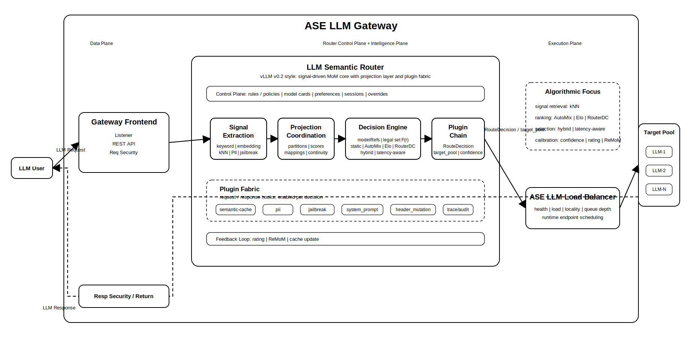
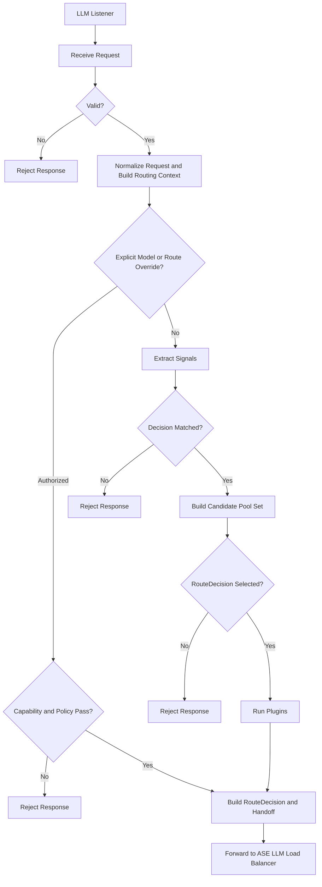
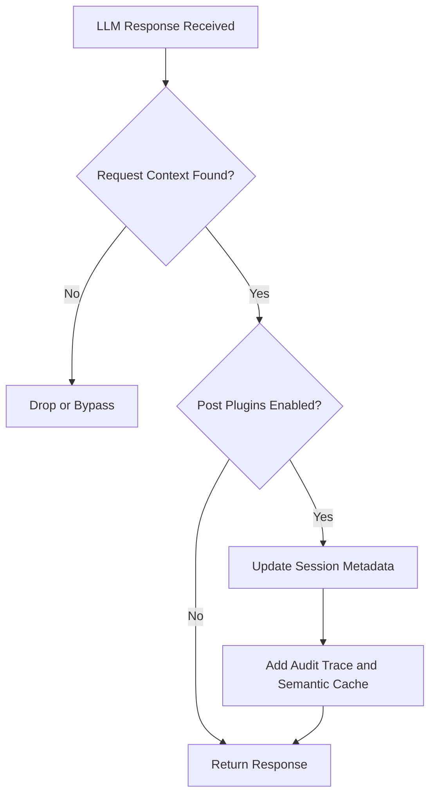
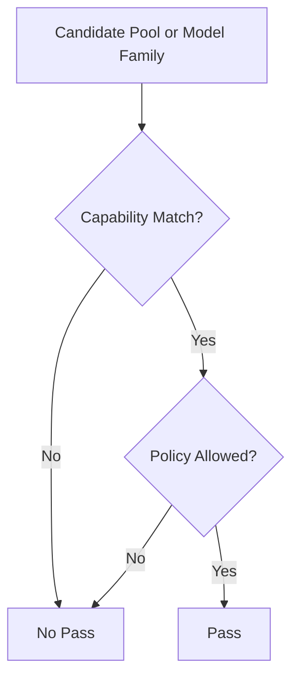
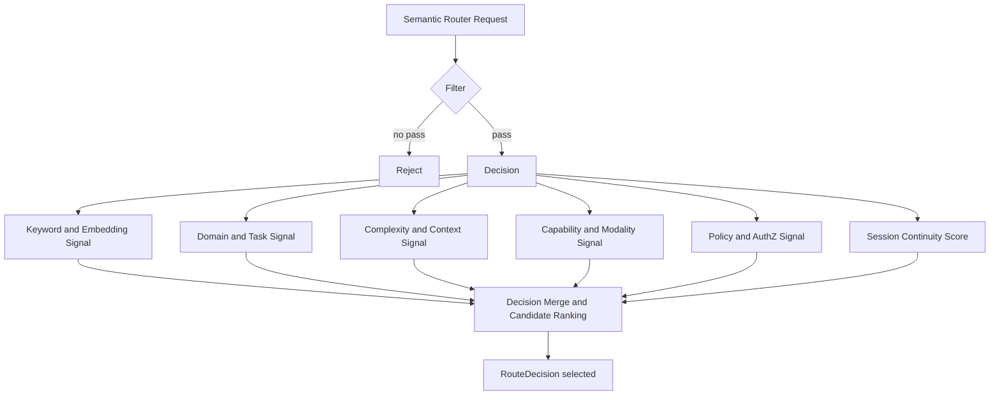

# ASE Semantic Router

## Introduction

In the inference network, semantic routing and load balancing are separate control-plane decisions. Semantic routing determines which capability path, model family, or target pool is eligible to serve a request according to request meaning, declared constraints, and governance policy. Load balancing determines which healthy backend endpoint inside that selected pool should execute the request. The semantic router therefore operates on normalized request context rather than on transport metadata alone, and it MUST produce a route decision that remains explainable to operators and auditable by policy systems.

Traditional API routing and static model pinning are insufficient for this workload. LLM requests frequently encode capability requirements implicitly in prompt content, may require different modalities or reasoning depth, and may be constrained by tenant, privacy, or compliance rules before any model invocation is allowed. If capability-path selection and backend instance scheduling are mixed together, the system loses ownership boundaries, weakens debuggability, and makes policy review harder. ASE Semantic Router addresses this by selecting a legal route class and target pool first, then handing an enriched request and a stable `RouteDecision` contract to ASE LLM Load Balancer for endpoint scheduling.

This design is informed by both open-source and commercial routing systems, including vLLM semantic-router, semantic-router, RouteLLM, Kong AI Gateway, and Cloudflare AI Gateway. ASE follows the general direction of signal-driven semantic routing, but it defines a stricter boundary between route selection and downstream load balancing so that security, governance, and audit controls can be enforced before inference dispatch. A production router in this position MUST evaluate request meaning, model capability requirements, context-window constraints, output-shape expectations, tenant policy, privacy and compliance restrictions, session continuity, and caller preferences within a single normalized routing context. Because the industry does not yet define a unified standard for semantic signal taxonomy, capability-pool description, or the contract between a semantic router and a downstream scheduler, ASE Semantic Router MUST normalize heterogeneous request inputs into a canonical routing context, compute only the signals required for the current request, and emit a stable `RouteDecision` contract that downstream systems can consume without reinterpretation. In combination with ASE LLM Load Balancer, this architecture provides policy-aware, secure, explainable, and performance-aware routing for LLM inference traffic.

## Background

Current LLM routing products often extend traditional API gateways with prompt classification or provider-selection logic, but they do not consistently model semantic routing as a first-class request pipeline for capability-path and pool selection. In many implementations, semantic interpretation, policy enforcement, and backend dispatch are interleaved, which makes it difficult to explain why a request was assigned to a given model family or service pool. This is operationally problematic because capability matching, context-window validation, modality support, tenant restrictions, and auditability requirements all belong to the route-selection stage rather than to replica scheduling.

## Conventions and Terminology

The uppercase keywords `MUST`, `SHOULD`, and `MAY` in this document indicate normative requirements. When those words appear in lowercase, they are used in their ordinary descriptive sense.

In this document, Semantic Router refers to the stage that selects a legal capability path and target pool. Load Balancer refers to the downstream stage that selects a concrete backend endpoint within that pool. A target pool is therefore a semantic dispatch domain rather than an individual provider endpoint or replica.

## Scope

The first development stage supports OpenAI-compatible HTTP/2 REST APIs only. HTTP/1.1 and gRPC northbound interfaces are outside the scope of this stage. Unless otherwise specified, all references to HTTP in this document mean HTTP/2.

Within this scope, the module is responsible for request-level capability-path and target-pool selection, request normalization and routing-context construction, signal extraction and decision matching, capability and policy filtering, session continuity and semantic escalation, plugin execution after route selection, emission of the `RouteDecision` handoff contract to ASE LLM Load Balancer, and the production of routing trace, audit, and semantic rejection outcomes. The module is not responsible for backend endpoint health checks, queue-aware or metrics-aware dispatch, upstream connection pooling, retry or redispatch behavior, backend fault isolation, or endpoint metrics polling and scoring. These responsibilities belong to ASE LLM Load Balancer.

## System Architecture

### ASE Semantic Router Block Diagram

<div align="center">

</div>

The end-to-end request path is `Client -> Semantic Router -> Load Balancer -> Model Pool / Endpoint -> vLLM Server`. At the semantic control-plane boundary, the same path is `Request -> SR: semantic decision -> LB: instance selection -> Backend: inference execution`.

### Major LLM Request Processing Flow



### Major LLM Response Processing Flow



### LLM Listener

The LLM listener terminates northbound LLM API traffic on the configured L4 port and constructs the request context required by semantic routing.

Semantic routing is evaluated per request rather than per connection. Two requests arriving over the same client session or transport connection MAY be resolved to different target pools when prompt meaning, policy state, or session metadata differs.

ASE Semantic Router SHOULD preserve a stable request identifier across semantic routing, downstream load balancing, and final response handling so that route decisions remain traceable after execution.

### Port Model

The architecture includes transport-adjacent modules for TLS termination, HTTP handling, authentication, and operational management.

Those modules are architectural dependencies of the service, but their internal design is outside the scope of this document.

### Northbound LLM REST API Service

ASE Semantic Router is the northbound LLM service surface presented to clients.

The router MUST expose model-discovery and standard management endpoints such as model listing, health status, readiness status, and metrics. The model list exposed by this service represents configured semantic entry models or route aliases, not an aggregated inventory of every backend provider model. An explicit `model` value that is not present in the configured semantic entry surface MUST either be rejected or be mapped explicitly to a legal target pool according to routing policy.

All other inference requests are handled as routed relay traffic. The semantic router resolves the route contract, enriches the request with routing metadata, and forwards the result to ASE LLM Load Balancer for endpoint-level scheduling.

### Semantic Router

#### Core Data Structures

##### Routing Context

A routing context is built for each LLM request. It is the canonical data object used by semantic routing logic.

| Routing Context Class | Major fields | Purpose |
| --------------------- | ------------ | ------- |
| Request Content | messages, prompt text, system instructions, tool requirements, multimodal metadata, output format requirement | Describe what the request is asking for |
| Control Metadata | `model`, `routing_hint`, `route_override`, `preference`, `input_tokens_estimate`, debug flags | Express caller routing intent or optimization hints |
| Identity and Governance Context | tenant identity, user class, authorization scope, privacy tags, compliance tags, provider restrictions | Constrain what the caller is allowed to use |
| Session Context | `session_id`, previous route class or target pool, continuity preference, escalation history | Preserve continuity across multiple turns when appropriate |

Without this context, capability-pool selection becomes guesswork. With it, routing becomes a controlled decision problem.

##### Model Card

A model card is the route-visible model-family definition used by semantic routing to derive a pool decision.

Each routable semantic entry or model family SHOULD expose at least a semantic entry identifier or model-family identifier, a capability class, a target-pool mapping, a human-readable description and routing tags, supported capabilities and modalities, context-window and token-limit information, optional quality, latency, and cost attributes, optional reasoning-mode or LoRA variants, and any governance, authorization, or tenant restrictions relevant to route selection.

For clarity, a semantic entry or model family is not a concrete backend endpoint. A target pool MAY map to one or more provider-side models and many downstream replicas, while endpoint health status and queue metrics remain outside the ownership of model cards.

##### Decision Rule

A decision rule is the semantic route rule defined in `routing.decisions`.

Each decision rule SHOULD contain a name, a priority, typed rules with logical composition such as AND, OR, and NOT, a candidate `modelRefs` set, a selection algorithm, and any optional plugins. Decision rules define the legal route space for a request; they do not select the final backend endpoint.

##### Major Interface Objects

The module boundary consists of four major objects:

| Object | Owned by | Major fields | Purpose |
| ------ | -------- | ------------ | ------- |
| Request | Client or gateway | prompt, messages, metadata, identity, session | Original request entering semantic routing |
| RouteDecision | Semantic Router | `route_class`, `target_pool`, `model_family`, `safety_profile`, `cache_policy`, `routing_confidence`, `fallback_pools` | Formal SR to LB handoff contract |
| SchedulingContext | Load Balancer | pool members, health, load, latency, locality, admission status | Runtime scheduling state owned by LB only |
| DispatchResult | Load Balancer | selected endpoint, replica, region, dispatch reason | Final execution result after scheduling |

##### Signal Set

A signal is a typed routing feature extracted from the request context.

Depending on deployment requirements, ASE Semantic Router MAY use signal families such as keyword, embedding, domain, language, complexity, context, modality, preference, user-feedback, authorization or role binding, jailbreak, and PII signals.

Not every deployment requires every signal family, and not every request requires every signal extractor to run.

##### Session Continuity Metadata

Session continuity is an optimization input rather than a hard override.

Session continuity metadata MAY include `session_id`, the previous route class or target pool, the last escalation reason, a continuity preference, and conversation-classification history. This metadata MAY help preserve continuity or trigger escalation, but it MUST NOT bypass hard capability or policy constraints.

#### Request Normalization

The request normalizer converts inbound OpenAI-compatible API traffic into one canonical routing object that every later stage can consume consistently.

ASE Semantic Router SHOULD support the following semantic-routing-aware controls:

| Field | Purpose | Constraint |
| ----- | ------- | ---------- |
| `model=auto` | Request semantic route selection | Default path for routed traffic |
| `model=<explicit-model>` | Request a specific semantic entry model or model family directly | Still subject to capability and policy validation, then mapped to a legal target pool |
| `routing_hint` | Provide a coarse semantic hint such as `code`, `reasoning`, `extract`, `vision` | Advisory only; MUST NOT bypass policy |
| `route_override` | Request a specific capability path or target-pool alias | Restricted to authorized callers |
| `preference` | Express latency, cost or quality bias | Optimization input only |
| `input_tokens_estimate` | Provide a caller-side prompt-size estimate | Advisory signal only |
| `session_id` | Preserve multi-turn continuity context | Optional unless continuity policy requires it |
| `debug` or `explain` | Request routing diagnostics | Restricted and redacted for trusted callers only |

The precedence order MUST be explicit. Hard capability and policy constraints are evaluated first, authorized explicit model requests or route overrides are evaluated second, and session continuity or optimization preferences are applied only after the request is proven eligible. ASE SHOULD route at request granularity rather than pinning an entire session permanently to one target pool.

#### Signal Extraction Layer

Signals are the intermediate representation between raw request context and final route-decision generation.

The signal extraction layer SHOULD compute cheap signals first, invoke expensive signal extractors only when they materially affect the decision, keep outputs explicit and typed, and avoid hidden heuristic logic embedded directly in the request path. Supporting runtime modules MAY include an embedding service, classifier service, token estimator, prompt guard or jailbreak detector, PII detector, tool catalog, and semantic cache.

These supporting services are subordinate to the routing pipeline. The explicit signal set remains the source of truth for semantic decisions.

Within `routing.decisions`, `modelRefs` remains the canonical upstream configuration term. In ASE split mode, `modelRefs` is an input to semantic route selection, while `RouteDecision.target_pool` is the primary output consumed by ASE LLM Load Balancer.

#### Hard Constraint and Policy Filter

Before any optimization among candidate pools or model families, the request MUST pass hard capability and policy checks.

The filter evaluates request validity, explicit-override authorization, capability and modality matching, context-length and token-limit constraints, tenant restrictions, provider allowlists or denylists, privacy and compliance tags, jailbreak and abuse policy, and PII-sensitive routing restrictions.

The filter processing flowchart is below:



#### Decision Engine and Pool Selection

To operate as a request-aware semantic router, the route-decision algorithm MUST use normalized request context, extracted routing signals, configured decision rules and candidate pools or `modelRefs`, logical model capabilities and pool mappings, and any applicable session continuity or caller preferences. Unlike ASE LLM Load Balancer, semantic routing MUST NOT use backend endpoint queue depth, endpoint health state, or connection-pool runtime state to choose the target pool.

The semantic routing processing flowchart is below:



In this flow, the Filter module evaluates request validity, hard capability constraints, and policy constraints. The Decision Merge and Candidate Ranking phase is bounded by the matched `routing.decisions` rule and the legal candidate pools and `modelRefs` associated with that rule.

Supported route-selection strategies MAY include static priority, quality-first selection, cost-aware selection, latency-aware selection based on model-level attributes, and hybrid policy-aware ranking.

The following pseudo formulas are non-normative examples:

```text
bool capability_pass(...) {
    return modality_match && context_limit_ok && required_capability_ok
}

bool policy_pass(...) {
    return tenant_allowed && compliance_allowed && privacy_allowed && abuse_policy_ok
}

float semantic_score(...) {
    return keyword_score + embedding_score + domain_score + complexity_score
}

float continuity_score(...) {
    if (session_id_missing) {
        return 0.0
    }
    return previous_pool_still_valid ? 1.0 : 0.0
}

float preference_score(...) {
    return latency_bias + cost_bias + quality_bias
}

float route_score(...) {
    if (!capability_pass(...) || !policy_pass(...)) {
        return -INF
    }
    return w1 * semantic_score(...)
         + w2 * continuity_score(...)
         + w3 * preference_score(...)
         + w4 * capability_pool_score
}

RouteDecision build_route_decision(...) {
    return {
        route_class: selected_route_class,
        target_pool: selected_pool,
        model_family: selected_model_family,
        safety_profile: selected_safety_profile
    }
}
```

The formulas above are illustrative only. The normative requirement is that hard constraints and policy are applied first, semantic and continuity signals are used only for bounded optimization among legal candidates, and the output of the module is a `RouteDecision` rather than a backend endpoint selection. Semantic Router selects the capability pool; Load Balancer selects the concrete serving replica.

#### Plugin Chain and Handoff Contract

After the semantic route decision is made, the module MAY execute per-decision plugins such as safety tagging, audit annotation, semantic-cache hooks, prompt rewrite, tracing, or retrieval augmentation.

The module then emits a formal `RouteDecision` plus any compatibility fields required by downstream execution.

The output of ASE Semantic Router is the formal handoff artifact to ASE LLM Load Balancer.

| Field | Requirement level | Purpose |
| ----- | ----------------- | ------- |
| `route_class` | Required | Capability path chosen by semantic routing |
| `target_pool` | Required | Primary dispatch contract consumed by ASE LLM load balancer |
| `model_family` | Optional | Preferred model family inside the selected pool |
| `latency_tier` | Optional | Scheduling hint for latency class |
| `cost_tier` | Optional | Scheduling hint for cost class |
| `safety_profile` | Optional | Required safety posture for downstream handling |
| `cache_policy` | Optional | Cache and reuse policy hint |
| `routing_confidence` | Optional | Confidence of the semantic decision |
| `fallback_pools` | Optional | Explicit cross-pool fallback policy allowed by semantic or gateway policy |
| `request_id` | Required | Stable request identity across routing, dispatch and observability |
| `route_decision_status` | Required | Distinguish successful routing from semantic rejection |
| `matched_decision` | Optional | Identify which semantic decision rule matched |
| `route_reason` | Optional | Preserve operator-readable routing rationale |
| `policy_tags` | Optional | Carry governance annotations that may matter downstream |
| `debug_trace_id` | Optional | Correlate routing decisions with trace and logs |
| `continuity_metadata` | Optional | Preserve session-related context |
| `model` or projected route header | Optional | Compatibility field only; not the sole dispatch contract in ASE split mode |

At a minimum, every emitted `RouteDecision` artifact MUST include `route_class`, `target_pool`, `request_id`, and `route_decision_status`. Optional fields MAY be omitted when they are not applicable or are intentionally withheld by policy.

At this module boundary, `target_pool` is the primary dispatch contract. `model_family` or a normalized `model` value are compatibility hints only. ASE LLM Load Balancer MUST schedule within the selected pool and MUST NOT reinterpret prompt semantics.

An example `RouteDecision` object is shown below.

```json
{
  "route_class": "reasoning",
  "target_pool": "reasoning_pool",
  "model_family": "qwen3-32b",
  "latency_tier": "standard",
  "cost_tier": "medium",
  "safety_profile": "default",
  "cache_policy": "allow",
  "routing_confidence": 0.91,
  "fallback_pools": ["general_large_pool", "review_pool"],
  "request_id": "req-123456",
  "route_decision_status": "ok",
  "matched_decision": "computer_science_reasoning",
  "route_reason": "domain=code;complexity=high;policy=allowed",
  "policy_tags": ["tenant:default", "privacy:standard"]
}
```

#### Interaction with ASE LLM Load Balancer

The interaction with the downstream load-balancing module is intentionally narrow and explicit. ASE Semantic Router MUST emit a `RouteDecision` whose primary dispatch contract is `target_pool`. ASE LLM Load Balancer MUST consume that pool directly and perform instance-level scheduling only within the declared pool. Policy tags and route metadata MAY constrain dispatch behavior, but they MUST NOT reopen semantic route selection during normal operation.

Two deployment modes MAY be supported. In upstream-compatible integrated mode, the semantic-router-based service MAY additionally project route headers or destination hints for gateway integration. In ASE split mode, the semantic router emits `RouteDecision` plus routing metadata and delegates final endpoint selection to ASE LLM Load Balancer. ASE split mode is the preferred deployment model for this architecture.

Fallback behavior MUST preserve the same architectural boundary. Infrastructure fallback keeps the target pool fixed while ASE LLM Load Balancer switches to another healthy replica within that pool. Cross-pool policy fallback is allowed only when semantic routing or gateway policy has declared it explicitly, for example through `fallback_pools`.

#### Semantic Failure Classes

| Failure class | Meaning | Typical cause |
| ------------- | ------- | ------------- |
| No Matching Decision | No configured semantic route matched the request signal set | Missing fallback route, unsupported workload shape, insufficient signal confidence |
| No Eligible Pool | No legal capability pool or model family satisfies hard capability or deployment constraints | Missing modality support, insufficient context window, no legal pool mapping |
| Policy Denial | One or more pools or model families are technically capable, but all are forbidden by policy | Tenant restriction, provider denylist, privacy or compliance rule |
| Invalid Routing Request | The request is malformed or missing required routing context | Malformed payload, unsupported request shape, invalid override |
| Decision Engine Failure | The module failed unexpectedly during routing | Internal evaluation failure, signal extraction failure, plugin error |
| Deferred Infrastructure Failure | Semantic routing succeeded, but downstream execution later failed | Endpoint unavailable, dispatch failure, retry exhaustion in ASE LLM Load Balancer |

## Management and Discovery APIs

The following non-inference REST endpoints are exposed by ASE Semantic Router for discovery, liveness, readiness, and operational telemetry.

### Models

The service MUST expose `GET /v1/models` for discovery of semantic entry models and route aliases.

```text
GET /v1/models
```

```json
{
  "data": [
    {
      "id": "general-small"
    },
    {
      "id": "code-large"
    }
  ]
}
```

### Health Check

The service MUST expose `GET /health` as the liveness probe for ASE Semantic Router.

```text
GET /health
```

When the service is healthy, it SHOULD return:

```json
{
  "status": "ok"
}
```

When the service is not healthy, it MAY return:

```text
HTTP/1.1 500 Internal Server Error
```

### Readiness

The service MUST expose `GET /ready` as the readiness probe for ASE Semantic Router.

```text
GET /ready
```

When the service is ready to accept traffic, it SHOULD return:

```json
{
  "status": "ok"
}
```

When the service is not ready, it MAY return:

```text
HTTP/1.1 500 Internal Server Error
```

### Metrics

The service MUST expose `GET /metrics` for router-level metrics.

```text
GET /metrics
```

```json
{
  "routing_decision_total": 0,
  "policy_denial_total": 0,
  "no_matching_decision_total": 0,
  "no_eligible_pool_total": 0,
  "signal_extraction_latency_ms": 0,
  "routing_latency_ms": 0
}
```

### Observability

Semantic routing MUST be traceable through logs and operational telemetry across the ASE processing path.

The implementation SHOULD provide diagnostic log levels that expose request-normalization results, signal-extraction outputs, the matched decision, candidate pools after filtering, the final `RouteDecision` and target pool, rejection reasons with policy tags, and the correlation between trace identifiers and request identifiers. Access to these diagnostics SHOULD be restricted when they could reveal sensitive request content, policy state, or tenant metadata.

## Configuration Model

The configuration model for ASE Semantic Router consists of the following major surfaces.

The canonical top-level contract SHOULD remain aligned with the general direction of vLLM semantic-router:

```yaml
version:
listeners:
providers:
routing:
global:
```

For this module, the primary concern is ownership. The `routing` section is the semantic-routing-owned surface. The `providers` section is a required system dependency but is not owned by this module. The `global` section contains router-wide runtime overrides and is likewise outside the ownership boundary of semantic routing.

An example configuration appears below.

```yaml
version: v0.3

listeners:
  - name: http-8899
    address: 0.0.0.0
    port: 8899
    timeout: 300s

providers:
  defaults:
    default_model: general-small
    default_reasoning_effort: medium
  models:
    - name: general-small
      provider_model_id: general-small
      backend_refs:
        - name: primary
          endpoint: llm-gateway.internal:8000
          protocol: http2
    - name: code-large
      provider_model_id: code-large
      backend_refs:
        - name: primary
          endpoint: code-gateway.internal:8000
          protocol: http2

routing:
  modelCards:
    - name: general-small
      description: default text assistant
      capability_class: chat
      target_pool: general_fast_pool
      modality: text
      capabilities: [chat, tools]
      context_length: 32768
      quality: medium
      latency: low
      cost: low
      governance_tags: [tenant:default, privacy:standard]
    - name: code-large
      description: code and design reasoning model
      capability_class: reasoning_code
      target_pool: code_reasoning_pool
      modality: text
      capabilities: [chat, reasoning, long-context]
      context_length: 131072
      quality: high
      latency: medium
      cost: medium
      governance_tags: [tenant:default, privacy:standard]
      loras:
        - name: code-review-adapter
          description: adapter for code review and design prompts
  signals:
    keywords:
      - name: code_terms
        operator: OR
        keywords: ["code", "api", "debug", "refactor"]
    complexity:
      - name: needs_reasoning
        threshold: 0.75
        description: multi-step synthesis or design-heavy prompts
    pii:
      - name: sensitive_data
        enabled: true
    jailbreak:
      - name: abuse_guard
        enabled: true
  decisions:
    - name: computer_science_reasoning
      description: route software engineering requests to reasoning-capable models
      priority: 170
      rules:
        operator: AND
        conditions:
          - type: keyword
            name: code_terms
          - type: complexity
            name: needs_reasoning
      modelRefs:
        - model: general-small
          use_reasoning: false
          weight: 0.2
        - model: code-large
          use_reasoning: true
          reasoning_effort: high
          lora_name: code-review-adapter
          weight: 0.8
      route_output:
        route_class: reasoning
        target_pool: code_reasoning_pool
        model_family: qwen3-32b
        latency_tier: standard
        cost_tier: medium
        safety_profile: default
        cache_policy: allow
        fallback_pools: [general_large_pool, review_pool]
      algorithm:
        type: hybrid_policy_aware
      plugins:
        - type: audit
          configuration:
            enabled: true
        - type: system_prompt
          configuration:
            enabled: true
            mode: insert
            system_prompt: You are a senior software architect.

global:
  router:
    config_source: file
```

The architectural requirement is that semantic routing remain declarative, reviewable, and versioned under the canonical `routing` surface. A conforming implementation MUST treat `routing` as the sole authority for semantic route selection. Provider `backend_refs`, endpoint weights, and execution failover remain outside this module's ownership even though they may appear in the full router configuration under `providers` or in downstream execution systems. In ASE split mode, `route_output` is the semantic-routing-owned handoff extension used to produce `RouteDecision` for ASE LLM Load Balancer.

## Verification and Conformance

A conforming implementation SHOULD be verified for both correctness of `RouteDecision` generation and preservation of the module boundary.

Verification SHOULD cover request normalization for OpenAI-compatible request shapes, explicit overrides, and malformed input handling; signal extraction for typed outputs, selective execution of expensive signals, and redaction behavior for sensitive inputs; and decision-engine behavior for rule precedence, no-match handling, hard-constraint filtering, and policy denial.

The same verification effort SHOULD also cover pool selection for static and algorithmic selectors, continuity preservation, escalation, and conservative downgrade behavior; plugin and handoff validation for the exact `RouteDecision` fields emitted to ASE LLM Load Balancer; and observability checks proving that routing traces preserve the matched decision, selected target pool, exclusion reasons, and failure code.

Existing unit and integration harnesses are sufficient if they can validate the staged pipeline end-to-end. If not, a dedicated semantic-routing harness SHOULD be added so the module can be tested independently of backend dispatch.

## Security Considerations

ASE Semantic Router processes request content that may contain sensitive prompts, user identifiers, policy metadata, and continuity state. The implementation MUST therefore enforce authorization, privacy, compliance, and abuse-control policy before any backend model invocation is attempted. Explicit overrides and diagnostic interfaces SHOULD be treated as privileged capabilities and SHOULD be restricted to authorized callers only.

Routing traces, policy tags, and debug outputs can expose sensitive routing rationale or tenant-specific governance state. Implementations SHOULD minimize unnecessary disclosure, redact sensitive fields where appropriate, and ensure that observability surfaces do not become an alternative path for data exfiltration or policy bypass. These requirements are consistent with the architectural boundary defined in this document: semantic routing is the stage at which such controls are expected to be enforced.

## References

[1] vLLM Semantic Router documentation https://vllm-semantic-router.com/docs/intro/

[2] vLLM Semantic Router configuration documentation https://vllm-semantic-router.com/docs/installation/configuration/

[3] vLLM Semantic Router system architecture documentation https://vllm-semantic-router.com/docs/overview/architecture/system-architecture/

[4] vLLM Semantic Router Envoy ExtProc integration documentation https://vllm-semantic-router.com/docs/overview/architecture/envoy-extproc

[5] vLLM Semantic Router GitHub repository https://github.com/vllm-project/semantic-router
