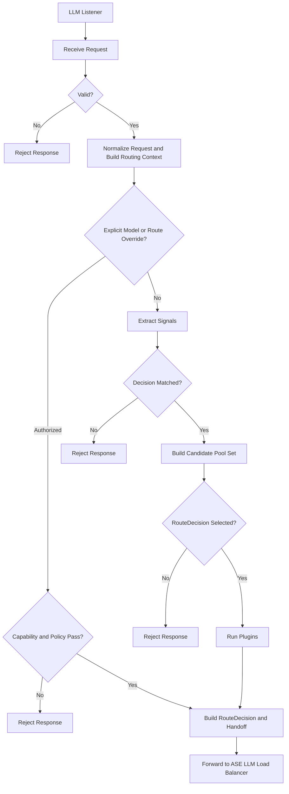
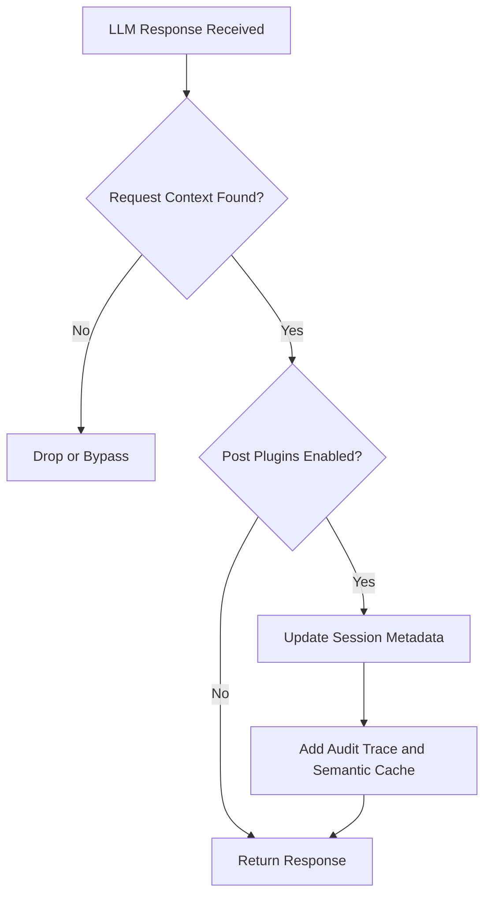
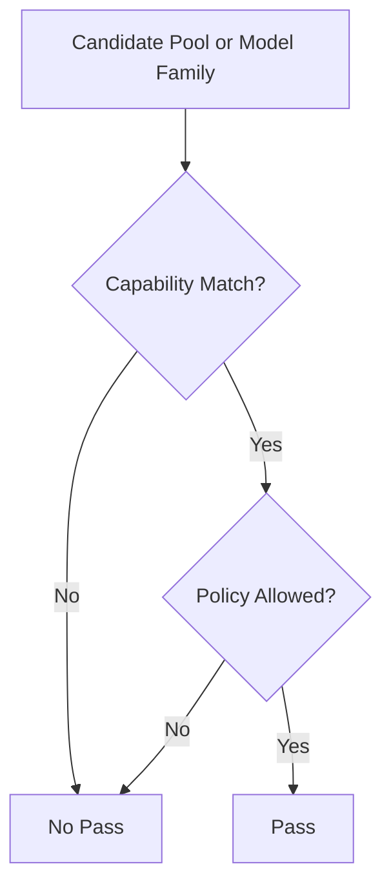
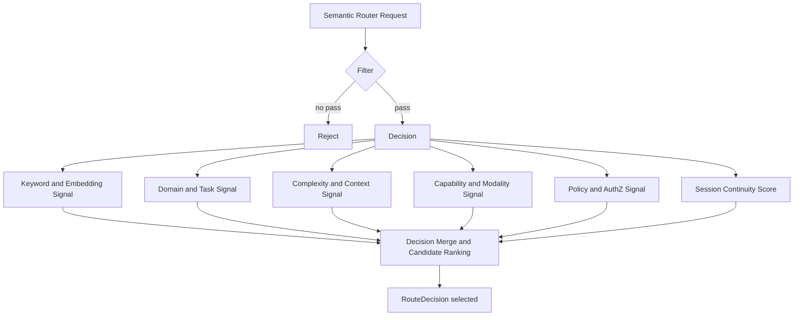

ASE Semantic Router

# Introduction

With the booming AI technology development and deployments across the world, there are two different routing problems in the LLM inference network:

- Semantic routing: decide which capability path, model family or target pool should serve the request
- Load balancing: decide which healthy backend LLM endpoint inside that selected pool should execute the request

The workload of LLM semantic routing is fundamentally different from traditional web routing, for example:

- Request meaning affects route selection, not only URL, host, or header
- Capability requirements may be implicit in prompt content
- Governance and security constraints must be enforced before model invocation
- Session continuity may matter across multiple turns
- The final route decision must remain explainable to operators

And traditional API routing or static model pinning fails because:

- It ignores prompt semantics and workload type
- It ignores capability mismatch such as context length, modality, and reasoning depth
- It ignores tenant, policy, privacy, and compliance restrictions
- It mixes capability-path choice and backend endpoint choice together
- It makes debugging difficult when a wrong model is selected

So ASE semantic router uses normalized request context, typed routing signals, decision rules, model cards, and policy filters to resolve the route class and target pool first, then hands the enriched request to ASE LLM load balancer for endpoint scheduling.

There are some open-sourced, partially open-sourced and commercial routing products in the market like vLLM semantic-router, semantic-router, RouteLLM, Kong AI Gateway and Cloudflare AI Gateway. ASE semantic router is designed to learn from the signal-driven direction of vLLM semantic-router, while keeping a stricter ASE boundary between semantic route selection and downstream load balancing.

The ASE semantic router, together with ASE LLM load balancer, is designed to address the core problems that exist in AI inference network, and to provide policy-aware, secure, explainable and performance-aware routing of inference workloads across backend LLM servers.

## Background

The problems in current LLM routers are:

- Semantic routing enhancements are often added on top of current API gateways, not natively designed as a request-level capability-path and pool-selection pipeline.
- Some products are designed and focused on provider binding or model choice, but do not clearly separate semantic routing from backend instance load balancing.
- Some routing implementations are heavily gateway-coupled and use hidden heuristics, which makes reasoning, audit and policy review difficult.
- Prompt classification alone is treated as semantic routing, while capability validation, governance, session continuity and explainability are underweighted.

ASE works as an important component of security gateway between internal network and external network, so it can naturally combine semantic routing with identity, policy, audit, jailbreak inspection, PII control and other security functions before the request reaches any backend LLM endpoint.

What's more, ASE semantic router and ASE LLM load balancer should be two separate stages:

- Semantic router decides which capability pool or service pool should serve the request
- Load balancer decides which backend endpoint or replica inside that selected pool should execute it

This separation is important for:

- Clear ownership boundary
- Better explainability
- Better failure isolation
- Easier upstream compatibility with vLLM semantic-router
- Easier downstream evolution of ASE load balancing logic

ASE semantic router is designed to meet this requirement.

Semantic Router selects the capability pool; Load Balancer selects the concrete serving replica.

## A Big Challenge

As just mentioned: semantic routing is not simple prompt classification.

A production semantic router needs to simultaneously understand:

- Request meaning and task type
- Model capability and pool requirements
- Context-window and output-shape constraints
- Tenant, privacy and compliance restrictions
- Session continuity and escalation history
- Caller latency, cost and quality preference

There are no unified standards across the industry for:

- Semantic signal taxonomy across different router implementations
- Capability-pool and model-family descriptions across vendors
- Policy-aware route contracts between semantic router and downstream load balancer
- Northbound request hints and semantic override controls

This means ASE semantic router needs to normalize heterogeneous request inputs into one canonical routing context, compute only the signals needed for the current request, apply explicit decision rules and hard constraints, and emit a stable handoff contract that downstream systems can trust.

Another big challenge is architectural boundary control.

Runtime endpoint healthy status, queue depth, retry state and connection pool statistics are important for load balancing, but they should not redefine semantic pool selection. If semantic routing and endpoint scheduling are mixed together, the system loses explainability and ownership boundary.

## Scope

The first development stage will support OpenAI-compatible HTTP/2 Restful APIs. HTTP/1.1 and gRPC northbound APIs are not planned in this stage.

Hereafter if not specified, all HTTP mentioned is referred as HTTP/2.

In scope of this module:

- Request-level capability-path and target-pool selection
- Request normalization and routing context construction
- Signal extraction and decision matching
- Capability and policy filtering
- Session continuity and semantic escalation
- Plugin execution after route selection
- RouteDecision handoff contract to ASE LLM load balancer
- Routing trace, audit and semantic rejection

Out of scope of this module:

- Backend endpoint health check
- Queue-aware or metrics-aware dispatch
- Upstream connection pool
- Retry, redispatch and failover
- Backend fault isolation
- Endpoint metrics polling and scoring

These responsibilities belong to ASE LLM load balancer.

# System Architecture

# ASE Semantic Router Block Diagram

<div align="center">

</div>

The request path can be abstracted as:

`Client -> Semantic Router -> Load Balancer -> Model Pool / Endpoint -> vLLM Server`

Or more precisely:

`Request -> SR: semantic decision -> LB: instance selection -> Backend: inference execution`

## Major LLM Request Processing Flow



# Major LLM Response Processing Flow



## LLM Listener

A dedicated LLM listener is used to listen LLM requests on a specified L4 port, terminate the northbound LLM API request, and build the request context needed by semantic routing.

To be noted, semantic routing is per LLM request based. Even two LLM requests go through the same client and same connection, they could be resolved to different target pools according to prompt meaning, policy and session state.

ASE semantic router should preserve a stable request ID throughout semantic routing, downstream load balancing and final response handling, so that route decisions can be traced afterwards.

## Ports

These ports represent the miscellaneous SSL, HTTP, authentication and management processing modules.

Not described further in this document.

## LLM Restful API Service

From LLM reference user's point of view, LLM inference services are provided by ASE semantic router.

There are some basic Restful APIs that must be implemented in ASE semantic router:

- Model list
  The returned models are the configured semantic entry models or route aliases exposed by semantic routing.

  Please note:
  This model list is not a merged provider model list of all backend LLM endpoints. If an explicit model in request is not in the configured semantic entry models, it must be rejected or explicitly mapped to a legal target pool.

- Healthy status
  This is the healthy status of ASE semantic router service.

- Readiness status
  This is the readiness status of ASE semantic router service.

- Metrics
  This is the metrics of ASE semantic router service.

As to the other kinds of LLM inference requests, ASE semantic router works as a relay point. It resolves the semantic route contract and forwards the enriched request to ASE LLM load balancer for backend endpoint selection.

## Semantic Router

### Core Data Structures

#### Routing Context

A routing context is built for each LLM request. It is the canonical data object used by semantic routing logic.

| Routing Context Class | Major fields | Purpose |
| --------------------- | ------------ | ------- |
| Request Content | messages, prompt text, system instructions, tool requirements, multimodal metadata, output format requirement | Describe what the request is asking for |
| Control Metadata | `model`, `routing_hint`, `route_override`, `preference`, `input_tokens_estimate`, debug flags | Express caller routing intent or optimization hints |
| Identity and Governance Context | tenant identity, user class, authorization scope, privacy tags, compliance tags, provider restrictions | Constrain what the caller is allowed to use |
| Session Context | `session_id`, previous route class or target pool, continuity preference, escalation history | Preserve continuity across multiple turns when appropriate |

Without this context, capability-pool selection becomes guesswork. With it, routing becomes a controlled decision problem.

#### Model Card

A model card is the route-visible model-family definition used by semantic routing to derive a pool decision.

Each routable semantic entry or model family should expose, at minimum:

- Semantic entry ID or model-family ID
- Capability class
- Target pool mapping
- Human-readable description and routing tags
- Supported capabilities and modalities
- Context-window size and token limits
- Optional quality, latency and cost attributes
- Optional reasoning mode and LoRA variants
- Governance, authorization and tenant restrictions

To be noted:

- A semantic entry or model family is not a concrete backend endpoint
- A target pool may map to one or more provider-side models and many replicas downstream
- Endpoint healthy status and queue metrics are not owned by model cards

#### Decision Rule

A decision rule is the semantic route rule used in `routing.decisions`.

Each decision rule should contain:

- Name
- Priority
- Typed rules with AND, OR and NOT conditions
- Candidate `modelRefs`
- Selection algorithm
- Optional plugins

Decision rules define the legal route space for a request. They do not select the final backend endpoint.

#### Major Interface Objects

The module boundary should be described by four major objects:

| Object | Owned by | Major fields | Purpose |
| ------ | -------- | ------------ | ------- |
| Request | Client or gateway | prompt, messages, metadata, identity, session | Original request entering semantic routing |
| RouteDecision | Semantic Router | `route_class`, `target_pool`, `model_family`, `safety_profile`, `cache_policy`, `routing_confidence`, `fallback_pools` | Formal SR to LB handoff contract |
| SchedulingContext | Load Balancer | pool members, health, load, latency, locality, admission status | Runtime scheduling state owned by LB only |
| DispatchResult | Load Balancer | selected endpoint, replica, region, dispatch reason | Final execution result after scheduling |

#### Signal Set

A signal is a typed routing feature extracted from the request context.

The major signal families that ASE semantic router may use:

- Keyword
- Embedding
- Domain
- Language
- Complexity
- Context
- Modality
- Preference
- User feedback
- Authorization or role binding
- Jailbreak
- PII

Not every deployment needs every signal family, and not every request needs every signal extractor to run.

#### Session Continuity Metadata

Session continuity is an optimization input, not a hard override.

Useful session metadata includes:

- `session_id`
- Previous route class or target pool
- Last escalation reason
- Continuity preference
- Conversation classification history

This metadata may help preserve continuity or trigger escalation, but it must not bypass hard capability or policy constraints.

### Request Normalization

The request normalizer converts inbound OpenAI-compatible API traffic into one canonical routing object that every later stage can consume consistently.

ASE should support the following semantic-routing-aware controls:

| Field | Purpose | Constraint |
| ----- | ------- | ---------- |
| `model=auto` | Request semantic route selection | Default path for routed traffic |
| `model=<explicit-model>` | Request a specific semantic entry model or model family directly | Still subject to capability and policy validation, then mapped to a legal target pool |
| `routing_hint` | Provide a coarse semantic hint such as `code`, `reasoning`, `extract`, `vision` | Advisory only; must not bypass policy |
| `route_override` | Request a specific capability path or target-pool alias | Restricted to authorized callers |
| `preference` | Express latency, cost or quality bias | Optimization input only |
| `input_tokens_estimate` | Provide a caller-side prompt-size estimate | Advisory signal only |
| `session_id` | Preserve multi-turn continuity context | Optional unless continuity policy requires it |
| `debug` or `explain` | Request routing diagnostics | Restricted and redacted for trusted callers only |

The precedence order should be explicit:

- Hard capability and policy constraints are evaluated first
- Authorized explicit model requests or route overrides are evaluated next
- Session continuity and optimization preferences are applied only after the request is proven eligible

ASE should route at request granularity, not by pinning an entire session to one target pool forever.

### Signal Extraction Layer

Signals are the intermediate representation between raw request context and final route-decision generation.

The signal extraction layer should:

- Compute cheap signals first
- Run expensive signal extractors only when they materially affect the decision
- Keep outputs explicit and typed
- Avoid hidden heuristic logic embedded in the request path

The layer may use shared runtime modules such as:

- Embedding service
- Classifier service
- Token estimator
- Prompt guard or jailbreak detector
- PII detector
- Tool catalog
- Semantic cache

These supporting services are subordinate to the routing pipeline. The explicit signal set remains the source of truth for semantic decisions.

To be noted:

- `modelRefs` is still the canonical upstream config term inside `routing.decisions`
- In ASE split mode, `modelRefs` is an input to semantic route selection, while `RouteDecision.target_pool` is the primary output consumed by ASE LLM load balancer

### Hard Constraint and Policy Filter

Before optimization among candidate pools or model families, the request must pass hard capability and policy checks.

The filter module checks:

- Request validity
- Explicit override authorization
- Capability match
- Modality match
- Context length and token limits
- Tenant restrictions
- Provider allowlist or denylist
- Privacy and compliance tags
- Jailbreak and abuse policy
- PII-sensitive routing restrictions

The filter processing flowchart is below:



### Decision Engine and Pool Selection

To be a request-aware semantic router, the route-decision algorithm must be based on multiple categories of data sources:

- Normalized request context
- Extracted routing signals
- Configured decision rules and candidate pools or `modelRefs`
- Logical model capabilities, capability classes and pool mappings
- Session continuity and caller preferences

Unlike ASE LLM load balancer, semantic routing should not use backend endpoint queue depth, endpoint healthy status or connection pool runtime state to choose the target pool.

The semantic routing processing flowchart is below:



In the above flowchart, the Filter module checks request validity, hard capability constraints and policy constraints. The Decision Merge and Candidate Ranking phase is bounded by the matched `routing.decisions` rule and the legal candidate pools and `modelRefs` of that rule.

Supported route-selection strategies may include:

- Static priority
- Quality-first
- Cost-aware
- Latency-aware using model-level attributes
- Hybrid policy-aware ranking

The routing pseudo formulas may look like:

```text
bool capability_pass(...) {
    return modality_match && context_limit_ok && required_capability_ok
}

bool policy_pass(...) {
    return tenant_allowed && compliance_allowed && privacy_allowed && abuse_policy_ok
}

float semantic_score(...) {
    return keyword_score + embedding_score + domain_score + complexity_score
}

float continuity_score(...) {
    if (session_id_missing) {
        return 0.0
    }
    return previous_pool_still_valid ? 1.0 : 0.0
}

float preference_score(...) {
    return latency_bias + cost_bias + quality_bias
}

float route_score(...) {
    if (!capability_pass(...) || !policy_pass(...)) {
        return -INF
    }
    return w1 * semantic_score(...)
         + w2 * continuity_score(...)
         + w3 * preference_score(...)
         + w4 * capability_pool_score
}

RouteDecision build_route_decision(...) {
    return {
        route_class: selected_route_class,
        target_pool: selected_pool,
        model_family: selected_model_family,
        safety_profile: selected_safety_profile
    }
}
```

The above formulas are only illustrative. The key point is:

- Hard constraints and policy are applied first
- Semantic and continuity signals are used for bounded optimization
- The result is a RouteDecision, not a backend endpoint

Semantic Router selects the capability pool; Load Balancer selects the concrete serving replica.

### Plugin Chain and Handoff Contract

After the semantic route decision is made, the module executes per-decision plugins such as:

- Safety tagging
- Audit annotation
- Semantic cache hooks
- Prompt rewrite
- Tracing
- Retrieval augmentation

Then it emits a formal `RouteDecision` plus any compatibility fields required by downstream execution.

The output of ASE semantic router is the formal handoff artifact to ASE LLM load balancer.

| Field | Requirement level | Purpose |
| ----- | ----------------- | ------- |
| `route_class` | Required | Capability path chosen by semantic routing |
| `target_pool` | Required | Primary dispatch contract consumed by ASE LLM load balancer |
| `model_family` | Optional | Preferred model family inside the selected pool |
| `latency_tier` | Optional | Scheduling hint for latency class |
| `cost_tier` | Optional | Scheduling hint for cost class |
| `safety_profile` | Optional | Required safety posture for downstream handling |
| `cache_policy` | Optional | Cache and reuse policy hint |
| `routing_confidence` | Optional | Confidence of the semantic decision |
| `fallback_pools` | Optional | Explicit cross-pool fallback policy allowed by semantic or gateway policy |
| `request_id` | Required | Stable request identity across routing, dispatch and observability |
| `route_decision_status` | Required | Distinguish successful routing from semantic rejection |
| `matched_decision` | Optional | Identify which semantic decision rule matched |
| `route_reason` | Optional | Preserve operator-readable routing rationale |
| `policy_tags` | Optional | Carry governance annotations that may matter downstream |
| `debug_trace_id` | Optional | Correlate routing decisions with trace and logs |
| `continuity_metadata` | Optional | Preserve session-related context |
| `model` or projected route header | Optional | Compatibility field only; not the sole dispatch contract in ASE split mode |

At this module boundary, `target_pool` is the primary dispatch contract. `model_family` or normalized `model` are compatibility hints. ASE LLM load balancer must schedule inside the selected pool and must not reinterpret prompt semantics.

An illustrative output shape is shown below.

```json
{
  "route_class": "reasoning",
  "target_pool": "reasoning_pool",
  "model_family": "qwen3-32b",
  "latency_tier": "standard",
  "cost_tier": "medium",
  "safety_profile": "default",
  "cache_policy": "allow",
  "routing_confidence": 0.91,
  "fallback_pools": ["general_large_pool", "review_pool"],
  "request_id": "req-123456",
  "route_decision_status": "ok",
  "matched_decision": "computer_science_reasoning",
  "route_reason": "domain=code;complexity=high;policy=allowed",
  "policy_tags": ["tenant:default", "privacy:standard"]
}
```

### Interaction between Semantic Router and ASE LLM Load Balancer

The interaction with downstream load balancing module is intentionally narrow and explicit.

- ASE semantic router must emit a RouteDecision with `target_pool` as the primary dispatch contract
- ASE LLM load balancer must consume that target pool directly and only do instance-level scheduling inside it
- ASE LLM load balancer must not reconstruct prompt semantics or silently downgrade or upgrade the pool under normal operation
- Policy tags and route metadata may constrain dispatch, but they must not reopen semantic route selection under normal operation

There are two deployment modes that can be supported:

- Upstream-compatible integrated mode
  The semantic-router-based service may additionally project route headers or destination hints for gateway integration
- ASE split mode
  The semantic router emits RouteDecision plus routing metadata, and final endpoint selection is delegated to ASE LLM load balancer

ASE split mode is the preferred architectural contract.

Fallback should also preserve the boundary:

1. Infra fallback
   The same target pool remains fixed, and ASE LLM load balancer switches to another healthy replica inside that pool.

2. Policy fallback
   Cross-pool fallback is allowed only when it is explicitly declared by semantic routing or gateway policy, for example through `fallback_pools`.

### Semantic Failure Classes

| Failure class | Meaning | Typical cause |
| ------------- | ------- | ------------- |
| No Matching Decision | No configured semantic route matched the request signal set | Missing fallback route, unsupported workload shape, insufficient signal confidence |
| No Eligible Pool | No legal capability pool or model family satisfies hard capability or deployment constraints | Missing modality support, insufficient context window, no legal pool mapping |
| Policy Denial | One or more pools or model families are technically capable, but all are forbidden by policy | Tenant restriction, provider denylist, privacy or compliance rule |
| Invalid Routing Request | The request is malformed or missing required routing context | Malformed payload, unsupported request shape, invalid override |
| Decision Engine Failure | The module failed unexpectedly during routing | Internal evaluation failure, signal extraction failure, plugin error |
| Deferred Infrastructure Failure | Semantic routing succeeded, but downstream execution later failed | Endpoint unavailable, dispatch failure, retry exhaustion in ASE LLM load balancer |

## LLM Service Restful APIs

# Request APIs

## Models

- Request

```text
GET /v1/models
```

- Response

```json
{
  "data": [
    {
      "id": "general-small"
    },
    {
      "id": "code-large"
    }
  ]
}
```

## Healthy Check

This is the health check of ASE semantic router service.

- Request

```text
GET /health
```

- Response

1. Healthy

```json
{
  "status": "ok"
}
```

2. Not healthy

```text
HTTP/1.1 500 Internal Server Error
```

## Readiness

This is the readiness check of ASE semantic router service.

- Request

```text
GET /ready
```

- Response

1. Ready

```json
{
  "status": "ok"
}
```

2. Not ready

```text
HTTP/1.1 500 Internal Server Error
```

## Metrics

This is the metrics of ASE semantic router service.

- Request

```text
GET /metrics
```

- Response

```json
{
  "routing_decision_total": 0,
  "policy_denial_total": 0,
  "no_matching_decision_total": 0,
  "no_eligible_pool_total": 0,
  "signal_extraction_latency_ms": 0,
  "routing_latency_ms": 0
}
```

### Debuggability

Shall support log traceable for the semantic routing processing throughout ASE.

Add new semantic router debug logs and levels, including:

- Request normalization result
- Signal extraction result
- Matched decision
- Candidate pools after filtering
- Final RouteDecision and target pool
- Rejection reason and policy tags
- Trace ID and request ID

# Configuration

This part describes the major configurations used for ASE semantic router.

The canonical top-level contract should remain aligned with the vLLM semantic-router direction:

```yaml
version:
listeners:
providers:
routing:
global:
```

For this module, the important point is ownership:

- `routing` is the semantic-routing-owned surface
- `providers` is a required system dependency, but it is not owned by this module
- `global` contains router-wide runtime overrides, and is not owned by this module

An illustrative configuration is shown below:

```yaml
version: v0.3

listeners:
  - name: http-8899
    address: 0.0.0.0
    port: 8899
    timeout: 300s

providers:
  defaults:
    default_model: general-small
    default_reasoning_effort: medium
  models:
    - name: general-small
      provider_model_id: general-small
      backend_refs:
        - name: primary
          endpoint: llm-gateway.internal:8000
          protocol: http2
    - name: code-large
      provider_model_id: code-large
      backend_refs:
        - name: primary
          endpoint: code-gateway.internal:8000
          protocol: http2

routing:
  modelCards:
    - name: general-small
      description: default text assistant
      capability_class: chat
      target_pool: general_fast_pool
      modality: text
      capabilities: [chat, tools]
      context_length: 32768
      quality: medium
      latency: low
      cost: low
      governance_tags: [tenant:default, privacy:standard]
    - name: code-large
      description: code and design reasoning model
      capability_class: reasoning_code
      target_pool: code_reasoning_pool
      modality: text
      capabilities: [chat, reasoning, long-context]
      context_length: 131072
      quality: high
      latency: medium
      cost: medium
      governance_tags: [tenant:default, privacy:standard]
      loras:
        - name: code-review-adapter
          description: adapter for code review and design prompts
  signals:
    keywords:
      - name: code_terms
        operator: OR
        keywords: ["code", "api", "debug", "refactor"]
    complexity:
      - name: needs_reasoning
        threshold: 0.75
        description: multi-step synthesis or design-heavy prompts
    pii:
      - name: sensitive_data
        enabled: true
    jailbreak:
      - name: abuse_guard
        enabled: true
  decisions:
    - name: computer_science_reasoning
      description: route software engineering requests to reasoning-capable models
      priority: 170
      rules:
        operator: AND
        conditions:
          - type: keyword
            name: code_terms
          - type: complexity
            name: needs_reasoning
      modelRefs:
        - model: general-small
          use_reasoning: false
          weight: 0.2
        - model: code-large
          use_reasoning: true
          reasoning_effort: high
          lora_name: code-review-adapter
          weight: 0.8
      route_output:
        route_class: reasoning
        target_pool: code_reasoning_pool
        model_family: qwen3-32b
        latency_tier: standard
        cost_tier: medium
        safety_profile: default
        cache_policy: allow
        fallback_pools: [general_large_pool, review_pool]
      algorithm:
        type: hybrid_policy_aware
      plugins:
        - type: audit
          configuration:
            enabled: true
        - type: system_prompt
          configuration:
            enabled: true
            mode: insert
            system_prompt: You are a senior software architect.

global:
  router:
    config_source: file
```

The architectural requirement is that semantic routing remains declarative, reviewable and versioned under the canonical `routing` surface. Provider `backend_refs`, endpoint weights and execution failover remain outside this module's ownership even though they exist in the full router configuration under `providers` or in downstream execution systems. In ASE split mode, `route_output` is the semantic-routing-owned handoff extension used to produce RouteDecision for ASE LLM load balancer.

# Testing

The automated testing strategy for this module should verify both correctness of RouteDecision generation and preservation of the module boundary.

The testing plan should include:

- Request normalization tests for OpenAI-compatible request shapes, explicit overrides and malformed input handling
- Signal extraction tests that validate typed outputs, selective execution of expensive signals and redaction behavior for sensitive inputs
- Decision engine tests that cover rule precedence, no-match behavior, hard-constraint filtering and policy denial
- Pool selection tests for static and algorithmic selectors, continuity preservation, escalation and conservative downgrade behavior
- Plugin and handoff contract tests that verify the exact RouteDecision fields emitted to ASE LLM load balancer
- Observability tests that prove routing traces preserve matched decision, selected target pool, exclusion reasons and failure code

Existing unit and integration harnesses are sufficient if they can validate the staged pipeline end-to-end. If not, a dedicated semantic-routing harness should be added so the module can be tested independently of backend dispatch.

# References

[1] vLLM Semantic Router documentation https://vllm-semantic-router.com/docs/intro/

[2] vLLM Semantic Router configuration documentation https://vllm-semantic-router.com/docs/installation/configuration/

[3] vLLM Semantic Router system architecture documentation https://vllm-semantic-router.com/docs/overview/architecture/system-architecture/

[4] vLLM Semantic Router Envoy ExtProc integration documentation https://vllm-semantic-router.com/docs/overview/architecture/envoy-extproc

[5] vLLM Semantic Router GitHub repository https://github.com/vllm-project/semantic-router
