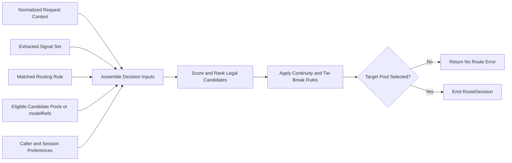
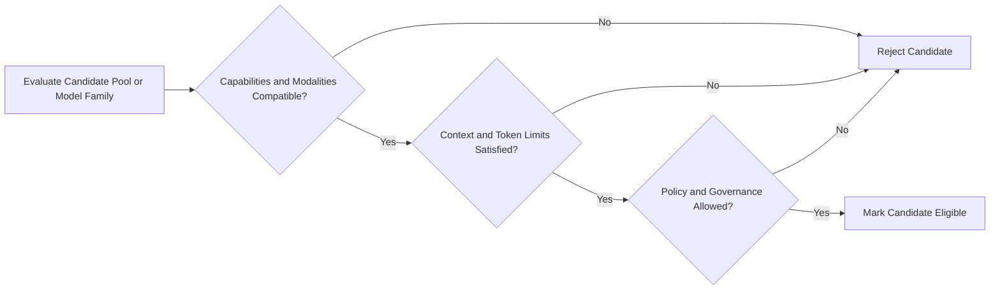

ASE Semantic Router

Author: Pu Yang/84399478， Rui Zhou/8400631

[[_TOC_]]

---

# Introduction


Traditional API gateways are designed for conventional application traffic. They typically front diverse microservices and focus on northbound request handling, authentication, security policy, protocol mediation, and service routing. AI gateway behavior is different. It must broker access to heterogeneous external LLM providers and self-hosted model stacks, where prompt meaning, data sensitivity, modality, context size, and governance constraints may determine the legal and appropriate model path before inference begins.

Within that access path, semantic routing and load balancing are separate functions. Semantic routing selects a legal capability path, model family, or target pool from normalized request context and governance constraints. Load balancing selects a healthy backend endpoint within the selected pool. ASE Semantic Router therefore operates on request semantics rather than transport metadata and MUST emit an explainable and auditable `RouteDecision` for ASE LLM Load Balancer and any downstream serving stack.

This boundary also defines feature ownership. Request understanding, provider connectivity, policy enforcement, semantic classification, model-family selection, and route explanation belong to ASE Semantic Router. Inference optimization, replica scheduling, KV-cache efficiency, batching, and endpoint-level failover belong to ASE LLM Load Balancer or to downstream self-hosted serving systems.

# Background

Many LLM routing systems extend API gateways with prompt classification or provider selection, but they often interleave semantic interpretation, policy enforcement, and backend dispatch. That coupling makes route selection harder to explain, govern, and audit. ASE treats semantic routing as a separate request pipeline whose output is a pool-level decision, not an endpoint choice.

## Conventions and Terminology

The uppercase keywords `MUST`, `SHOULD`, and `MAY` in this document indicate normative requirements. When those words appear in lowercase, they are used in their ordinary descriptive sense.

In this document, Semantic Router refers to the stage that selects a legal capability path and target pool. Load Balancer refers to the downstream stage that selects a concrete backend endpoint within that pool. A target pool is therefore a semantic dispatch domain rather than an individual provider endpoint or replica.

## Scope

# System Architecture

The ASE Semantic Router is organized into three top-level parts: `Signals`, `Projections`, and `Decision Engine`. `Signals` extracts heuristic and learned routing evidence such as domain, modality, complexity, safety posture, user intent, and governance constraints from the inbound LLM request. `Projections` then consolidates those raw detections into canonical partitions, scores, and named mappings so that downstream routing logic can operate on a stable semantic feature set rather than ad hoc prompt text.

The `Decision Engine` consumes the outputs of `Signals` and `Projections` together with request context, applies configured `Rules and Policies`, executes `Decision Match`, and produces the explainable route that is handed to ASE LLM Load Balancer. Around that core, the engine MAY invoke `Decision Plugins` to apply capability-specific behaviors such as image-generation handling, system-prompt shaping, tool activation, or header/body mutation, and it MAY call the `Algorithms` layer, which currently consists of `Selection` and `Loopers`, to choose among eligible model families or target pools and refine route quality over time. The router then emits a formal routing output and downstream handoff artifact for ASE LLM Load Balancer, while endpoint-level scheduling, health-aware balancing, and final dispatch remain outside the ownership of semantic routing.

<div align="center">

</div>


## Signals

`Signals` is the request-understanding layer of semantic routing. It converts raw request content, caller metadata, and governance context into explicit evidential features that can be reused by later stages. A signal therefore describes an observed or inferred property of the request, such as topic, modality, complexity, language, safety posture, or user intent. In methodological terms, signals answer "what is present in the request?" rather than "what route should be chosen?".

Separating signals from downstream route selection improves modularity, auditability, and scientific clarity. It avoids duplicating detection logic across multiple route rules, makes it easier to combine heterogeneous evidence sources in one routing graph, and preserves a clean distinction between measurement and action. This separation is especially important in semantic routing, where lexical cues, identity constraints, semantic similarity, safety detectors, and preference inference may all contribute evidence but should not be conflated with the final route outcome.

Signals SHOULD be used whenever multiple route paths depend on the same detector, whenever one route must combine heterogeneous evidence sources, or whenever the system design requires a clean boundary between detection, projection, decision logic, algorithms, and plugins. Cross-signal aggregation and derived routing bands do not belong in the signal layer; those functions belong in `Projections`.

Signals are grouped by extraction style so that dependency assumptions, runtime cost, and operational behavior remain explicit.

### Heuristic Signals

Heuristic signals route from explicit rules, request form, identity metadata, or lightweight detectors without depending on router-owned classifier models.

| Signal family | Purpose                                                                      |
| ------------- | ---------------------------------------------------------------------------- |
| `authz`       | route from identity, role, or tenant policy                                  |
| `context`     | route by effective token-window needs                                        |
| `keyword`     | route from lexical or BM25-style matches                                     |
| `language`    | route by detected request language                                           |
| `structure`   | route from request shape such as question counts or ordered workflow markers |

### Learned Signals

Learned signals use embeddings or classifier-style detectors and typically rely on router-owned model assets or maintained detector modules.

| Signal family   | Purpose                                                         |
| --------------- | --------------------------------------------------------------- |
| `complexity`    | detect hard vs easy reasoning traffic                           |
| `domain`        | classify the request topic family                               |
| `embedding`     | match by semantic similarity                                    |
| `modality`      | classify text-only, image-generation, or hybrid output mode     |
| `fact-check`    | detect prompts that need evidence verification                  |
| `jailbreak`     | detect prompt-injection or jailbreak attempts                   |
| `pii`           | detect sensitive personal data                                  |
| `preference`    | infer response-style preferences                                |
| `reask`         | detect repeated user questions as implicit dissatisfaction      |
| `kb`            | bind knowledge base labels or groups into named routing signals |
| `user-feedback` | detect correction or escalation feedback                        |

The following design rules SHOULD hold for this section of the routing graph:

- Signals SHOULD remain semantically stable and reusable across multiple routing paths.
- Signals SHOULD remain detection-oriented; route outcomes belong in later decision stages.
- Cross-signal partitions, score aggregation, and derived routing bands SHOULD live in `Projections`, not in the signal layer itself.
- Model or pool choice SHOULD remain separate from signals and belong in the algorithm layer.
- Route-side execution behavior SHOULD remain separate from signals and belong in plugins.

## Projections

`Projections` is the coordination layer between raw signal detection and final decision evaluation. Signals are intentionally local: a keyword detector, domain classifier, embedding matcher, or context detector contributes one piece of evidence about the request. Decision logic is intentionally selective: it determines which semantic route should win. Projections fill the gap between those two layers by coordinating several signal results into reusable routing facts.

This layer is needed when several competing signals must be reduced to one winner, when multiple weak signals collectively express a higher-level property such as difficulty or verification pressure, or when the same threshold policy should be reused across many route rules without duplicating numeric logic. By isolating that coordination step, the routing graph remains easier to inspect, validate, and evolve.

In the semantic-routing pipeline, projections sit after `Signals` and before `Decision Engine`. Their role is not to perform final route selection, but to transform raw signal outputs into derived facts that later decision logic can consume consistently.

### Partitions

`Partitions` coordinate competing `domain` or `embedding` matches and resolve them into a single winner when the route logic requires exclusivity.

Supported semantics include `exclusive` and `softmax_exclusive`.

### Scores

`Scores` aggregate multiple matched signals into one continuous numeric value. This is useful when no single detector is sufficient, but the joint evidence indicates a higher-level routing property such as complexity, verification need, or escalation pressure.

Supported methods include `weighted_sum`.

### Mappings

`Mappings` transform a continuous score into named projection outputs that can be consumed by later decision logic. In practice, mappings convert low-level numeric coordination into reusable routing bands such as `simple`, `complex`, `reasoning`, or `verification_required`.

Supported methods include `threshold_bands` and `sigmoid_distance`.

The following YAML fragment illustrates the canonical projection shape:

```yaml
routing:
  signals:
    embeddings:
      - name: technical_support
        threshold: 0.75
        candidates: ["installation guide", "troubleshooting"]
      - name: account_management
        threshold: 0.72
        candidates: ["billing issue", "subscription change"]
    context:
      - name: long_context
        min_tokens: "4000"
        max_tokens: "200000"

  projections:
    partitions:
      - name: support_intents
        semantics: exclusive
        members: [technical_support, account_management]
        default: technical_support

    scores:
      - name: request_difficulty
        method: weighted_sum
        inputs:
          - type: embedding
            name: technical_support
            weight: 0.18
            value_source: confidence
          - type: context
            name: long_context
            weight: 0.18

    mappings:
      - name: request_band
        source: request_difficulty
        method: threshold_bands
        outputs:
          - name: support_fast
            lt: 0.25
          - name: support_escalated
            gte: 0.25
```

The mapping outputs `support_fast` and `support_escalated` then become reusable projection facts for later decision evaluation.

## Decision Engine

The `Decision Engine` consumes routing context together with the outputs of `Signals` and `Projections`, evaluates semantic route hypotheses, invokes algorithm and plugin modules where needed, and emits a formal `RouteDecision`. For expository clarity, this section is organized in the following order: `Decisions`, `Algorithms`, `Decision Plugins`, `Policies and Rules`, and finally the output and downstream handoff to ASE LLM Load Balancer.

### Decisions

`Decisions` is the route-policy layer of semantic routing. `Signals` and `Projections` describe what has been detected or coordinated from the request. Decisions determine how the router should act on that evidence: which semantic route matches, which candidate model families or target pools are eligible, whether specialized reasoning behavior should be enabled, and which downstream algorithms or plugins may apply after the route is chosen.

This layer is necessary because evidence alone does not define routing behavior. Without an explicit decision layer, route logic tends to be scattered across ad hoc conditionals, model defaults, and plugin wiring. A dedicated decision layer keeps policy readable, priority-aware, and reviewable, while preserving a clean boundary between route matching, deployment bindings, selection algorithms, and post-selection behavior.

#### Routing Context

A routing context is the canonical object used by semantic routing.

| Routing Context Class           | Major fields                                                                                                  | Purpose                                             |
| ------------------------------- | ------------------------------------------------------------------------------------------------------------- | --------------------------------------------------- |
| Request Content                 | messages, prompt text, system instructions, tool requirements, multimodal metadata, output format requirement | Describe what the request is asking for             |
| Control Metadata                | `model`, `routing_hint`, `route_override`, `preference`, `input_tokens_estimate`, debug flags                 | Express caller routing intent or optimization hints |
| Identity and Governance Context | tenant identity, user class, authorization scope, privacy tags, compliance tags, provider restrictions        | Constrain what the caller is allowed to use         |

#### Model Card

A model card is the route-visible model-family definition used by semantic routing to derive a pool decision.

Each routable semantic entry or model family SHOULD expose an identifier, capability class, target-pool mapping, routing tags, supported capabilities and modalities, context-window limits, optional quality/latency/cost attributes, optional reasoning or LoRA variants, and any governance or tenant restrictions relevant to route selection.

A semantic entry or model family is not a concrete backend endpoint. A target pool MAY map to multiple provider models and downstream replicas, while endpoint health and queue metrics remain outside the ownership of model cards.

#### Major Interface Objects

The module boundary consists of four major objects:

| Object            | Owned by          | Major fields                                                                                                           | Purpose                                    |
| ----------------- | ----------------- | ---------------------------------------------------------------------------------------------------------------------- | ------------------------------------------ |
| Request           | Client or gateway | prompt, messages, metadata, identity                                                                                   | Original request entering semantic routing |
| RouteDecision     | Semantic Router   | `route_class`, `target_pool`, `model_family`, `safety_profile`, `cache_policy`, `routing_confidence`, `fallback_pools` | Formal SR to LB handoff contract           |
| SchedulingContext | Load Balancer     | pool members, health, load, latency, locality, admission status                                                        | Runtime scheduling state owned by LB only  |
| DispatchResult    | Load Balancer     | selected endpoint, replica, region, dispatch reason                                                                    | Final execution result after scheduling    |

#### Request Normalization

The request normalizer converts inbound OpenAI-compatible API traffic into a canonical routing object consumed by later stages.

ASE Semantic Router SHOULD support the following semantic-routing-aware controls:

| Field                    | Purpose                                                                         | Constraint                                                                            |
| ------------------------ | ------------------------------------------------------------------------------- | ------------------------------------------------------------------------------------- |
| `model=auto`             | Request semantic route selection                                                | Default path for routed traffic                                                       |
| `model=<explicit-model>` | Request a specific semantic entry model or model family directly                | Still subject to capability and policy validation, then mapped to a legal target pool |
| `routing_hint`           | Provide a coarse semantic hint such as `code`, `reasoning`, `extract`, `vision` | Advisory only; MUST NOT bypass policy                                                 |
| `route_override`         | Request a specific capability path or target-pool alias                         | Restricted to authorized callers                                                      |
| `preference`             | Express latency, cost or quality bias                                           | Optimization input only                                                               |
| `input_tokens_estimate`  | Provide a caller-side prompt-size estimate                                      | Advisory signal only                                                                  |
| `debug` or `explain`     | Request routing diagnostics                                                     | Restricted and redacted for trusted callers only                                      |

The precedence order MUST be explicit. Hard capability and policy constraints are evaluated first, authorized explicit model requests or route overrides second, and continuity or optimization preferences only after eligibility is established.

#### Decision Rules

A decision rule is the formal policy object that turns detected request evidence into routing intent. In scientific terms, it is the stage where reusable observations are converted into an explicit action hypothesis for the router.

Decision rules SHOULD be used when a route activates from one or more signals, when route priority matters, when the same model-selection policy should be reused across different evidence combinations, or when algorithms and plugins must attach to a matched route rather than to the entire router.

A decision rule SHOULD define:

- a stable rule identity and priority
- a boolean condition set over signals and projection outputs
- a candidate model-family or target-pool set
- any route-level reasoning or behavior flags
- an optional algorithm binding when multiple candidates remain
- optional plugins that execute after route selection

The logical forms of decision rules commonly include single-condition, `AND`, `OR`, `NOT`, and nested composite policies. Regardless of surface syntax, their purpose is the same: to define the legal route space for a request. They do not perform final endpoint scheduling, and they SHOULD remain separate from provider deployment bindings, runtime balancing state, and post-route mutation behavior.

#### Decision Match

`Decision Match` is the core request-evaluation path inside the decision engine. It consumes the canonical routing inputs, combines them with the matched rules and policy-constrained candidate set, and prepares the legal route space that will be consumed by downstream algorithms.

### Algorithms

`Algorithms` are the execution modules called by `Decision Engine` after rule matching and hard filtering. As shown in the updated diagram, this is a separate module group under the semantic router rather than part of the internal `Decision Match` stack. In the current architecture, this layer contains `Selection` and `Loopers`.

#### Selection

`Selection` determines how the engine chooses among the legal candidate pools or model families produced by `Decision Match`. As shown in the diagram, the architecture MAY support strategies such as static selection, AutoMix, Elo, Router DC, hybrid selection, latency-aware selection, KNN, or similar ranking methods.

The route-decision algorithm MUST use normalized request context, extracted signals, configured decision rules and candidate pools or `modelRefs`, logical model capabilities and pool mappings, and any applicable continuity or caller preferences. Unlike ASE LLM Load Balancer, semantic routing MUST NOT use backend queue depth, endpoint health, or connection-pool runtime state to choose the target pool.

The decision engine performs constrained selection over the legal candidate set that survives hard filtering. Its purpose is to explain how ASE chooses one semantic target pool or model family, not to expose internal helper-function structure.



In this flow, the hard-filter stage has already removed infeasible candidates. The decision engine then combines normalized request context, extracted signals, the matched `routing.decisions` rule, the remaining legal candidate pools or `modelRefs`, and any applicable caller into a bounded ranking problem. Continuity handling and tie-break rules MAY influence which legal candidate is selected, but they MUST operate only within the feasible route space.

Supported route-selection strategies MAY include static priority, quality-first selection, cost-aware selection, latency-aware selection based on model-level attributes, and hybrid policy-aware ranking. `Selection` MUST operate only within the feasible route space that survives hard filtering.

For specification and design review, the route decision SHOULD be modeled as constrained selection over legal candidate pools rather than as a chain of implementation helper functions.

Let `r` denote the normalized request context and let `P = {p1, p2, ..., pn}` denote the candidate serving pools derived from the matched routing rule. For each request-pool pair `(r, p)`, the router evaluates two hard-feasibility predicates:

- `capability_feasible(r, p)`: true only when modality, context-window, and required capability constraints are satisfied.
- `policy_feasible(r, p)`: true only when tenant, compliance, privacy, and abuse-policy constraints are satisfied.

The legal candidate set is therefore:

$$
F(r) = \{\, p \in P \mid \mathrm{capability\_feasible}(r, p) \wedge \mathrm{policy\_feasible}(r, p) \,\}
$$

For each `p in F(r)`, the router computes a bounded utility score:

$$
U(r, p) = w_1 S_{\mathrm{sem}}(r, p) + w_2 S_{\mathrm{cont}}(r, p) + w_3 S_{\mathrm{pref}}(r, p) + w_4 S_{\mathrm{pool}}(r, p)
$$

$$
S_{\mathrm{sem}}(r, p) = a_1 s_{\mathrm{keyword}}(r, p) + a_2 s_{\mathrm{embedding}}(r, p) + a_3 s_{\mathrm{domain}}(r, p) + a_4 s_{\mathrm{complexity}}(r, p)
$$

$$
S_{\mathrm{cont}}(r, p) \in \{0, 1\}
$$

`S_cont(r, p)` is `1` when a valid previous session exists and `p` remains valid; otherwise it is `0`.

$$
S_{\mathrm{pref}}(r, p) = b_1 s_{\mathrm{latency}}(r, p) + b_2 s_{\mathrm{cost}}(r, p) + b_3 s_{\mathrm{quality}}(r, p)
$$

The selected pool is the maximizer over the legal candidate set:

$$
p^{*} = \arg \max_{p \in F(r)} U(r, p)
$$

If `F(r)` is empty, the router MUST return a semantic rejection or an explicitly configured fallback outcome. Once `p*` is selected, the router constructs a `RouteDecision` containing the chosen `route_class`, `target_pool`, `model_family`, and `safety_profile`.

A non-normative reference procedure is shown below:

| Field     | Description                                                                                 |
| --------- | ------------------------------------------------------------------------------------------- |
| Algorithm | Constraint-Aware Route Selection                                                            |
| Inputs    | `r`: normalized request context; `P`: candidate pools derived from the matched routing rule |
| Output    | `RouteDecision`, or rejection/fallback outcome                                              |

```text
Procedure:
1. F <- {}
2. for each p in P do
3.     if not capability_feasible(r, p) then
4.         continue
5.     end if
6.     if not policy_feasible(r, p) then
7.         continue
8.     end if
9.     score[p] <- U(r, p)
10.    F <- F union {p}
11. end for
12. if F = {} then
13.    return reject_or_fallback(r)
14. end if
15. p* <- arg max score[p] over p in F
16. return build_route_decision(r, p*)
```

This formulation makes the module boundary explicit: hard capability and policy constraints define the feasible set first; semantic, continuity, and preference signals optimize only within that legal set; and the output of the module is a `RouteDecision` rather than a backend endpoint selection. Semantic Router selects the capability pool; Load Balancer selects the concrete serving replica.

#### Loopers

`Loopers` provide a closed feedback path for iterative route-quality refinement. As shown in the diagram, loopers MAY include confidence-based feedback, rating-driven feedback, or ReMoM-style memory mechanisms that adjust future routing behavior based on prior outcomes.

Loopers MAY update thresholds, weights, or preference signals over time, but they MUST NOT override hard capability checks, tenant governance constraints, or the matched decision rule for an individual request.

### Decision Plugins

`Decision Plugins` are per-decision extensions around the matched route. According to the architecture diagram, they MAY implement capability-specific behaviors such as image-generation handling, system-prompt shaping, header or body mutation, tool activation, or other route-local behaviors that modify how the selected semantic path is prepared for downstream execution.

After route selection, the module MAY also execute per-decision plugins such as safety tagging, audit annotation, semantic-cache hooks, prompt rewrite, tracing, or retrieval augmentation.

### Policies and Rules

`Policies and Rules` defines the non-negotiable constraint boundary within which decisions, algorithms, and plugins are allowed to operate. This material appears after the decision description here for explanatory clarity, but its runtime effect is earlier and stricter: it limits the legal route space before any optimization among candidate pools or model families is allowed.

#### Hard Constraint and Policy Filter

Before any optimization among candidate pools or model families, the request MUST pass hard capability and policy checks.

The filter evaluates request validity, explicit-override authorization, capability and modality matching, context-length and token-limit constraints, tenant restrictions, provider allowlists or denylists, privacy and compliance tags, jailbreak policy, and PII-sensitive routing restrictions.

The hard-filter stage is eliminative rather than score-based. A candidate that fails any hard constraint MUST be removed from the legal route space before optimization, preference handling, or plugin execution begins.



### Output and Downstream Handoff

This part documents what the decision engine emits after route evaluation and how that result is consumed by downstream ASE LLM Load Balancer.

#### Handoff Contract

The module emits a formal `RouteDecision` plus any compatibility fields required by downstream execution. This object is the handoff artifact to ASE LLM Load Balancer.

| Field                             | Requirement level | Purpose                                                                    |
| --------------------------------- | ----------------- | -------------------------------------------------------------------------- |
| `route_class`                     | Required          | Capability path chosen by semantic routing                                 |
| `target_pool`                     | Required          | Primary dispatch contract consumed by ASE LLM load balancer                |
| `model_family`                    | Optional          | Preferred model family inside the selected pool                            |
| `latency_tier`                    | Optional          | Scheduling hint for latency class                                          |
| `cost_tier`                       | Optional          | Scheduling hint for cost class                                             |
| `safety_profile`                  | Optional          | Required safety posture for downstream handling                            |
| `cache_policy`                    | Optional          | Cache and reuse policy hint                                                |
| `routing_confidence`              | Optional          | Confidence of the semantic decision                                        |
| `fallback_pools`                  | Optional          | Explicit cross-pool fallback policy allowed by semantic or gateway policy  |
| `request_id`                      | Required          | Stable request identity across routing, dispatch and observability         |
| `route_decision_status`           | Required          | Distinguish successful routing from semantic rejection                     |
| `matched_decision`                | Optional          | Identify which semantic decision rule matched                              |
| `route_reason`                    | Optional          | Preserve operator-readable routing rationale                               |
| `policy_tags`                     | Optional          | Carry governance annotations that may matter downstream                    |
| `debug_trace_id`                  | Optional          | Correlate routing decisions with trace and logs                            |
| `model` or projected route header | Optional          | Compatibility field only; not the sole dispatch contract in ASE split mode |

At a minimum, every emitted `RouteDecision` MUST include `route_class`, `target_pool`, `request_id`, and `route_decision_status`. Optional fields MAY be omitted when not applicable or when withheld by policy.

At this boundary, `target_pool` is the primary dispatch contract. `model_family` or a normalized `model` value are compatibility hints only. ASE LLM Load Balancer MUST schedule within the selected pool and MUST NOT reinterpret prompt semantics.

An example `RouteDecision` object is shown below.

```json
{
  "route_class": "reasoning",
  "target_pool": "reasoning_pool",
  "model_family": "qwen3-32b",
  "latency_tier": "standard",
  "cost_tier": "medium",
  "safety_profile": "default",
  "cache_policy": "allow",
  "routing_confidence": 0.91,
  "fallback_pools": ["general_large_pool", "review_pool"],
  "request_id": "req-123456",
  "route_decision_status": "ok",
  "matched_decision": "computer_science_reasoning",
  "route_reason": "domain=code;complexity=high;policy=allowed",
  "policy_tags": ["tenant:default", "privacy:standard"]
}
```

#### Interaction with ASE LLM Load Balancer

The interaction with the downstream load-balancing module is intentionally narrow. ASE Semantic Router MUST emit a `RouteDecision` whose primary dispatch contract is `target_pool`. ASE LLM Load Balancer MUST consume that pool directly and perform instance-level scheduling only within the declared pool. Policy tags and route metadata MAY constrain dispatch behavior, but they MUST NOT reopen semantic route selection during normal operation.

Two deployment modes MAY be supported. In upstream-compatible integrated mode, the service MAY project route headers or destination hints for gateway integration. In ASE split mode, the semantic router emits `RouteDecision` plus routing metadata and delegates final endpoint selection to ASE LLM Load Balancer. ASE split mode is preferred.

Fallback behavior MUST preserve the same boundary. Infrastructure fallback keeps the target pool fixed while ASE LLM Load Balancer switches to another healthy replica within that pool. Cross-pool fallback is allowed only when semantic routing or gateway policy declares it explicitly, for example through `fallback_pools`.

#### Semantic Failure Classes

| Failure class                   | Meaning                                                                                      | Typical cause                                                                      |
| ------------------------------- | -------------------------------------------------------------------------------------------- | ---------------------------------------------------------------------------------- |
| No Matching Decision            | No configured semantic route matched the request signal set                                  | Missing fallback route, unsupported workload shape, insufficient signal confidence |
| No Eligible Pool                | No legal capability pool or model family satisfies hard capability or deployment constraints | Missing modality support, insufficient context window, no legal pool mapping       |
| Policy Denial                   | One or more pools or model families are technically capable, but all are forbidden by policy | Tenant restriction, provider denylist, privacy or compliance rule                  |
| Invalid Routing Request         | The request is malformed or missing required routing context                                 | Malformed payload, unsupported request shape, invalid override                     |
| Decision Engine Failure         | The module failed unexpectedly during routing                                                | Internal evaluation failure, signal extraction failure, plugin error               |
| Deferred Infrastructure Failure | Semantic routing succeeded, but downstream execution later failed                            | Endpoint unavailable, dispatch failure, retry exhaustion in ASE LLM Load Balancer  |

# Management and Discovery APIs

Please refer to the corresponding section of [ASE semantic load balancer](./ase_semantic_load_balancer.md).

# Operational Debuggability

Please refer to the corresponding section of [ASE semantic load balancer](./ase_semantic_load_balancer.md).

# Configuration

This section illustrates the major configuration surfaces required by ASE semantic router. Field names are illustrative; an implementation MAY use different names provided that it preserves equivalent semantics.

```yaml
version: v0.3

listeners:
  - name: http-8899
    address: 0.0.0.0
    port: 8899
    timeout: 300s

providers:
  defaults:
    default_model: general-small
    default_reasoning_effort: medium
  models:
    - name: general-small
      provider_model_id: general-small
      backend_refs:
        - name: primary
          endpoint: llm-gateway.internal:8000
          protocol: http2
    - name: code-large
      provider_model_id: code-large
      backend_refs:
        - name: primary
          endpoint: code-gateway.internal:8000
          protocol: http2

routing:
  modelCards:
    - name: general-small
      description: default text assistant
      capability_class: chat
      target_pool: general_fast_pool
      modality: text
      capabilities: [chat, tools]
      context_length: 32768
      quality: medium
      latency: low
      cost: low
      governance_tags: [tenant:default, privacy:standard]
    - name: code-large
      description: code and design reasoning model
      capability_class: reasoning_code
      target_pool: code_reasoning_pool
      modality: text
      capabilities: [chat, reasoning, long-context]
      context_length: 131072
      quality: high
      latency: medium
      cost: medium
      governance_tags: [tenant:default, privacy:standard]
      loras:
        - name: code-review-adapter
          description: adapter for code review and design prompts
  signals:
    keywords:
      - name: code_terms
        operator: OR
        keywords: ["code", "api", "debug", "refactor"]
    complexity:
      - name: needs_reasoning
        threshold: 0.75
        description: multi-step synthesis or design-heavy prompts
    pii:
      - name: sensitive_data
        enabled: true
    jailbreak:
      - name: abuse_guard
        enabled: true
  decisions:
    - name: computer_science_reasoning
      description: route software engineering requests to reasoning-capable models
      priority: 170
      rules:
        operator: AND
        conditions:
          - type: keyword
            name: code_terms
          - type: complexity
            name: needs_reasoning
      modelRefs:
        - model: general-small
          use_reasoning: false
          weight: 0.2
        - model: code-large
          use_reasoning: true
          reasoning_effort: high
          lora_name: code-review-adapter
          weight: 0.8
      route_output:
        route_class: reasoning
        target_pool: code_reasoning_pool
        model_family: qwen3-32b
        latency_tier: standard
        cost_tier: medium
        safety_profile: default
        cache_policy: allow
        fallback_pools: [general_large_pool, review_pool]
      algorithm:
        type: hybrid_policy_aware
      plugins:
        - type: audit
          configuration:
            enabled: true
        - type: system_prompt
          configuration:
            enabled: true
            mode: insert
            system_prompt: You are a senior software architect.

global:
  router:
    config_source: file
```

# References

[1] vLLM Semantic Router documentation https://vllm-semantic-router.com/docs/intro/

[2] vLLM Semantic Router configuration documentation https://vllm-semantic-router.com/docs/installation/configuration/

[3] vLLM Semantic Router system architecture documentation https://vllm-semantic-router.com/docs/overview/architecture/system-architecture/

[4] vLLM Semantic Router Envoy ExtProc integration documentation https://vllm-semantic-router.com/docs/overview/architecture/envoy-extproc

[5] vLLM Semantic Router GitHub repository https://github.com/vllm-project/semantic-router
