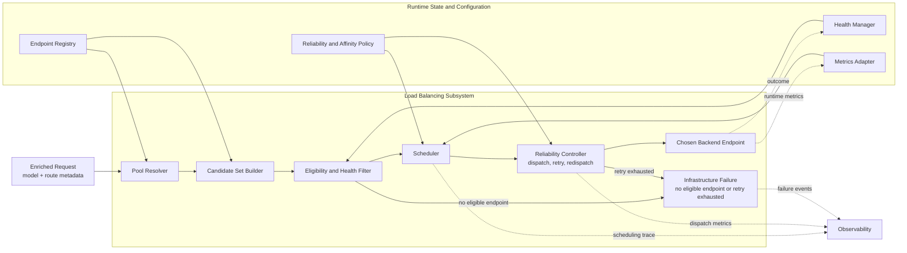

# ASE Load Balancing Design

## Introduction

This document defines the design of the Load Balancing subsystem in the ASE LLM gateway. Load Balancing is the second decision layer in the request path and is responsible for selecting which backend endpoint should execute a request whose target model has already been resolved.

This document is not a generic overview of traffic distribution. It is the governing design for the dispatch subsystem that receives an authoritative model decision from Semantic Routing, resolves the corresponding backend pool, and selects an execution target under runtime health, capacity, affinity, and reliability constraints.

Within the overall document set, this file defines instance-level dispatch only. Gateway-wide architecture is defined in `overview.md`, and model-level decision making is defined in `ASE_Semantic_routing.md`.

## Background

### Subsystem Problem

Load Balancing solves the following problem:

> Given a request with an already resolved target model, and a set of backend endpoints capable of serving that model, select an execution target that preserves availability, stability, and service efficiency.

This is an instance-selection problem, not a model-selection problem. The semantic question has already been answered upstream. What remains is to map the selected model onto a serving endpoint under current operational conditions.

In production, this problem is complicated by partial endpoint failures, uneven request sizes, long-lived streaming requests, heterogeneous backends, administrative drain behavior, and inconsistent telemetry quality across serving systems.

### Why This Layer Must Exist

Load Balancing exists because choosing where a request should execute is a different problem from choosing what model should execute it.

Once the model is fixed, the system must reason about backend health, in-flight load, queue pressure, affinity, retries, redispatch, and recovery behavior. None of these concerns should require the subsystem to reinterpret prompt semantics or revise the model decision under normal operation.

ASE therefore isolates Load Balancing as the layer that owns endpoint choice and runtime dispatch behavior. It must honor the model assignment it receives and operate within that constraint.

### Design Objectives

The subsystem is designed to achieve the following outcomes:

- dispatch only to endpoints that are eligible to serve the selected model
- route around unhealthy, overloaded, or administratively drained endpoints
- keep retries, redispatch, and failover bounded and predictable
- maintain scheduling overhead low enough for the online request path
- preserve strict separation from semantic model selection
- support heterogeneous backends with varying telemetry richness

### Governing Principles

The subsystem follows five governing principles.

First, Load Balancing is instance-centric, not model-centric. Second, health and eligibility must be evaluated before throughput optimization. Third, scheduling decisions should be based on explicit runtime state and declarative policy rather than hidden side effects. Fourth, retries and redispatch must be finite and observable. Fifth, affinity is a preference that improves locality, not an excuse to route to unhealthy endpoints.

ASE aligns this layer with mature load-balancer practice. The scheduling vocabulary used by NGINX, the health and retry controls documented by HAProxy, and rich runtime metrics from systems such as vLLM provide the right conceptual foundation for the subsystem. See [R3], [R4], and [R5].

## Scope

### In Scope

This document defines:

- model-to-pool resolution
- endpoint discovery and eligibility evaluation
- health-aware instance scheduling
- runtime dispatch behavior
- retry, redispatch, and bounded failover
- drain and recovery behavior
- affinity and stickiness policy
- runtime metrics ingestion for scheduling
- observability requirements for dispatch decisions
- configuration and operational requirements specific to instance-level routing

### Out of Scope

This document does not define:

- semantic model selection
- prompt classification
- policy-driven model-family choice
- semantic safety gating that belongs before model resolution
- plugin logic tied to semantic decision making

Those responsibilities belong to `ASE_Semantic_routing.md` or to broader gateway control-plane systems outside this subsystem.

## Design

### Subsystem Summary

Load Balancing is the authoritative endpoint-selection layer in ASE. It accepts a request whose `model` has already been resolved, maps that model to a backend pool, filters endpoints using health and eligibility rules, applies scheduling policy, and dispatches the request to a concrete execution target.

The key property of the subsystem is that it resolves an endpoint, not a model. Its value comes from making runtime dispatch reliable, observable, and operationally tunable without collapsing back into semantic decision making.

### Architectural Position

Load Balancing appears in the request path as follows:

`Client Request -> Semantic Routing -> Request Enrichment (model=...) -> Load Balancing -> Selected Backend Instance`

Its contract is:

- input: request with resolved `model` plus route metadata
- output: selected backend endpoint plus dispatch behavior governed by runtime policy

That contract is normative. Load Balancing may decide where the selected model runs, but it may not change what model the request has been assigned.

The subsystem should also produce a stable dispatch outcome contract for observability and downstream control paths.

| Field | Requirement Level | Purpose |
| --- | --- | --- |
| `request_id` | required | preserve request identity across semantic and infrastructure decisions |
| `model` | required | record which semantic model decision this dispatch honored |
| `pool_id` | required | identify the backend pool chosen for execution |
| `endpoint_id` | required on success | identify the concrete backend endpoint that was selected |
| `dispatch_status` | required | distinguish success, immediate failure, retry exhaustion, and pool unavailability |
| `retry_count` | optional | preserve how much bounded recovery was attempted |
| `redispatch_count` | optional | record whether recovery required switching endpoints |
| `dispatch_reason` or algorithm detail | optional | explain why the endpoint was chosen or why dispatch failed |

### System Design Diagram

The diagram below shows the internal flow of the Load Balancing subsystem after model resolution has already completed.



### Architectural Invariants

The following invariants are mandatory for this subsystem.

1. Load Balancing must not begin until Semantic Routing has resolved the authoritative `model`.
2. Endpoint selection must remain constrained to the backend pool for that model.
3. Endpoint health and hard eligibility must be evaluated before scheduling optimization.
4. Retry and redispatch behavior must be explicit, finite, and observable.
5. Failure classification must preserve the distinction between semantic success and infrastructure failure.

These invariants define acceptable dispatch behavior even as backend technologies and scheduling implementations evolve.

### Internal Architecture

The subsystem is composed of six logical components.

| Component | Primary Responsibility | Architectural Output |
| --- | --- | --- |
| Pool Resolver | map the resolved model to a logical backend pool | pool identity and pool configuration |
| Endpoint Registry | provide endpoint inventory and static metadata | candidate endpoint universe for the selected pool |
| Health Manager | maintain endpoint serviceability state | health and drain state used for hard filtering |
| Scheduler | choose the best endpoint among eligible candidates | selected endpoint and scheduling rationale |
| Reliability Controller | apply retry, redispatch, and dispatch-time failover policy | dispatch outcome and bounded recovery behavior |
| Metrics Adapter | normalize generic and backend-native telemetry | scheduler-facing runtime metrics |

The architecture is intentionally staged. Pool resolution defines the search space, endpoint and health data constrain that space, the scheduler selects within it, and the reliability controller manages the execution attempt.

### Backend Pool Model

Load Balancing schedules within logical backend pools associated with the resolved model.

Each pool should be treated as the execution domain for a specific semantic decision. The subsystem should not search globally across all backends once a model has already been selected.

Each pool definition should expose, at minimum:

- the resolved model or model alias it serves
- endpoint membership
- endpoint priority and weight
- backend type and protocol information
- deployment-zone or locality metadata
- any pool-specific scheduling or reliability overrides

ASE should support more than one kind of pool, including homogeneous internal pools, heterogeneous weighted pools, external provider pools, hybrid fallback pools, and compliance-scoped pools restricted by tenant or region.

### Scheduling Inputs

The scheduler operates on a structured runtime view assembled from four input classes.

| Input Class | Purpose | Representative Inputs |
| --- | --- | --- |
| Static Pool Inputs | define the dispatch domain and configured policy | selected model, pool membership, weights, locality, endpoint priority |
| Health Inputs | determine whether an endpoint is serviceable | active health state, passive failure rate, circuit state, drain state |
| Runtime Load Inputs | describe current execution pressure | in-flight requests, queue depth, latency, token throughput, rate-limit status |
| Affinity Inputs | preserve useful locality where possible | session ID, conversation ID, tenant ID, sticky hash |

Without these inputs, endpoint choice becomes blind traffic spreading. With them, Load Balancing becomes a controlled scheduling problem grounded in current system state.

### Dispatch Framework

Dispatch should be understood as a staged reduction process rather than a single opaque scheduling step.

#### Stage 1: Resolve Pool

The subsystem maps the resolved `model` field to the logical backend pool that is allowed to serve it. This establishes the execution domain for the request.

#### Stage 2: Build Candidate Set

The subsystem retrieves all endpoints that belong to the selected pool together with their static metadata and current runtime state.

#### Stage 3: Apply Hard Exclusions

Endpoints that are down, draining, policy-ineligible, locality-ineligible, or otherwise incapable of serving the request are removed first. Scheduling must not optimize over endpoints that should never receive traffic.

#### Stage 4: Apply Affinity Preference

If stickiness is enabled, the subsystem should prefer the previously associated endpoint when it remains healthy and eligible. Affinity is applied after hard exclusion because locality cannot override serviceability.

#### Stage 5: Select Endpoint

The scheduler chooses the best endpoint among the remaining candidates using the configured scheduling algorithm and available runtime metrics.

#### Stage 6: Dispatch and Observe

The subsystem dispatches the request, classifies the outcome, and updates health, reliability, and observability state accordingly.

This staged framework is central to explainability. It allows operators to understand not only which endpoint was chosen, but why other endpoints were excluded or deprioritized.

### Scheduling Model

Load Balancing should support a family of scheduling strategies rather than a single fixed algorithm. Different backend topologies favor different policies.

| Scheduling Strategy | Best Fit | Primary Tradeoff |
| --- | --- | --- |
| Round Robin / Weighted Round Robin | simple or relatively homogeneous pools | low overhead, limited runtime sensitivity |
| Least Connections / Least In-Flight | variable-duration or streaming workloads | better concurrency awareness, needs current state |
| Hash / Affinity-Based Placement | cache locality or session continuity sensitive workloads | stronger locality, weaker short-term fairness |
| Priority / Weighted Failover | primary-backup or tiered backend topologies | explicit preference ordering, less even spread |
| Metrics-Aware Scheduling | rich telemetry environments | better adaptation, stronger dependency on telemetry quality |

The initial ASE deployment can start with simpler strategies such as weighted round robin or least in-flight and evolve toward richer metrics-aware approaches without changing the subsystem boundary.

### Advanced Scheduling Strategies

In addition to baseline strategies, ASE should treat several LLM-specific scheduling patterns as first-class policies rather than ad hoc implementation details.

| Strategy | Required Signals | Best Fit | Primary Caveat |
| --- | --- | --- | --- |
| Consistent Hashing / Stable Affinity | session ID, conversation ID, or request-class hash | preserve KV-cache or prefix-cache locality across related requests | locality must be breakable when the preferred endpoint is unhealthy or overloaded |
| Power of Two Choices | lightweight load signal such as in-flight requests or queue depth | better short-term balance than random selection at low overhead | still depends on reasonably fresh load state |
| Least Queue / Queue-Aware | queue depth, waiting requests, or admission backlog | prefill-heavy or bursty clusters where waiting time dominates | poor queue telemetry leads to poor choices |
| Token-Aware Scheduling | prompt-token estimate, `max_tokens`, token throughput | highly variable request sizes where raw request count is misleading | estimates are approximate and should not be treated as exact cost |
| Cache-Aware / Prefix-Aware Routing | prefix hash, cache-hit probability, or session locality hint | repeated system prompts, agent workloads, or templated RAG requests | can reduce fairness if locality is over-weighted |

These strategies are composable. For example, ASE may use Power of Two Choices to reduce candidate-selection overhead, then break ties using least in-flight load or cache-locality preference.

### Health Model

Endpoint health must be modeled explicitly. Dispatch quality depends on being able to distinguish endpoints that are healthy, degraded, unavailable, or draining for administrative reasons.

Recommended endpoint states include:

- `up`
- `degraded`
- `down`
- `draining`

Health state should be informed by both active and passive signals. Active checks detect connectivity or service-level failure independently of live traffic. Passive signals react to observed outcomes such as connection failure, timeout, HTTP failure classes, or abrupt stream termination.

Recovery must also be policy-controlled. An endpoint that has just recovered should not necessarily receive full traffic immediately. Gradual re-entry or controlled reinstatement is preferable when recent instability suggests recovery may be incomplete.

Circuit-breaking state may be layered on top of endpoint health. An `open` circuit suppresses traffic to a recently failing endpoint, while a `half_open` circuit permits controlled probes before the endpoint is returned to normal service. Circuit state is an operational safety mechanism and should remain visible in dispatch telemetry.

### Reliability Model

Reliability behavior is part of the subsystem design, not an implementation afterthought.

Retries should be finite and policy-controlled. Redispatch should occur only when the failure mode and request semantics make it safe to do so. Failover should remain bounded and observable rather than open-ended.

Safe retry scenarios usually involve failures before execution begins, such as connection failure, TLS establishment failure, or immediate admission rejection. Unsafe retry scenarios usually involve the possibility that execution already began, such as partial streamed responses, ambiguous upstream timeouts, or tool side effects.

For streaming responses, redispatch is usually unsafe once bytes or tokens have already been relayed to the caller. Unless the upstream protocol provides explicit resumable semantics, ASE should treat post-stream-start failures as terminal execution failures rather than silently replaying them on another backend.

If retry and redispatch are exhausted, the subsystem must emit a clear infrastructure failure rather than silently collapsing the error into a semantic-routing problem.

### Affinity and Locality Model

Affinity exists to improve locality, not to weaken availability.

Useful affinity keys include session ID, conversation ID, tenant ID, and request-class hashes that approximate cache reuse or backend warm state. Affinity may improve session continuity, prefix-cache locality, and hot-state reuse, but it should always remain subordinate to endpoint eligibility and health.

Consistent placement strategies may be used where stable assignment matters, but the subsystem must still be able to break affinity when the preferred endpoint is unhealthy, draining, or overloaded beyond policy.

### Metrics and Runtime State

The subsystem should be able to operate correctly using generic telemetry and improve when richer backend-native telemetry exists.

Generic metrics that should work across backend types include:

- endpoint health state
- request latency
- in-flight requests
- error rate
- timeout rate
- dispatch success rate

When available, richer backend-native telemetry may also be incorporated, such as queue depth, token throughput, GPU utilization, KV cache usage, and prefix-cache hit potential. vLLM-style metrics endpoints are particularly useful in this category. See [R5].

The architectural principle is portability: ASE should benefit from rich metrics without depending on a single serving stack in order to function correctly.

### Canonical Runtime Metrics Vocabulary

ASE should normalize backend-native telemetry into a small canonical vocabulary before the scheduler consumes it. Scheduling policy should target logical metrics rather than vendor-specific metric names.

| Canonical Metric | Meaning | Example Backend-Native Signal | Primary Use |
| --- | --- | --- | --- |
| `requests_running` | active requests currently executing on an endpoint | `vllm:num_requests_running` | least in-flight and overload detection |
| `requests_waiting` | requests queued or waiting for admission | `vllm:num_requests_waiting` | least-queue and queue-aware scheduling |
| `requests_swapped` | requests displaced due to memory pressure | `vllm:num_requests_swapped` | detect degraded service and memory stress |
| `ttft_seconds` | time to first token | `vllm:time_to_first_token_seconds` | user-visible latency and endpoint scoring |
| `tpot_seconds` | average time per output token | `vllm:time_per_output_token_seconds` | decode-speed scoring for streaming workloads |
| `e2e_latency_seconds` | end-to-end request latency | `vllm:e2e_request_latency_seconds` | overall service quality and regression detection |
| `prompt_tokens_total` | prompt token throughput counter | `vllm:prompt_tokens_total` | throughput and token-aware cost estimation |
| `generation_tokens_total` | generation token throughput counter | `vllm:generation_tokens_total` | decode throughput and capacity planning |
| `gpu_kv_cache_usage_ratio` | GPU-side KV-cache pressure | `vllm:gpu_cache_usage_perc` | cache-aware scoring and overload protection |
| `cpu_kv_cache_usage_ratio` | CPU-side KV-cache pressure | `vllm:cpu_cache_usage_perc` | swapped-state diagnosis and pressure scoring |
| `prefix_cache_hit_rate` | reuse potential for repeated prompts | `vllm:prefix_cache_hit_rate` | cache-aware or prefix-aware routing |
| `gpu_utilization_ratio` | approximate accelerator saturation | backend-specific GPU metric | capacity and hotspot detection |

Not every backend will expose every metric. The normalization layer should preserve missing values explicitly so that schedulers can degrade gracefully rather than pretending absent telemetry is a healthy zero.

### Backend Compatibility and Degradation Model

Not all inference backends expose the same operational surface. Some provide rich `/metrics` and `/health` endpoints, while others provide only coarse availability signals or no scheduler-friendly telemetry at all.

ASE should therefore classify backend integrations by capability level.

| Capability Level | Typical Signals Available | Scheduling Modes That Fit |
| --- | --- | --- |
| Level 0: minimal | passive failure observation, connect success, HTTP status | weighted round robin, priority failover |
| Level 1: basic | active health, request latency, in-flight count | least in-flight, Power of Two Choices |
| Level 2: queue-aware | waiting queue, token throughput, admission signals | least queue, token-aware scheduling |
| Level 3: cache and accelerator aware | KV-cache usage, prefix-cache hit rate, GPU utilization | cache-aware, prefix-aware, richer metrics-aware scheduling |

This compatibility model is operationally important. A backend that lacks `/metrics` should not be excluded from ASE, but it should be scheduled using simpler and more conservative policies. Likewise, if `/health` is missing, ASE should fall back to passive health signals or synthetic probes rather than assuming full observability.

### Failure Semantics

Load Balancing must classify failures by dispatch stage so that operators can distinguish an endpoint-selection failure from a semantic-routing failure.

| Failure Class | Meaning | Typical Cause |
| --- | --- | --- |
| No Eligible Endpoint | the selected model resolves to a pool, but no endpoint is eligible to serve it | all endpoints down, draining, policy-ineligible, or filtered out |
| Dispatch Failure | an eligible endpoint was chosen, but the immediate dispatch attempt failed | connect failure, admission failure, protocol failure |
| Retry Exhaustion | a dispatch failure was retried or redispatched within policy, but all attempts failed | repeated connect failures, repeated endpoint instability |
| Pool Unavailable | the pool as a whole cannot currently serve traffic | pool-wide outage, full drain, region-wide restriction |

These categories matter because they let operators distinguish semantic success followed by infrastructure failure, isolated endpoint instability, and pool-wide unavailability.

### Observability

Load Balancing must expose operationally useful telemetry because its decisions are driven by runtime state and often change rapidly under load.

Core metrics should include:

- pool-resolution count
- endpoint-selection count by endpoint and pool
- dispatch latency
- retry count
- redispatch count
- per-endpoint failure rate
- pool-unavailable count
- drain-state traffic volume

Useful trace or log fields include request ID, selected model, resolved pool, selected endpoint, scheduling algorithm, retry count, redispatch count, and final dispatch outcome.

The minimum dispatch trace should preserve enough state to reconstruct the path from resolved model, to pool, to candidate filtering, to selected endpoint, to final dispatch result.

### Configuration Model

The subsystem should be configured declaratively rather than through code changes. This is necessary so that scheduling and reliability policy remain reviewable and tunable as fleet conditions evolve.

The configuration surface should at least cover:

- model-to-pool mapping
- endpoint registry
- health-check policy
- retry policy
- redispatch policy
- scheduling algorithm selection
- scheduler fallback policy by backend capability tier
- stickiness or affinity policy
- metrics-adapter bindings

An illustrative logical configuration is shown below.

```yaml
load_balancing:
  default_algorithm: least_inflight
  retry_policy:
    max_retries: 2
    redispatch_on_connect_failure: true
  affinity_policy:
    enabled: true
    key: session_id
    mode: preferred
  pools:
    - model: code-large
      algorithm: least_inflight
      metrics_capability: level_2
      endpoints:
        - id: code-large-a
          address: 10.0.0.11:8000
          weight: 100
        - id: code-large-b
          address: 10.0.0.12:8000
          weight: 100
    - model: general-small
      algorithm: weighted_round_robin
      metrics_capability: level_0
      endpoints:
        - id: general-small-a
          address: 10.0.1.11:8000
          weight: 100
```

The exact DSL is implementation-specific. The architectural requirement is that dispatch and reliability behavior remain declarative, reviewable, and versioned.

### Security and Operational Implications

Although Load Balancing is not the semantic governance layer, it is still a security- and operations-relevant subsystem because it controls the actual execution path to backend systems.

At minimum, it should support:

- explicit endpoint allowlists
- protocol and TLS policy per backend
- controlled external fallback
- backend isolation by tenant or region when required
- safe draining for maintenance
- telemetry suitable for incident response

These controls make the dispatch layer operationally trustworthy without turning it into a semantic policy engine.

### Architectural Consequences

This design makes dispatch behavior tunable and observable, but it also imposes obligations on the implementation.

The subsystem must maintain a stable model-to-pool contract, preserve explicit health semantics, and keep retry and redispatch behavior visible to operators. It must also resist architectural drift. If prompt meaning or business policy starts to directly drive endpoint selection inside this layer, or if this layer silently rewrites model choice during failure handling, the boundary with Semantic Routing has been violated and the design has degraded.

## References

- [R1] `overview.md`, ASE LLM Gateway Architecture Overview
- [R2] `ASE_Semantic_routing.md`, ASE Semantic Routing Design
- [R3] NGINX HTTP Load Balancing Documentation, https://docs.nginx.com/nginx/admin-guide/load-balancer/http-load-balancer/
- [R4] HAProxy Reliability and Health Check Documentation, https://www.haproxy.com/documentation/haproxy-configuration-tutorials/reliability/
- [R5] vLLM Metrics Documentation, https://docs.vllm.ai/en/stable/design/metrics/
