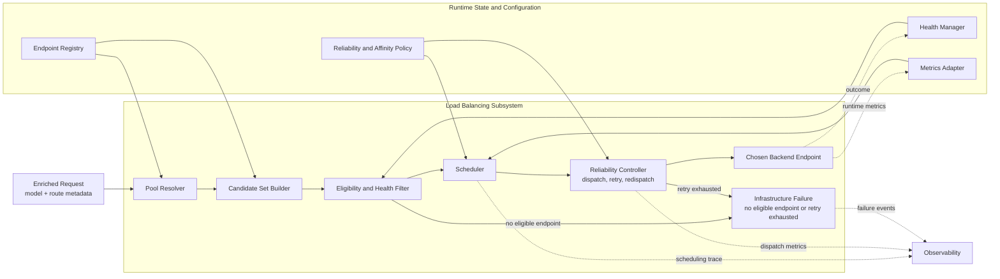

# ASE Load Balancing Design

## Introduction

This document defines the design of the Load Balancing subsystem in the ASE LLM gateway. Load Balancing is the second decision layer in the request path and is responsible for choosing which backend instance should execute a request whose target model has already been resolved.

Its input is an enriched request that already contains an authoritative `model` assignment from Semantic Routing. Its output is a selected backend endpoint plus the dispatch behavior needed to execute the request reliably.

This document focuses only on instance-level dispatch after model selection. It does not define prompt interpretation, semantic model choice, or policy logic that belongs to `ASE_Semantic_routing.md`.

## Background

### Problem Definition

Load Balancing solves the following problem:

> Given a request with an already resolved target model, and a set of backend endpoints capable of serving that model, select the best execution target while preserving availability, stability, and service efficiency.

This is an instance-selection problem, not a model-selection problem.

The subsystem must operate correctly under conditions such as:

- partial backend failures
- overloaded endpoints
- uneven request sizes
- long-lived streaming requests
- mixed internal and external backends
- heterogeneous observability support across serving systems

### Why Load Balancing Is a Separate Layer

Once the model has already been selected, the remaining problem is traffic engineering. The load balancer should reason about runtime state such as endpoint health, in-flight requests, queue pressure, locality, retries, and failover. It should not reinterpret prompt semantics or silently change the selected model under normal operation.

Keeping this behavior in a separate layer provides clear accountability:

- Semantic Routing owns model choice.
- Load Balancing owns endpoint choice.

### Design Goals

The Load Balancing subsystem is designed to satisfy the following goals:

- dispatch only to endpoints that are eligible to serve the selected model
- route around unhealthy, overloaded, or drained endpoints
- keep recovery behavior bounded and predictable
- keep scheduling overhead low enough for every request path
- preserve a strict separation from semantic decision making
- support heterogeneous backends with different runtime telemetry quality

### Design Principles

The subsystem follows these design principles:

- instance-centric rather than model-centric decision making
- evaluate hard eligibility and health before optimizing for throughput
- apply constraint filtering before scheduling
- keep retries, redispatch, and failover explicit and finite
- treat affinity as a preference rather than an absolute
- use metrics when available without depending on one backend-specific telemetry format

ASE draws on mature load-balancer practice for this layer, especially the scheduling vocabulary used by NGINX and the health, retry, and redispatch controls described in HAProxy documentation. Runtime telemetry from systems such as vLLM can be incorporated when available. See [R3], [R4], and [R5].

## Scope

### In Scope

This document covers:

- model-pool resolution
- endpoint discovery and eligibility evaluation
- health-aware instance scheduling
- request dispatch
- retry, redispatch, and bounded failover
- draining and recovery behavior
- affinity and stickiness policy
- runtime metrics ingestion for scheduling
- load-balancing observability
- configuration and operational considerations for dispatch

### Out of Scope

This document does not define:

- semantic model selection
- prompt classification
- policy-driven model choice
- safety-based model restriction at the semantic layer
- plugin logic tied to semantic decision making

Those concerns belong to `ASE_Semantic_routing.md`.

## Design

### Architectural Position

Load Balancing is the second decision layer in the ASE request path:

`Client Request -> Semantic Routing -> Request Enrichment (model=...) -> Load Balancing -> Selected Backend Instance`

Its contract is:

- input: request with resolved `model`
- output: selected backend endpoint capable of serving that model

Load Balancing may choose the serving instance, but it may not change the semantic model assignment under normal operation.

### System Design Diagram

The diagram below shows the detailed internal flow of the Load Balancing subsystem after a model has already been selected.



### Internal Architecture

The subsystem is composed of six logical components.

#### Pool Resolver

This component maps the resolved `model` field to a backend pool definition.

Responsibilities:

- model-to-pool lookup
- pool membership retrieval
- endpoint metadata loading
- priority and weight loading

#### Endpoint Registry

This component maintains the set of known endpoints and their static metadata.

Responsibilities:

- endpoint identity
- address and protocol metadata
- supported model mapping
- deployment type
- configured weight
- locality metadata
- drain status

#### Health Manager

This component tracks the operational state of each endpoint.

Responsibilities:

- active health-check results
- passive failure observations
- endpoint state transitions such as `up`, `degraded`, `down`, and `draining`
- recovery gating for unstable endpoints

#### Scheduler

This component selects a single eligible endpoint for a request.

Responsibilities:

- apply scheduling policy
- enforce affinity when appropriate
- select among healthy candidates
- support fallback ordering

#### Reliability Controller

This component applies dispatch-time reliability behavior.

Responsibilities:

- classify dispatch failures
- apply connect-time retry policy
- control redispatch
- enforce bounded failover
- suppress unstable endpoints when required

#### Metrics Adapter

This component normalizes runtime signals from different backend types.

Responsibilities:

- ingest generic health and latency telemetry
- ingest backend-native metrics when available
- normalize scheduler-facing runtime state
- expose a consistent metrics interface to the scheduler

### Backend Pool Model

Load Balancing should schedule within logical pools associated with the selected model.

#### Logical Pooling

Each routable model maps to a logical backend pool.

Examples:

- `general-small` -> Pool A
- `code-large` -> Pool B
- `reasoning-private-long` -> Pool C

This keeps Load Balancing focused on the endpoints that can actually serve the resolved model.

#### Pool Membership

Each pool should define at least:

- endpoint IDs
- addresses and protocols
- weights
- supported deployment zones
- endpoint priority
- external or internal backend type

#### Pool Types

ASE should support more than one kind of pool:

- homogeneous internal pools
- heterogeneous internal pools with weighted balancing
- external provider pools
- hybrid fallback pools
- compliance-scoped pools restricted by region or tenant

### Scheduling Inputs

The scheduler should reason over multiple input classes.

#### Static Inputs

These do not change frequently.

Examples:

- selected model
- pool membership
- configured weights
- endpoint locality
- affinity rules
- endpoint priority

#### Health Inputs

These describe endpoint serviceability.

Examples:

- active health-check status
- passive failure rate
- circuit-open state
- drain state

#### Runtime Load Inputs

These describe current execution pressure.

Examples:

- in-flight requests
- queue depth
- observed latency
- token throughput
- rate-limit status
- cache pressure when available

#### Affinity Inputs

These preserve useful locality when possible.

Examples:

- session ID
- conversation ID
- tenant ID
- sticky key derived from request metadata

### Scheduling Pipeline

Requests should move through the following scheduling pipeline.

#### Step 1: Resolve Pool

Read the resolved `model` field and map it to a backend pool.

#### Step 2: Build Candidate Set

Load all endpoints that belong to the selected pool.

#### Step 3: Apply Hard Exclusions

Remove endpoints that are down, draining, disallowed by locality or policy, or otherwise ineligible.

#### Step 4: Apply Affinity Preference

If stickiness is enabled, prefer the previously associated endpoint when it remains healthy and eligible.

#### Step 5: Apply Scheduling Algorithm

Select the best endpoint among the remaining candidates using the configured algorithm and runtime state.

#### Step 6: Dispatch

Forward the request to the chosen endpoint.

#### Step 7: Observe Outcome

Record whether the attempt succeeded, failed before execution, or failed after dispatch began.

#### Step 8: Update Runtime State

Feed the observed outcome back into health, reliability, and metrics systems.

### Supported Scheduling Algorithms

ASE should support multiple algorithms because no single policy fits every serving stack.

#### Round Robin and Weighted Round Robin

These are suitable for simpler or more homogeneous pools where load is relatively even and minimal scheduling overhead is desired.

#### Least Connections and Least In-Flight

These are better suited for variable request durations and long-lived streaming traffic because they react to concurrency rather than just request count.

#### Hash and Affinity-Based Routing

These are useful when cache locality, session continuity, or backend warm state matters more than perfect short-term fairness.

#### Priority and Weighted Failover

These support preferred pools or endpoints with backup ordering when the primary set is unavailable or degraded.

#### Metrics-Aware Scheduling

These strategies incorporate telemetry such as queue depth, latency, token pressure, or cache state when the backend exposes reliable metrics.

The initial ASE deployment can start with weighted round robin or least in-flight and later evolve toward richer metrics-aware policies without changing the layer boundary.

### Health Model

Endpoint health should be modeled explicitly rather than inferred ad hoc during dispatch.

#### Endpoint States

Recommended states include:

- `up`
- `degraded`
- `down`
- `draining`

Each state should have clear scheduling semantics so that operators can predict how traffic will move during incidents and maintenance.

#### Active Health Checks

Active checks are periodic probes used to detect connectivity or service-level failure before user traffic is affected.

Typical uses:

- remove failed endpoints from rotation
- validate recovery before re-entry
- distinguish transient network issues from prolonged unavailability

#### Passive Health Signals

Passive signals come from live request outcomes.

Examples:

- connection failures
- timeout rate
- HTTP failure classes
- abrupt stream termination

Passive signals help the balancer react faster than active checks alone.

#### Recovery Policy

Recovered endpoints should not immediately receive full traffic. Gradual re-entry or controlled reinstatement is preferable when an endpoint has recently been unstable.

### Retry, Redispatch, and Failover

Reliability behavior must be explicit and bounded.

#### Retry Principle

Retries should be finite and policy-controlled. Unlimited or ambiguous retries create duplicate work, unstable latency, and hard-to-debug failure patterns.

#### Safe Retry Cases

Retries are typically safe when failure occurs before the backend begins executing the request, such as:

- connection failure
- TLS setup failure
- immediate admission rejection before execution

#### Unsafe Retry Cases

Retries are typically unsafe when execution may already have started, such as:

- partial streamed responses
- ambiguous upstream timeout after possible execution
- side effects triggered through tools or external systems

#### Redispatch Policy

When retry is allowed, ASE may redispatch to a different endpoint in the same pool if policy permits and another healthy candidate exists.

#### Escalation to Higher-Level Failure

If retries and redispatch are exhausted, the subsystem should emit a clear infrastructure failure rather than silently collapsing the error into a semantic routing problem.

### Affinity and Stickiness

Affinity can improve locality and user experience but should remain subordinate to availability.

#### Purpose

Stickiness can preserve:

- session continuity
- prefix-cache locality
- backend warm state
- tenant or conversation locality

#### Affinity Keys

Useful keys include:

- session ID
- conversation ID
- tenant ID
- request-class hash

#### Affinity Rule

Affinity should be treated as a preference. If the preferred endpoint is unhealthy, drained, or overloaded beyond policy, the scheduler should select another candidate rather than forcing a bad placement.

#### Consistent Placement

Consistent hashing or deterministic sticky mapping may be used where stable placement matters more than perfect traffic spread.

### Metrics and Runtime State

The scheduler should be able to work with both generic and backend-native telemetry.

#### Generic Metrics

Metrics that should be usable across backend types include:

- endpoint health state
- request latency
- in-flight requests
- error rate
- timeout rate
- dispatch success rate

#### Backend-Native Metrics

When available, ASE may incorporate richer signals such as:

- queue depth
- token throughput
- GPU utilization
- KV cache usage
- prefix-cache hit potential

vLLM-style metrics endpoints are especially useful for this class of runtime-aware scheduling. See [R5].

#### Metrics Portability Principle

ASE should benefit from rich telemetry without depending on one serving stack. If advanced metrics are unavailable, the subsystem must still function correctly using generic health and latency signals.

### Failure Semantics

Load Balancing should classify failures based on dispatch stage.

#### No Eligible Endpoint

The selected model resolves to a pool, but no endpoint is currently eligible to serve the request.

#### Dispatch Failure

The chosen endpoint was eligible, but the immediate dispatch attempt failed.

#### Retry Exhaustion

A dispatch failure was retried or redispatched according to policy, but all allowed attempts failed.

#### Pool Unavailable

The entire serving pool is unavailable due to health, drain, or policy constraints.

#### Why This Matters

These failure classes let operators distinguish:

- semantic success followed by infrastructure failure
- isolated endpoint failure versus pool-wide outage
- transient connect problems versus repeated dispatch instability

### Observability

Load Balancing must expose operationally useful telemetry because its decisions are runtime-sensitive.

#### Core Metrics

- pool-resolution count
- endpoint-selection count by endpoint and pool
- dispatch latency
- retry count
- redispatch count
- per-endpoint failure rate
- pool-unavailable count
- drain-state traffic volume

#### Recommended Dashboards

Operators should be able to see:

- endpoint health by pool
- request volume by selected model and backend pool
- retry and redispatch trends
- latency and failure distribution by endpoint
- drained or degraded endpoint behavior during maintenance or incidents

#### Trace Fields

Useful trace or log fields include:

- request ID
- selected model
- resolved pool
- selected endpoint
- scheduling algorithm
- retry count
- redispatch count
- final dispatch outcome

### Configuration Model

The subsystem should be configured declaratively.

#### Configuration Domains

- model-to-pool mapping
- endpoint registry
- health-check policy
- retry policy
- redispatch policy
- scheduling algorithm
- stickiness policy
- metrics adapters

#### Example Logical Structure

```yaml
load_balancing:
  default_algorithm: least_inflight
  retry_policy:
    max_retries: 2
    redispatch_on_connect_failure: true
  affinity_policy:
    enabled: true
    key: session_id
    mode: preferred
  pools:
    - model: code-large
      algorithm: least_inflight
      endpoints:
        - id: code-large-a
          address: 10.0.0.11:8000
          weight: 100
        - id: code-large-b
          address: 10.0.0.12:8000
          weight: 100
    - model: general-small
      algorithm: weighted_round_robin
      endpoints:
        - id: general-small-a
          address: 10.0.1.11:8000
          weight: 100
```

This structure is intentionally logical rather than implementation-specific. The important property is that scheduling and reliability policy remain reviewable and changeable without code edits.

### Security and Operational Considerations

Although Load Balancing is not the semantic governance layer, it still has important security and operational responsibilities.

It should support:

- explicit endpoint allowlists
- protocol and TLS policy per backend
- controlled external fallback
- backend isolation by tenant or region when required
- safe draining for maintenance
- telemetry suitable for incident response

These controls make the dispatch layer operationally trustworthy without turning it into a semantic policy engine.

## References

- [R1] `overview.md`, ASE LLM Gateway Architecture Overview
- [R2] `ASE_Semantic_routing.md`, ASE Semantic Routing Design
- [R3] NGINX HTTP Load Balancing Documentation, https://docs.nginx.com/nginx/admin-guide/load-balancer/http-load-balancer/
- [R4] HAProxy Reliability and Health Check Documentation, https://www.haproxy.com/documentation/haproxy-configuration-tutorials/reliability/
- [R5] vLLM Metrics Documentation, https://docs.vllm.ai/en/stable/design/metrics/
