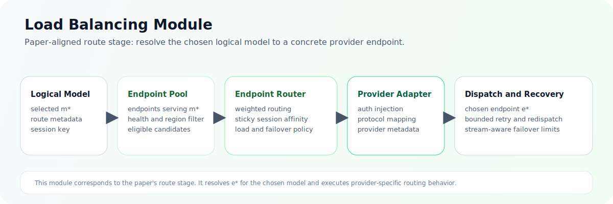
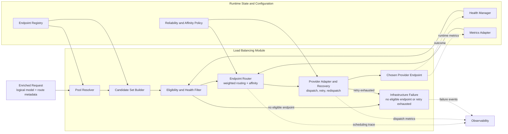

ASE Load Balancing Module Design

Author(s): PU Yang/n000000000

Status: Intent to implement

[[_TOC_]]

Introduction
============

This document defines the design of the Load Balancing Module in the ASE Semantic Routing and Load Balancing architecture. The Load Balancing Module is the second decision stage in the request path and is responsible for selecting which concrete provider endpoint should execute a request whose target logical model has already been resolved.

This document is not a generic overview of traffic distribution. It is the governing design for the execution-balancing module that receives an authoritative logical-model decision from the Semantic Routing Module, resolves the corresponding endpoint pool, and selects an execution target under runtime health, capacity, affinity, and reliability constraints.

Within the overall document set, this file defines instance-level dispatch only. System-wide architecture is defined in `architecture.md`, and model-level decision making is defined in `semantic_routing_module.md`.

Background
==========

### Module problem

The Load Balancing Module solves the following problem:

> Given a request with an already resolved target logical model, and a set of provider endpoints capable of serving that logical model, select an execution target that preserves availability, stability, and service efficiency.

This is a provider-endpoint-selection problem, not a logical-model-selection problem. The semantic question has already been answered upstream. What remains is to map the selected logical model onto a serving endpoint under current operational conditions.

In production, this problem is complicated by partial endpoint failures, uneven request sizes, long-lived streaming requests, heterogeneous backends, administrative drain behavior, and inconsistent telemetry quality across serving systems.

### Why this module must exist

The Load Balancing Module exists because choosing where a request should execute is a different problem from choosing what logical model should execute it.

Once the logical model is fixed, the system must reason about endpoint weight, provider choice, backend health, in-flight load, queue pressure, affinity, retries, redispatch, region, and recovery behavior. None of these concerns should require the module to reinterpret prompt semantics or revise the logical-model decision under normal operation.

ASE therefore isolates the Load Balancing Module as the module that owns endpoint choice and runtime dispatch behavior. It must honor the logical-model assignment it receives and operate within that constraint.

### Design objectives

The module is designed to achieve the following outcomes:

- dispatch only to provider endpoints that are eligible to serve the selected logical model
- route around unhealthy, overloaded, or administratively drained endpoints
- keep retries, redispatch, and failover bounded and predictable
- maintain scheduling overhead low enough for the online request path
- preserve strict separation from semantic logical-model selection
- support heterogeneous backends with varying telemetry richness

### Governing principles

The module follows five governing principles.

First, the Load Balancing Module is endpoint-centric, not logical-model-centric. Second, health and eligibility must be evaluated before throughput optimization. Third, scheduling decisions should be based on explicit runtime state and declarative policy rather than hidden side effects. Fourth, retries and redispatch must be finite and observable. Fifth, affinity is a preference that improves locality, not an excuse to route to unhealthy endpoints.

ASE aligns this module with mature load-balancer practice. The scheduling vocabulary used by NGINX, the health and retry controls documented by HAProxy, and rich runtime metrics from systems such as vLLM provide the right conceptual foundation for the module. See [R3], [R4], and [R5].

Scope
=====

### In scope

This document defines:

- logical-model-to-pool resolution
- endpoint discovery and eligibility evaluation
- health-aware instance scheduling
- runtime dispatch behavior
- retry, redispatch, and bounded failover
- drain and recovery behavior
- affinity and stickiness policy
- runtime metrics ingestion for scheduling
- observability requirements for dispatch decisions
- configuration and operational requirements specific to instance-level routing

### Out of scope

This document does not define:

- semantic logical-model selection
- prompt classification
- policy-driven model-family choice
- semantic safety gating that belongs before logical-model resolution
- plugin logic tied to semantic decision making

Those responsibilities belong to `semantic_routing_module.md` or to broader ASE control-plane components outside this module.

Architecture overview
=====================

### Module summary

The Load Balancing Module is the authoritative endpoint-selection module in ASE. It accepts a request whose `model` already carries a resolved logical model, maps that logical model to an endpoint pool, filters provider endpoints using health and eligibility rules, applies scheduling policy, and dispatches the request to a concrete execution target.

The key property of the module is that it resolves a provider endpoint, not a logical model. Its value comes from making runtime dispatch reliable, observable, and operationally tunable without collapsing back into semantic decision making.

### Role in the two-stage process

ASE follows a `select -> route` process.

- The Semantic Routing Module owns semantic analysis and logical-model selection.
- The Load Balancing Module owns endpoint-pool resolution and provider-endpoint routing.
- This module corresponds to the execution `route` stage, and is closest to the endpoint router, not the semantic `select` stage.

This means the Load Balancing Module is primarily a resource-scheduling and availability module. It resolves the selected logical model to a concrete endpoint, then applies weighted routing, session affinity, provider adaptation, and failover behavior. It does not decide what capability class the request needs.

### Module at a glance

The diagram below summarizes the Load Balancing Module before the more detailed internal design diagram.



### System design diagram

The diagram below shows the internal flow of the Load Balancing Module after logical-model resolution has already completed.



### Architectural position

The Load Balancing Module appears in the request path as follows:

`Client Request -> Semantic Routing Module -> Request Enrichment (logical model in model field) -> Load Balancing Module -> Selected Provider Endpoint`

Its contract is:

- input: request with resolved logical model in `model` plus route metadata
- output: selected provider endpoint plus dispatch behavior governed by runtime policy

That contract is normative. The Load Balancing Module may decide where the selected logical model runs, but it may not change what logical model the request has been assigned.

The module should also produce a stable dispatch outcome contract for observability and downstream control paths.

| Field | Requirement level | Purpose |
| --- | --- | --- |
| `request_id` | required | preserve request identity across semantic and infrastructure decisions |
| `model` | required | record which semantic logical-model decision this dispatch honored |
| `pool_id` | required | identify the endpoint pool chosen for execution |
| `provider_id` | optional | identify which provider or serving system supplied the chosen endpoint |
| `endpoint_id` | required on success | identify the concrete provider endpoint that was selected |
| `dispatch_status` | required | distinguish success, immediate failure, retry exhaustion, and pool unavailability |
| `retry_count` | optional | preserve how much bounded recovery was attempted |
| `redispatch_count` | optional | record whether recovery required switching endpoints |
| `dispatch_reason` or algorithm detail | optional | explain why the endpoint was chosen or why dispatch failed |

### Architectural invariants

The following invariants are mandatory for this module.

1. The Load Balancing Module must not begin until the Semantic Routing Module has resolved the authoritative logical model in `model`.
2. Endpoint selection must remain constrained to the endpoint pool for that logical model.
3. Endpoint health and hard eligibility must be evaluated before scheduling optimization.
4. Retry and redispatch behavior must be explicit, finite, and observable.
5. Failure classification must preserve the distinction between semantic success and infrastructure failure.

### Internal architecture

The module is composed of six logical components.

| Component | Primary responsibility | Architectural output |
| --- | --- | --- |
| Pool Resolver | map the resolved logical model to a logical endpoint pool | pool identity and pool configuration |
| Endpoint Registry | provide endpoint inventory and static metadata | candidate endpoint universe for the selected pool |
| Health Manager | maintain endpoint serviceability state | health and drain state used for hard filtering |
| Scheduler | choose the best provider endpoint among eligible candidates | selected provider endpoint and scheduling rationale |
| Reliability Controller | apply retry, redispatch, and dispatch-time failover policy | dispatch outcome and bounded recovery behavior |
| Metrics Adapter | normalize generic and backend-native telemetry | scheduler-facing runtime metrics |

### Dispatch framework

Dispatch should be understood as a staged reduction process rather than a single opaque scheduling step.

1. Resolve the logical model in `model` to the endpoint pool that is allowed to serve it.
2. Build the candidate set from endpoint registry membership and static metadata.
3. Apply hard exclusions for health, drain, locality, protocol, and policy incompatibility.
4. Apply affinity preference when enabled and still safe.
5. Select an endpoint using the configured scheduling algorithm and runtime metrics.
6. Dispatch the request and classify the outcome.

Pool Resolver
=============

The Pool Resolver schedules within logical endpoint pools associated with the resolved logical model. Each pool should be treated as the execution domain for a specific semantic decision. The module should not search globally across all backends once a logical model has already been selected.

The same logical model may be backed by multiple provider endpoints. This is a first-class use case, not an exception path. The purpose of the Load Balancing Module is to route among those equivalent or near-equivalent endpoints under runtime policy without reopening semantic model selection.

Each pool definition should expose, at minimum:

- the resolved logical model or logical-model alias it serves
- endpoint membership
- provider identity
- endpoint priority and weight
- backend type and protocol information
- deployment-zone or locality metadata
- any pool-specific scheduling or reliability overrides

ASE should support more than one kind of pool, including homogeneous internal pools, heterogeneous weighted pools, external provider pools, hybrid fallback pools, and compliance-scoped pools restricted by tenant or region.

Endpoint Registry and Health Manager
====================================

The Endpoint Registry provides the static and slowly changing metadata required to build the candidate set for a pool. The Health Manager provides the dynamic serviceability state required to exclude endpoints that should not currently receive traffic.

The scheduler operates on a structured runtime view assembled from four input classes.

| Input class | Purpose | Representative inputs |
| --- | --- | --- |
| Static Pool Inputs | define the dispatch domain and configured policy | selected logical model, pool membership, provider, weights, locality, endpoint priority |
| Health Inputs | determine whether an endpoint is serviceable | active health state, passive failure rate, circuit state, drain state |
| Runtime Load Inputs | describe current execution pressure | in-flight requests, queue depth, latency, token throughput, rate-limit status, provider-side quota state |
| Affinity Inputs | preserve useful locality where possible | session ID, conversation ID, tenant ID, sticky hash |

Endpoint health must be modeled explicitly. Dispatch quality depends on being able to distinguish endpoints that are healthy, degraded, unavailable, or draining for administrative reasons.

Recommended endpoint states include:

- `up`
- `degraded`
- `down`
- `draining`

Health state should be informed by both active and passive signals. Active checks detect connectivity or service-level failure independently of live traffic. Passive signals react to observed outcomes such as connection failure, timeout, HTTP failure classes, or abrupt stream termination.

Recovery must also be policy-controlled. An endpoint that has just recovered should not necessarily receive full traffic immediately. Gradual re-entry or controlled reinstatement is preferable when recent instability suggests recovery may be incomplete.

Circuit-breaking state may be layered on top of endpoint health. An `open` circuit suppresses traffic to a recently failing endpoint, while a `half_open` circuit permits controlled probes before the endpoint is returned to normal service. Circuit state is an operational safety mechanism and should remain visible in dispatch telemetry.

Scheduler
=========

The scheduler chooses the best provider endpoint among the remaining eligible candidates. It should support a family of scheduling strategies rather than a single fixed algorithm because different backend topologies favor different policies.

| Scheduling strategy | Best fit | Primary tradeoff |
| --- | --- | --- |
| Weighted Random / Weighted Round Robin | simple or relatively homogeneous pools | low overhead, limited runtime sensitivity |
| Least Connections / Least In-Flight | variable-duration or streaming workloads | better concurrency awareness, needs current state |
| Hash / Affinity-Based Placement | cache locality or session continuity sensitive workloads | stronger locality, weaker short-term fairness |
| Priority / Weighted Failover | primary-backup or tiered backend topologies | explicit preference ordering, less even spread |
| Metrics-Aware Scheduling | rich telemetry environments | better adaptation, stronger dependency on telemetry quality |

In addition to baseline strategies, ASE should treat several LLM-specific scheduling patterns as first-class policies rather than ad hoc implementation details.

| Strategy | Required signals | Best fit | Primary caveat |
| --- | --- | --- | --- |
| Consistent Hashing / Stable Affinity | session ID, conversation ID, or request-class hash | preserve KV-cache or prefix-cache locality across related requests | locality must be breakable when the preferred endpoint is unhealthy or overloaded |
| Power of Two Choices | lightweight load signal such as in-flight requests or queue depth | better short-term balance than random selection at low overhead | still depends on reasonably fresh load state |
| Least Queue / Queue-Aware | queue depth, waiting requests, or admission backlog | prefill-heavy or bursty clusters where waiting time dominates | poor queue telemetry leads to poor choices |
| Token-Aware Scheduling | prompt-token estimate, `max_tokens`, token throughput | highly variable request sizes where raw request count is misleading | estimates are approximate and should not be treated as exact cost |
| Cache-Aware / Prefix-Aware Routing | prefix hash, cache-hit probability, or session locality hint | repeated system prompts, agent workloads, or templated RAG requests | can reduce fairness if locality is over-weighted |

Affinity exists to improve locality, not to weaken availability. Useful affinity keys include session ID, conversation ID, tenant ID, and request-class hashes that approximate cache reuse or backend warm state. Affinity may improve session continuity, prefix-cache locality, and hot-state reuse, but it should always remain subordinate to endpoint eligibility and health.

Reliability Controller
======================

Reliability behavior is part of the module design, not an implementation afterthought.

Retries should be finite and policy-controlled. Redispatch should occur only when the failure mode and request semantics make it safe to do so. Failover should remain bounded and observable rather than open-ended.

Safe retry scenarios usually involve failures before execution begins, such as connection failure, TLS establishment failure, or immediate admission rejection. Unsafe retry scenarios usually involve the possibility that execution already began, such as partial streamed responses, ambiguous upstream timeouts, or tool side effects.

For streaming responses, redispatch is usually unsafe once bytes or tokens have already been relayed to the caller. Unless the upstream protocol provides explicit resumable semantics, ASE should treat post-stream-start failures as terminal execution failures rather than silently replaying them on another backend.

If retry and redispatch are exhausted, the module must emit a clear infrastructure failure rather than silently collapsing the error into a semantic-routing problem.

Failure classification must remain explicit.

| Failure class | Meaning | Typical cause |
| --- | --- | --- |
| No Eligible Endpoint | the selected logical model resolves to a pool, but no endpoint is eligible to serve it | all endpoints down, draining, policy-ineligible, or filtered out |
| Dispatch Failure | an eligible endpoint was chosen, but the immediate dispatch attempt failed | connect failure, admission failure, protocol failure |
| Retry Exhaustion | a dispatch failure was retried or redispatched within policy, but all attempts failed | repeated connect failures, repeated endpoint instability |
| Pool Unavailable | the pool as a whole cannot currently serve traffic | pool-wide outage, full drain, region-wide restriction |

Although the Load Balancing Module is not the semantic governance layer, it is still a security- and operations-relevant module because it controls the actual execution path to backend systems. At minimum, it should support explicit endpoint allowlists, protocol and TLS policy per backend, controlled external fallback, backend isolation by tenant or region when required, safe draining for maintenance, and telemetry suitable for incident response.

Metrics Adapter and Backend Compatibility
=========================================

The module should be able to operate correctly using generic telemetry and improve when richer backend-native telemetry exists.

Generic metrics that should work across backend types include:

- endpoint health state
- request latency
- in-flight requests
- error rate
- timeout rate
- dispatch success rate

When available, richer backend-native telemetry may also be incorporated, such as queue depth, token throughput, GPU utilization, KV cache usage, and prefix-cache hit potential. vLLM-style metrics endpoints are particularly useful in this category. See [R5].

ASE should normalize backend-native telemetry into a small canonical vocabulary before the scheduler consumes it. Scheduling policy should target logical metrics rather than vendor-specific metric names.

| Canonical metric | Meaning | Example backend-native signal | Primary use |
| --- | --- | --- | --- |
| `requests_running` | active requests currently executing on an endpoint | `vllm:num_requests_running` | least in-flight and overload detection |
| `requests_waiting` | requests queued or waiting for admission | `vllm:num_requests_waiting` | least-queue and queue-aware scheduling |
| `requests_swapped` | requests displaced due to memory pressure | `vllm:num_requests_swapped` | detect degraded service and memory stress |
| `ttft_seconds` | time to first token | `vllm:time_to_first_token_seconds` | user-visible latency and endpoint scoring |
| `tpot_seconds` | average time per output token | `vllm:time_per_output_token_seconds` | decode-speed scoring for streaming workloads |
| `e2e_latency_seconds` | end-to-end request latency | `vllm:e2e_request_latency_seconds` | overall service quality and regression detection |
| `prompt_tokens_total` | prompt token throughput counter | `vllm:prompt_tokens_total` | throughput and token-aware cost estimation |
| `generation_tokens_total` | generation token throughput counter | `vllm:generation_tokens_total` | decode throughput and capacity planning |
| `gpu_kv_cache_usage_ratio` | GPU-side KV-cache pressure | `vllm:gpu_cache_usage_perc` | cache-aware scoring and overload protection |
| `cpu_kv_cache_usage_ratio` | CPU-side KV-cache pressure | `vllm:cpu_cache_usage_perc` | swapped-state diagnosis and pressure scoring |
| `prefix_cache_hit_rate` | reuse potential for repeated prompts | `vllm:prefix_cache_hit_rate` | cache-aware or prefix-aware routing |
| `gpu_utilization_ratio` | approximate accelerator saturation | backend-specific GPU metric | capacity and hotspot detection |

Not every backend will expose every metric. The normalization layer should preserve missing values explicitly so that schedulers can degrade gracefully rather than pretending absent telemetry is a healthy zero.

Not all inference backends expose the same operational surface. Some provide rich `/metrics` and `/health` endpoints, while others provide only coarse availability signals or no scheduler-friendly telemetry at all. ASE should therefore classify backend integrations by capability level.

| Capability level | Typical signals available | Scheduling modes that fit |
| --- | --- | --- |
| Level 0: minimal | passive failure observation, connect success, HTTP status | weighted round robin, priority failover |
| Level 1: basic | active health, request latency, in-flight count | least in-flight, Power of Two Choices |
| Level 2: queue-aware | waiting queue, token throughput, admission signals | least queue, token-aware scheduling |
| Level 3: cache and accelerator aware | KV-cache usage, prefix-cache hit rate, GPU utilization | cache-aware, prefix-aware, richer metrics-aware scheduling |

This compatibility model is operationally important. A backend that lacks `/metrics` should not be excluded from ASE, but it should be scheduled using simpler and more conservative policies. Likewise, if `/health` is missing, ASE should fall back to passive health signals or synthetic probes rather than assuming full observability.

Provider-specific request adaptation, including auth injection or protocol shaping, may occur after endpoint selection. That work belongs to this module or its execution adapters because it depends on the chosen provider endpoint, not on semantic model selection.

Interaction between the Semantic Routing Module and the Load Balancing Module
============================================================================

The interaction with the upstream Semantic Routing Module is intentionally narrow and explicit.

- The Semantic Routing Module supplies the authoritative logical model in `model`.
- The Load Balancing Module resolves only the endpoint pool associated with that logical model.
- Route metadata may constrain dispatch policy, but it must not reopen logical-model choice under normal operation.
- A downstream failure after model selection must remain classified as infrastructure failure, not be rewritten as semantic rejection.

The Load Balancing Module must expose operationally useful telemetry because its decisions are driven by runtime state and often change rapidly under load.

Core metrics should include:

- pool-resolution count
- endpoint-selection count by endpoint, provider, and pool
- dispatch latency
- retry count
- redispatch count
- per-endpoint failure rate
- pool-unavailable count
- drain-state traffic volume

Useful trace or log fields include request ID, selected logical model, resolved endpoint pool, selected provider, selected provider endpoint, scheduling algorithm, retry count, redispatch count, and final dispatch outcome.

Configuration
=============

The module should be configured declaratively rather than through code changes. This is necessary so that scheduling and reliability policy remain reviewable and tunable as fleet conditions evolve.

The configuration surface should at least cover:

- logical-model-to-pool mapping
- endpoint registry
- provider metadata and execution-adapter binding
- health-check policy
- retry policy
- redispatch policy
- scheduling algorithm selection
- scheduler fallback policy by backend capability tier
- stickiness or affinity policy
- metrics-adapter bindings

Notation
--------

ASE uses declarative YAML or JSON configuration for load balancing. The XML-specific notation in the generic template does not apply to this module.

load_balancing
--------------

| Element | Possible values | Description |
| --- | --- | --- |
| `load_balancing:` | object | Top-level Load Balancing Module configuration |
| `  default_algorithm:` | string | Default endpoint-selection strategy when a pool does not override it |
| `  retry_policy:` | object | Bounded retry and redispatch controls |
| `  affinity_policy:` | object | Stickiness controls such as key, enablement, and mode |
| `  pools:` | list | Logical-model-to-pool mappings and endpoint membership |
| `    logical_model:` | string | Logical model served by the pool |
| `    algorithm:` | string | Pool-specific scheduling strategy |
| `    metrics_capability:` | string | Backend telemetry capability tier used for scheduler fallback |
| `    endpoints:` | list | Concrete provider endpoints in the pool |

pools.endpoints
---------------

| Element | Possible values | Description |
| --- | --- | --- |
| `id` | string | Stable endpoint identifier used for scheduling and observability |
| `provider` | string | Provider or serving system backing the endpoint |
| `address` | string | Network address or adapter target used for dispatch |
| `weight` | integer | Relative traffic weight when weighted strategies are used |
| `priority` | integer | Preferred order for failover-oriented policies |
| `zone` or `region` | string | Locality metadata used for placement and compliance controls |

An illustrative logical configuration is shown below.

```yaml
load_balancing:
  default_algorithm: least_inflight
  retry_policy:
    max_retries: 2
    redispatch_on_connect_failure: true
  affinity_policy:
    enabled: true
    key: session_id
    mode: preferred
  pools:
    - logical_model: code-high-capacity
      algorithm: least_inflight
      metrics_capability: level_2
      endpoints:
        - id: code-large-a
          provider: internal-vllm
          address: 10.0.0.11:8000
          weight: 100
        - id: code-large-b
          provider: internal-vllm
          address: 10.0.0.12:8000
          weight: 100
    - logical_model: general-general-purpose
      algorithm: weighted_round_robin
      metrics_capability: level_0
      endpoints:
        - id: general-small-a
          provider: external-provider-a
          address: 10.0.1.11:8000
          weight: 100
```

The exact DSL is implementation-specific. The architectural requirement is that dispatch and reliability behavior remain declarative, reviewable, and versioned.

Testing
=======

The automated testing strategy for this module should verify endpoint selection correctness, failure handling, and preservation of the semantic-to-dispatch boundary.

The testing plan should include:

- pool-resolution tests that verify the selected logical model maps to the correct endpoint pool and never escapes that pool
- endpoint-filtering tests that validate health, drain, locality, and policy exclusions before scheduling occurs
- scheduler tests for weighted, least-inflight, affinity, and metrics-aware strategies using deterministic runtime fixtures
- reliability tests for bounded retry, bounded redispatch, streaming failure handling, and retry exhaustion
- backend-compatibility tests that prove the scheduler degrades correctly across telemetry capability levels
- observability tests that verify dispatch traces preserve pool, endpoint, retry, redispatch, and final failure classification

Existing unit and integration harnesses are sufficient if they can inject health and runtime-state changes deterministically. If not, a dedicated dispatch test harness should be added so scheduling and failover behavior can be validated repeatably.

Task breakdown
==============

The work should be broken down into mergeable tasks that preserve a working dispatch path after each step.

| Task | Time Estimate | Tracker |
| --- | --- | --- |
| Implement logical-model-to-pool resolution and endpoint registry | 4 days | |
| Implement health management and hard eligibility filtering | 1 week | |
| Implement scheduler strategies and affinity controls | 1 week | |
| Implement retry, redispatch, and provider-adapter recovery logic | 4 days | |
| Add dispatch observability and failure-injection test coverage | 3 days | |

## Implement logical-model-to-pool resolution and endpoint registry

Add the stable mapping from semantic logical models to execution pools together with the endpoint metadata needed to build candidate sets.

## Implement health management and hard eligibility filtering

Add active and passive health evaluation, drain handling, and exclusion logic so the scheduler operates only on serviceable endpoints.

## Implement scheduler strategies and affinity controls

Implement the baseline and metrics-aware scheduling policies together with safe affinity handling that never overrides health or hard eligibility.

## Implement retry, redispatch, and provider-adapter recovery logic

Add bounded recovery behavior, provider-specific dispatch adapters, and explicit failure classification for exhausted retries and unavailable pools.

## Add dispatch observability and failure-injection test coverage

Add metrics, logs, traces, and fault-injection tests that protect dispatch behavior and failure attribution from regression.

References
==========

R1. `architecture.md`, ASE Semantic Routing and Load Balancing Architecture

R2. `semantic_routing_module.md`, ASE Semantic Routing Module Design

R3. NGINX HTTP Load Balancing Documentation, https://docs.nginx.com/nginx/admin-guide/load-balancer/http-load-balancer/

R4. HAProxy Reliability and Health Check Documentation, https://www.haproxy.com/documentation/haproxy-configuration-tutorials/reliability/

R5. vLLM Metrics Documentation, https://docs.vllm.ai/en/stable/design/metrics/
