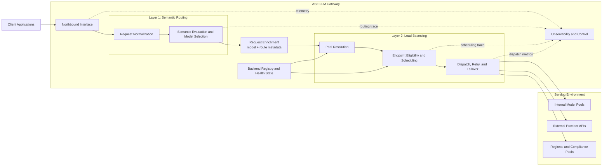

# ASE LLM Gateway Architecture Overview

## Introduction

This document defines the top-level architecture of the ASE LLM gateway. Its purpose is to explain how ASE should process LLM requests end to end, what the major control boundaries are, and how the gateway separates model-level decision making from infrastructure-level traffic distribution.

The intended audience is platform architects, gateway engineers, AI infrastructure engineers, security engineers, and operations teams that need a common architecture narrative before reading subsystem-level design documents.

This document is the entry point to a three-document design set:

- `overview.md` explains the overall architecture, request path, and responsibility split.
- `ASE_Semantic_routing.md` specifies how ASE selects the target model.
- `load_balancer.md` specifies how ASE selects the serving instance for that model.

## Background

### Enterprise LLM Gateway Problem

Enterprise LLM access can no longer be treated as a simple proxying or HTTP forwarding problem. Modern AI applications invoke different models with different capability profiles, cost tiers, latency characteristics, deployment boundaries, and governance constraints. As a result, an LLM gateway must make two different classes of decision for every request:

1. Which model should serve the request.
2. Which backend instance should execute the selected model.

These two decisions operate on different inputs and optimize for different outcomes. Model selection depends on semantics, policy, and business intent. Instance selection depends on health, load, runtime pressure, locality, and reliability.

### Why a Single-Layer Router Is Not Enough

A single opaque router that mixes prompt understanding, business policy, endpoint health, retry behavior, and traffic scheduling becomes difficult to explain, operate, and evolve. It combines control-plane reasoning with data-plane scheduling and makes it hard to answer basic production questions such as:

- Was the request sent to the wrong model, or did the right model fail on the wrong server?
- Is a failure caused by semantic policy, pool availability, or endpoint instability?
- Can platform teams tune balancing behavior without changing model-selection policy?

ASE therefore needs an architecture that preserves a clean decision boundary between semantic routing and load balancing.

### Architecture Goals

The overall ASE architecture is designed to satisfy the following goals:

- route each request to a model that is appropriate for task intent, capability need, and policy boundary
- dispatch traffic only to eligible backend instances that can serve the selected model reliably
- enforce governance before expensive inference execution
- maintain operational reliability under overload, partial failure, and recovery
- keep routing explainable as a sequence of decisions rather than one opaque outcome
- allow semantic policy and traffic engineering to evolve independently

### Foundational Principles

The design is based on a small set of architectural principles:

- separation of concerns between model selection and instance scheduling
- a strict layered contract in which Semantic Routing resolves `model` and Load Balancing honors it
- policy and authorization checks before the request reaches expensive inference backends
- explicit distinction between semantic failures and infrastructure failures
- support for internal, external, and hybrid serving topologies without changing the layer model

## Scope

### In Scope

This document covers:

- the high-level ASE system boundary
- the two-layer architecture used in the request path
- the contract between Semantic Routing and Load Balancing
- the major logical components in the gateway
- the end-to-end request lifecycle
- the responsibility split between the two layers
- the top-level failure model
- deployment and observability expectations
- the relationship between this overview and the subsystem design documents

### Out of Scope

This document does not define:

- detailed semantic signal extraction logic
- detailed model-selection policy rules
- detailed instance scheduling algorithms
- concrete retry or failover thresholds
- full request and response API schemas
- full configuration schemas
- implementation-specific storage, cache, or controller choices

Those topics belong in the subsystem design documents.

## Design

### System Context

ASE sits between enterprise applications and a heterogeneous LLM serving environment.

On the northbound side, ASE exposes a unified request interface to applications and internal services. On the southbound side, ASE may connect to:

- internally hosted inference clusters
- external provider APIs
- model-specific serving pools
- region-specific or compliance-specific deployments
- mixed fleets with different cost and latency tiers

In this architecture, ASE acts as both an enterprise LLM gateway and a policy-aware control point for request steering.

### Two-Layer Architecture

ASE processes each request through two logical decision layers.

#### Semantic Routing

Semantic Routing decides which model should serve the request. It evaluates request meaning, capability requirements, governance constraints, tenant policy, and business objectives. Its output is an authoritative `model` assignment plus optional routing metadata that explains or constrains downstream behavior.

#### Request Enrichment Boundary

The boundary between the two layers is explicit. After Semantic Routing finishes, the request is enriched with the selected `model` value and any routing annotations needed downstream. That enriched request becomes the input contract for Load Balancing.

#### Load Balancing

Load Balancing decides which backend instance should execute the already selected model request. It resolves the backend pool for the chosen model, filters ineligible or unhealthy endpoints, applies scheduling policy, and dispatches traffic to a concrete target.

#### Core Contract

The central architectural rule of ASE is:

> Semantic Routing resolves the target model. Load Balancing resolves the serving instance within that model's backend pool.

This rule keeps semantic policy and infrastructure scheduling separate, testable, and operationally understandable.

### System Design Diagram

The diagram below shows the overall ASE architecture and the contract between the two decision layers.

### High-Level Component Model

The ASE LLM gateway can be described through the following logical components.

#### Northbound Interface

The northbound interface receives client requests, performs gateway-level authentication and request admission, and normalizes inbound traffic into the internal request pipeline.

#### Semantic Routing Subsystem

This subsystem interprets request content and control metadata, extracts routing signals, filters ineligible models, selects the best eligible model, and emits routing rationale.

#### Request Enrichment Boundary

This boundary materializes the semantic decision into a stable request contract, typically through `model=<resolved-model>` plus optional route metadata such as policy tags, route reason, or debug fields.

#### Load Balancing Subsystem

This subsystem maps the resolved model to a backend pool, evaluates endpoint eligibility, selects a target instance, applies retry and redispatch policy, and forwards the request.

#### Backend Registry and Health State

ASE requires a backend inventory and runtime health model so that Load Balancing can reason about endpoint identity, model support, locality, weights, drain state, and service health.

#### Southbound Model Endpoints

Southbound targets may be internal inference servers, provider-hosted APIs, or hybrid targets. The architecture treats them as execution backends after semantic resolution, even when their operational characteristics differ.

#### Observability and Control Functions

ASE must emit enough telemetry to reconstruct the request path as:

`request received -> model selected -> pool resolved -> instance selected -> response or failure`

This is necessary for debugging routing behavior and for separating semantic errors from infrastructure failures during operations.

### End-to-End Request Lifecycle

An end-to-end request should follow the lifecycle below.

#### Step 1: Request Ingress

ASE receives a client request through the unified gateway interface.

#### Step 2: Request Normalization

Gateway-level request parsing and normalization prepare the request for semantic evaluation.

#### Step 3: Semantic Evaluation

Semantic Routing extracts routing-relevant signals such as task type, complexity, policy tags, user hints, and context requirements.

#### Step 4: Model Resolution

Semantic Routing filters candidate models and selects the final target model. The request is enriched with `model=<resolved-model>`.

#### Step 5: Pool Resolution

Load Balancing resolves the backend pool associated with the selected model.

#### Step 6: Endpoint Filtering

Load Balancing removes endpoints that are unhealthy, drained, policy-ineligible, or otherwise unavailable.

#### Step 7: Instance Scheduling

Load Balancing selects the best execution target according to the configured scheduling policy and current runtime state.

#### Step 8: Request Dispatch

ASE forwards the request to the chosen backend target and applies bounded retry or redispatch policy if dispatch-time failures occur.

#### Step 9: Response Handling

ASE returns the backend response to the caller and classifies any failures according to whether they originated in semantic decision making or infrastructure execution.

#### Step 10: Observability Update

ASE emits the metrics, logs, traces, and decision metadata needed to debug the request later.

### Responsibility Split

The two layers must preserve a strict ownership boundary.

#### Semantic Routing Owns

- request understanding
- routing signal extraction
- model eligibility filtering
- policy-aware model selection
- request enrichment with the resolved `model`
- decision rationale and semantic trace data

#### Load Balancing Owns

- model-pool resolution
- endpoint discovery
- health-aware candidate filtering
- instance scheduling
- retry, redispatch, and dispatch-time failover
- runtime traffic distribution telemetry

#### Semantic Routing Does Not Own

- per-endpoint health checks
- queue-aware instance scheduling
- connection retry mechanics
- pool-level failover sequencing

#### Load Balancing Does Not Own

- prompt interpretation
- semantic task classification
- model-family selection under normal operation
- business-policy reasoning that belongs in Layer 1

### Failure Model

ASE should classify failures according to the layer that owns the failed decision.

#### Semantic Failure

Semantic failure occurs when ASE cannot normalize the request, cannot find an eligible model, or denies the request based on policy or governance rules. These are pre-dispatch failures.

#### Infrastructure Failure

Infrastructure failure occurs after a model has already been selected but no backend endpoint can serve the request successfully. Examples include pool exhaustion, endpoint unavailability, dispatch failure, or retry exhaustion.

#### Why the Distinction Matters

Separating these failure classes improves:

- debugging, because operators know whether the issue was model choice or backend execution
- user messaging, because rejection and temporary unavailability can be reported differently
- policy evolution, because semantic policy can change independently from dispatch policy
- operational tuning, because SREs can optimize backend behavior without changing model-selection logic

### Deployment View

The two-layer architecture is deployment-agnostic and supports multiple deployment modes.

#### Centralized Gateway, Distributed Model Pools

A single logical ASE gateway fronts multiple model pools hosted in one or more backend clusters.

#### Hybrid Internal and External Serving

ASE routes some requests to internal inference infrastructure and others to external provider APIs while keeping the same semantic-to-balancing handoff.

#### Compliance-Aware Segmentation

Specific requests can be constrained to approved regions, providers, or data-handling boundaries without changing the overall layer model.

#### Tiered Serving

Different model pools may represent different service tiers such as low-cost, high-throughput, premium-quality, or private-serving deployments.

### Observability Model

Observability is a first-class design requirement because routing behavior must be explainable. At the overview level, ASE should expose enough telemetry to answer:

- what request arrived
- which model was selected
- which pool was resolved
- which instance was chosen
- whether retries or redispatch happened
- whether the request succeeded, was denied semantically, or failed infrastructurally

Core observability signals should therefore include:

- request ingress volume
- model-selection distribution
- pool-resolution outcomes
- endpoint-selection outcomes
- dispatch latency
- retry and failover counts
- semantic rejection and policy-denial counts
- backend failure classes

### Relationship to Subsystem Documents

This overview intentionally stops at the system boundary and layer contract. Detailed behavior is delegated to the subsystem documents:

- `ASE_Semantic_routing.md` defines the request-level model-selection architecture.
- `load_balancer.md` defines the instance-level dispatch and reliability architecture.

The overview should remain stable even if either subsystem evolves internally.

## References

- [R1] `ASE_Semantic_routing.md`, ASE Semantic Routing Design
- [R2] `load_balancer.md`, ASE Load Balancing Design
