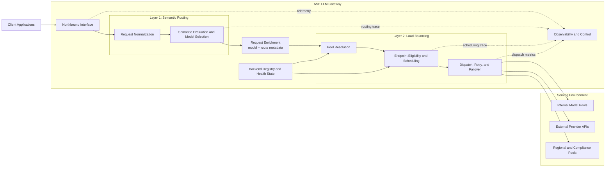

# ASE LLM Gateway Architecture Overview

## Introduction

This document defines the top-level architecture of the ASE LLM gateway. It is the governing design document for the gateway as a whole: it explains what problem ASE is solving, why the system is structured as two decision layers, what responsibilities belong to each layer, and what contract connects them.

The intended audience is platform architects, gateway engineers, AI infrastructure engineers, security engineers, and operations teams. The document is written to establish a common architectural model before readers go into subsystem-level detail.

This overview is also the entry point to the design set:

- `overview.md` defines the overall gateway architecture and the authoritative layer boundary.
- `ASE_Semantic_routing.md` defines how ASE selects the target model for a request.
- `load_balancer.md` defines how ASE selects the serving endpoint for the already selected model.

## Background

### Architectural Problem

An enterprise LLM gateway is not just a reverse proxy in front of inference endpoints. For every incoming request, the system must answer two separate questions.

The first question is semantic: which model should handle this request, given its intent, capability requirements, policy constraints, tenant restrictions, and business objectives. The second question is operational: which concrete serving endpoint should execute that already selected model request, given current health, capacity, locality, and reliability conditions.

These questions are related, but they are not the same problem. They depend on different inputs, they optimize for different outcomes, and they fail for different reasons. Treating them as a single routing decision produces a design that is difficult to reason about and difficult to operate.

### Why a Single Smart Router Is the Wrong Abstraction

If prompt interpretation, policy enforcement, endpoint health, retries, and traffic scheduling are collapsed into one opaque router, the system loses architectural clarity. The gateway can no longer cleanly answer operational questions such as:

- whether a bad outcome was caused by incorrect model selection or unstable backend placement
- whether a policy change should be made in the semantic layer or the dispatch layer
- whether a latency regression is a model-choice problem or an instance-scheduling problem

That design also makes change management harder. Semantic policy tends to evolve with product and governance requirements, while traffic engineering evolves with fleet topology, runtime behavior, and SRE practice. Those concerns should not be coupled without a compelling reason.

### Architectural Decision

ASE therefore adopts a two-layer request-processing model.

The first layer, Semantic Routing, resolves the target model. The second layer, Load Balancing, resolves the serving instance within the backend pool for that model. The handoff between the two layers is explicit and materialized in the request itself through an authoritative `model` assignment and associated routing metadata.

This is the central architectural decision in the ASE gateway. Everything else in this document exists to make that decision operationally precise.

### Architecture Objectives

The architecture is designed to achieve the following outcomes:

- correct model selection under semantic, policy, and business constraints
- reliable dispatch to a healthy endpoint that can serve the chosen model
- clear separation between policy-driven model choice and runtime traffic engineering
- explainable request handling, including why a model was chosen and why a backend was chosen
- operational resilience under partial failure, overload, recovery, and mixed backend topologies
- independent evolution of the semantic layer and the load-balancing layer

### Governing Principles

The architecture follows a small set of governing principles.

First, model choice and endpoint choice are separate decisions and should remain separate in code, configuration, and observability. Second, policy and authorization should be enforced before expensive model execution begins. Third, the handoff from Semantic Routing to Load Balancing must be explicit rather than implicit. Fourth, semantic failures and infrastructure failures are different classes of failure and must remain distinguishable to operators. Fifth, the gateway should preserve the same architectural shape across internal, external, and hybrid deployment modes.

## Scope

### In Scope

This document defines:

- the system boundary of the ASE LLM gateway
- the two-layer processing model used for request handling
- the contract between Semantic Routing and Load Balancing
- the major logical components in the gateway
- the end-to-end request path at the architectural level
- the ownership boundary between semantic and infrastructure decisions
- the top-level failure model and observability expectations
- the relationship between this overview and the subsystem documents

### Out of Scope

This document does not define:

- detailed semantic signal extraction logic
- detailed model selection policy rules
- detailed endpoint scheduling algorithms
- concrete health-check thresholds, retry limits, or failover parameters
- full request and response schemas
- full configuration schemas
- implementation-specific controller, cache, or state-storage mechanisms

Those details belong in the subsystem design documents.

## Design

### Architecture Summary

ASE is an enterprise LLM gateway positioned between client applications and a heterogeneous serving environment. Northbound, it presents a stable gateway interface to internal applications and services. Southbound, it can route to internal inference clusters, external provider APIs, region-specific deployments, or compliance-scoped model pools.

The gateway does not treat all downstream targets as interchangeable. Instead, it resolves each request in two stages. Semantic Routing determines what model should run. Load Balancing determines where that model should run. The architecture deliberately separates these two decisions so that policy reasoning and traffic engineering can each remain coherent.

### System Design Diagram

The diagram below shows the overall system structure and the explicit handoff between the two decision layers.

### System Context

From an architectural perspective, ASE sits at the boundary between enterprise applications and a mixed LLM serving estate. That serving estate may include self-hosted inference systems, vendor-hosted APIs, model-specific clusters, and deployments that exist for regional or regulatory reasons.

This position gives ASE two roles. It is a gateway because it terminates and mediates access to downstream LLM services. It is also a control point because it is the place where model-selection policy, dispatch policy, and request observability are unified.

### Architectural Invariants

The following invariants are mandatory for the architecture and should be treated as design constraints rather than implementation suggestions.

1. Model resolution must complete before endpoint scheduling begins.
2. The handoff from Semantic Routing to Load Balancing must be explicit and carried in the request contract.
3. Load Balancing must not reinterpret or rewrite the semantic model decision under normal operation.
4. Semantic failures and infrastructure failures must remain distinguishable in logs, metrics, and user-visible outcomes.
5. Every request must be traceable across both decision layers.

### Logical Architecture

The logical architecture is composed of six major elements. Each element exists to support the two-layer decision model and the explicit contract between the layers.

#### Northbound Interface

The northbound interface receives requests from applications, performs gateway-level admission functions, and normalizes inbound traffic into the internal processing path. It is the stable entry point into the ASE system.

#### Semantic Routing

Semantic Routing is the first decision layer. It evaluates request content, control metadata, policy context, tenant context, and business objectives in order to produce an authoritative model decision. Its output is not a backend host; its output is a routing decision expressed as `model=<resolved-model>` plus optional routing metadata.

#### Request Enrichment Boundary

The request enrichment boundary is the formal contract between the two layers. Once Semantic Routing finishes, the request carries the selected model explicitly. Downstream components do not have to infer the routing decision; they consume it directly.

This boundary is what prevents hidden coupling. Load Balancing receives a resolved model and operates within that constraint. Under normal operation it does not reinterpret prompt semantics and it does not rewrite the model decision.

#### Load Balancing

Load Balancing is the second decision layer. It resolves the backend pool associated with the selected model, evaluates endpoint eligibility and health, applies scheduling policy, and dispatches the request to a concrete execution target. It is responsible for runtime traffic engineering, not semantic reasoning.

#### Backend Registry and Health State

The gateway requires a representation of backend inventory and current runtime state. This includes endpoint identity, model support, topology metadata, drain state, health state, and other scheduler-relevant signals. That information feeds the Load Balancing layer and is not itself a replacement for the semantic decision.

#### Observability and Control

Observability is a first-class architectural component, not an afterthought. ASE must emit enough information to reconstruct the request path from ingress to model selection to endpoint selection to final outcome. Without that visibility, the two-layer design would be theoretically clean but operationally weak.

The role of each major element can be summarized as follows.

| Element | Primary Role | Architectural Output |
| --- | --- | --- |
| Northbound Interface | Admit and normalize client requests | canonical request entering the gateway pipeline |
| Semantic Routing | Resolve the target model under semantic and policy constraints | authoritative `model` decision plus routing metadata |
| Request Enrichment Boundary | Materialize the handoff between the two decision layers | stable layer contract carried in the request |
| Load Balancing | Resolve a serving endpoint for the selected model | concrete dispatch target and runtime dispatch behavior |
| Backend Registry and Health State | Provide scheduler-relevant runtime knowledge | backend inventory and current eligibility signals |
| Observability and Control | Preserve explainability and operational control | traces, metrics, logs, and control-plane visibility |

### Request Processing Model

At a high level, request handling proceeds as follows.

1. A client sends a request to the ASE gateway.
2. ASE performs gateway-level ingress handling and request normalization.
3. Semantic Routing evaluates the request and resolves the target model.
4. The request is enriched with the authoritative `model` assignment and associated route metadata.
5. Load Balancing resolves the backend pool for that model.
6. Load Balancing filters ineligible endpoints, applies scheduling policy, and dispatches the request.
7. ASE returns the response and records the decision and execution trace needed for audit and operations.

This sequence is important because it establishes dependency order. Model resolution is upstream of endpoint scheduling, and endpoint scheduling is downstream of model resolution. The architecture should not blur that order.

### Layer Contract and Responsibility Boundary

The most important contract in the system is the one between Semantic Routing and Load Balancing:

> Semantic Routing resolves the target model. Load Balancing resolves the serving instance within that model's backend pool.

That sentence is the authoritative boundary for ownership.

The minimum handoff contract between the two layers should be treated as follows.

| Field | Produced By | Consumed By | Purpose |
| --- | --- | --- | --- |
| `request_id` | gateway ingress and Semantic Routing path | Load Balancing and observability systems | preserve request identity across both decision layers |
| `model` | Semantic Routing | Load Balancing | identify the only backend pool the dispatch layer may schedule within |
| `route_decision_status` | Semantic Routing | Load Balancing and operators | distinguish successful model resolution from semantic rejection |
| `route_reason` | Semantic Routing | operators, audit, optional downstream diagnostics | preserve why the model decision was made |
| `policy_tags` | Semantic Routing | Load Balancing and audit systems | carry governance-relevant annotations that may constrain dispatch |
| `trace_id` or equivalent | observability path | both layers and operators | correlate semantic and infrastructure decisions in one trace |

The ownership boundary should be interpreted as follows.

| Layer | Owns | Explicitly Does Not Own |
| --- | --- | --- |
| Semantic Routing | request understanding; routing signal extraction; model eligibility and policy evaluation; final model selection; request enrichment with the resolved `model`; semantic rationale and routing trace | per-endpoint health management; queue-aware scheduling; connection retry mechanics; pool-level failover sequencing |
| Load Balancing | model-to-pool resolution; endpoint discovery and eligibility; health-aware filtering; instance scheduling; retry, redispatch, and dispatch-time failover; runtime dispatch telemetry | prompt interpretation; task classification; policy-driven model choice under normal operation; semantic optimization across model families |

This table is normative. If future changes cause either layer to absorb responsibilities from the other without revisiting this overview, the architecture has drifted.

### Architectural Consequences

The two-layer decision model has several direct consequences for the system.

It improves explainability because a routing outcome can be decomposed into two auditable decisions rather than one opaque result. It improves operability because policy tuning and traffic tuning can proceed independently. It improves extensibility because new models can be introduced at the semantic layer without redesigning endpoint scheduling, and new backend scheduling strategies can be introduced without rewriting model-selection policy.

The design also imposes constraints. The request contract between the layers must be stable. Observability must capture both decisions rather than only the final backend target. Finally, exception paths must preserve the layer boundary instead of using hidden fallback logic that silently changes the model decision during dispatch.

### Failure Model

The architecture separates failures by the layer that owns the failed decision.

#### Semantic Failure

Semantic failure occurs before dispatch, when ASE cannot normalize the request, cannot identify an eligible model, or denies the request based on policy or governance rules. These failures belong to the semantic decision path and should be surfaced as such.

#### Infrastructure Failure

Infrastructure failure occurs after a model has already been selected but the system cannot successfully execute the request on a backend endpoint. Typical cases include pool exhaustion, endpoint unavailability, dispatch failure, or retry exhaustion.

#### Operational Importance

This distinction is not cosmetic. It is necessary so that operators can tell the difference between "the wrong model could not be chosen" and "the right model was chosen but could not be served." Without that separation, incident response, policy tuning, and service-level reporting all become harder.

At the overview level, the required failure classification is:

| Failure Class | Decision Point | Representative Causes | Operational Meaning |
| --- | --- | --- | --- |
| Semantic Failure | before dispatch | invalid request, no eligible model, policy denial | the request could not be lawfully or correctly mapped to a model |
| Infrastructure Failure | after model selection | no healthy endpoint, dispatch failure, retry exhaustion | the model decision was made, but the serving system could not execute it |

### Deployment Model

The two-layer architecture is stable across several deployment modes.

In a centralized-gateway deployment, one logical ASE gateway fronts multiple backend model pools. In a hybrid deployment, ASE may dispatch some traffic to internal inference systems and other traffic to external provider APIs. In a compliance-scoped deployment, Semantic Routing and Load Balancing may both operate under additional regional or tenant constraints, but the fundamental handoff between the two layers remains unchanged.

This is an important property of the design. Deployment topology may change over time, but the architectural contract should not.

### Observability Model

The overview-level observability requirement is straightforward: operators must be able to reconstruct how a request moved through the gateway and where it failed if it failed.

At minimum, ASE should expose enough telemetry to answer the following questions:

- what request entered the system
- which model was selected
- which backend pool was resolved
- which endpoint was chosen
- whether retry or redispatch occurred
- whether the final outcome was success, semantic denial, or infrastructure failure

These signals are required for explainability, SRE operations, capacity analysis, and policy debugging. The subsystem documents define the detailed fields and metrics, but the architectural requirement originates here.

The minimum cross-layer trace should therefore preserve, for each request, the request identity, selected model, resolved pool, selected endpoint, retry or redispatch history, and final outcome classification.

### Relationship to Subsystem Documents

This overview intentionally stops at the boundary where subsystem detail begins.

`ASE_Semantic_routing.md` specifies how the semantic layer extracts signals, evaluates policy, and resolves a model. `load_balancer.md` specifies how the dispatch layer resolves pools, evaluates endpoint state, and selects a serving instance. Those documents are free to evolve internally, but they must continue to honor the architectural contract defined in this overview.

## References

- [R1] `ASE_Semantic_routing.md`, ASE Semantic Routing Design
- [R2] `load_balancer.md`, ASE Load Balancing Design
