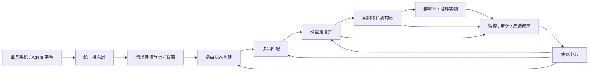

# 项目需求文档

## 1. 项目概述

### 1.1 项目名称

面向 LLM Gateway 的语义路由与负载均衡系统

### 1.2 项目背景

随着大模型服务从单模型、单集群、单场景逐步演进到多模型、多租户、长上下文、混合部署和多供应商协同阶段，推理系统面临的调度问题已经不再是传统意义上的“把请求均匀分发出去”。

在传统 Web 服务中，请求成本相对稳定，负载均衡通常只需要关注连接数、请求数或实例健康状态；而在大模型场景下，请求的输入长度、输出长度、任务类型、推理深度、工具调用需求、上下文规模和安全风险都存在显著差异。与此同时，模型实例的处理能力也会随 GPU 利用率、显存占用、KV Cache 状态、排队深度和 Prefill / Decode 阶段变化而快速波动。

从业界实践看，vLLM Semantic Router 尤其是 2026 年 3 月 10 日发布的 v0.2 Athena 版本，进一步明确了几项值得借鉴的设计方向：

- 采用 `Signal -> Decision -> Model Selection` 的清晰管线，而不是把所有逻辑混在单一规则层里。
- 将模型选择定义为一等路由原语，即先完成信号提取与决策匹配，再在匹配到的候选 `modelRefs` 中做模型选择。
- 在长上下文场景中引入“仅用于信号提取”的提示词压缩，以降低信号路径成本，同时不改写实际发往模型的原始请求。
- 强化可观测与调试面，使路由结果不仅可执行，而且可解释、可复盘。

因此，本项目并不打算建设一个无限扩展的独立推理平台，而是面向 LLM Gateway 建设一套可落地的语义路由与负载均衡子系统。在请求进入执行链路之前，系统先完成语义理解、治理约束校验、模型池选择和实例级调度，从而实现质量、时延、成本、稳定性和资源利用率之间的平衡。

### 1.3 当前问题

当前系统在大模型推理调度中普遍存在以下问题：

| 问题 | 具体表现 | 业务影响 |
| --- | --- | --- |
| 请求与模型能力不匹配 | 简单请求使用高成本模型，复杂请求进入低能力模型 | 成本浪费或结果质量不足 |
| 长短请求相互阻塞 | 长上下文、长输出任务长期占用资源 | 短请求时延恶化，用户体验下降 |
| 多模型调度分散 | 模型池、供应商、部署形态分别管理 | 接入复杂，资源利用率低 |
| 实例负载不均衡 | 热点实例过载，空闲实例未充分利用 | 吞吐下降，故障风险上升 |
| 治理能力不统一 | 风险请求、越权请求、异常请求处理路径分散 | 合规和稳定性风险增大 |

### 1.4 项目目标

本项目目标是面向 LLM Gateway 建设一个统一的语义路由与负载均衡子系统，使系统能够基于请求语义、资源状态和治理约束，在毫秒级完成模型池选择与实例调度，并通过持续反馈实现质量、时延、成本与稳定性的联合优化。

项目目标包括：

- 建立 Gateway 内部统一调度子系统，统一承接多模型、多实例、多供应商下的推理请求。
- 提升请求与模型能力的匹配度，减少模型资源错配。
- 提升 GPU 与实例资源利用率，降低热点和空转。
- 降低平均时延和长尾时延，改善用户体验。
- 建立策略、降级、治理和审计闭环，提升系统可控性与可运营性。

### 1.5 项目边界

#### 做什么

- 统一接收推理请求并完成请求建模、语义识别和路由状态构建。
- 基于模型画像、业务策略和治理约束完成模型池选择。
- 在目标模型池内完成实例级负载均衡。
- 支持会话亲和、Prefix / KV Cache 亲和、降级切换和故障隔离。
- 输出全链路监控、审计记录和策略反馈数据。

#### 不做什么

- 不负责模型训练、微调和模型评测体系建设。
- 不负责 Prompt 工程、业务工作流编排或 Agent 逻辑设计。
- 不负责底层推理引擎内部实现。
- 不建设独立的语义缓存返回系统、工具自动选择系统或系统 Prompt 注入系统。
- 不建设面向多智能体编排的操作层，不纳入 ClawOS 类团队协作与 worker 管理能力。
- 不将 Memory、RAG、Responses 状态持久化演进为当前阶段的核心建设范围。
- 不替代通用 API 网关的基础认证、鉴权与限流能力。
- 不替代 Kubernetes 调度器或底层 GPU 调度器。

## 2. 用户与场景

### 2.1 用户角色

| 用户角色 | 关注点 | 核心诉求 |
| --- | --- | --- |
| 业务系统 / Agent 平台 | 服务可用性、接入效率、响应效果 | 希望通过统一入口获得稳定、低成本、可控的推理能力 |
| 平台产品 / 平台管理员 | 调度策略、模型管理、成本控制 | 希望统一管理模型池、策略和租户边界 |
| 运维 / SRE | 稳定性、容量、故障处理、观测性 | 希望实时掌握负载状态并快速定位异常 |
| 安全 / 合规团队 | 权限边界、数据安全、审计留痕 | 希望风险请求可识别、可管控、可追踪 |

### 2.2 典型使用场景

1. 简单问答类请求优先进入低成本、低时延模型池，降低整体推理成本。
2. 复杂推理、长上下文或高质量要求请求进入高能力模型池，保障输出质量。
3. 多轮会话请求在满足策略约束前提下保持会话连续性，提高上下文复用效率。
4. 长请求与短请求分流处理，降低长尾任务对整体服务体验的影响。
5. 当模型池过载、实例异常或风险规则命中时，系统自动执行降级、切换或拒绝。
6. 不同租户、不同业务域和不同数据等级请求按独立策略进行路由与治理。

### 2.3 用户诉求

| 用户角色 | 用户诉求 |
| --- | --- |
| 业务系统 / Agent 平台 | 请求接入简单，结果稳定，时延可控，成本可预期 |
| 平台产品 / 平台管理员 | 模型能力、成本、质量和策略可以统一编排和管理 |
| 运维 / SRE | 能实时看到请求去哪了、为什么这么调度、哪里出了问题 |
| 安全 / 合规团队 | 能确认高风险请求是否被识别、限制和审计 |

### 2.4 当前痛点

- 当前调度逻辑更多基于静态配置或单一维度规则，无法反映请求真实语义。
- 模型池和实例调度分散实现，缺少统一控制面。
- 调度结果不可解释，出现质量问题、时延问题或成本问题时难以追责和优化。
- 会话粘性、KV Cache 亲和、长短请求隔离等大模型特有能力没有形成体系化支撑。
- 缺少统一的策略、治理和反馈闭环，系统难以持续迭代优化。

## 3. 产品定位与价值

### 3.1 产品定位

本系统定位为“LLM Gateway 内部的智能路由与调度子系统”。其职责不是替代整个推理平台，而是在 Gateway 已有接入、认证、协议适配和转发能力之上，增加面向大模型场景的语义理解、模型池选择、实例调度、降级治理和可观测能力。

### 3.2 核心价值

- 提升质量。让复杂任务进入高能力模型池，降低能力错配导致的结果退化。
- 降低成本。让简单请求优先走低成本路径，避免高价值模型资源被滥用。
- 提升效率。通过池内调度、会话亲和和资源感知，提升吞吐和 GPU 利用率。
- 提升稳定性。通过故障摘除、Fallback 和隔离机制，增强系统韧性。
- 提升治理能力。通过权限、审计和安全约束，让调度结果可控、可查、可优化。

### 3.3 与现有方案差异

设计上，本系统参考 vLLM Semantic Router 与 vLLM Production Stack 的职责拆分思路，特别是 Athena 强调的 `Signal-Decision-Selection` 管线，但严格限定在 Gateway 服务范围内，不扩展为完整的推理编排平台。

| 对比维度 | 传统 API 网关 / 静态路由 | 普通负载均衡 | 本系统 |
| --- | --- | --- | --- |
| 决策依据 | 显式路由规则、请求头、接口路径 | 连接数、请求数、实例健康 | 请求语义、模型能力、资源状态、治理策略 |
| 目标对象 | 接口或固定模型 | 实例或连接 | 模型池 + 实例两级联合决策 |
| 职责拆分 | 通常不区分语义选择与实例调度 | 只关注实例调度 | 语义路由负责选模型池，负载均衡负责选实例 |
| 大模型特性支持 | 弱 | 弱 | 强，支持会话亲和、KV Cache 亲和、长短请求隔离等 |
| 治理能力 | 分散 | 有限 | 支持权限、审计、安全和降级闭环 |
| 决策可解释性 | 有限 | 弱 | 强，可输出路由依据和命中策略 |

### 3.4 为什么需要这个系统

需要这个系统的根本原因有四点：

1. 大模型请求不是同质流量，传统负载均衡方法无法有效处理。
2. 模型能力、运行状态和治理约束正在成为同等重要的调度输入。
3. 企业级场景需要统一控制成本、质量、稳定性和合规风险。
4. 后续多模型接入、异构后端纳管和策略优化，都需要以 Gateway 内部统一调度底座作为支撑。

## 4. 系统设计总览

### 4.1 整体架构

系统整体采用“信号提取 + 决策匹配 + 模型池选择 + 实例级负载均衡 + 策略治理 + 观测反馈”的 Gateway 内部控制子系统架构。

该架构中，请求先进入信号提取和决策匹配，再进入模型池选择，最后进入实例级负载均衡。这个处理顺序直接借鉴了 Athena 所强调的管线化思路：模型选择不是替代信号提取和决策匹配，而是发生在其后、发生在候选集合之内。与此同时，本项目只保留对 Gateway 路径直接有价值的能力：请求理解、候选过滤、模型池选择、实例调度、降级治理和观测反馈。

### 4.2 设计主线

从 Gateway 视角看，本系统本质上是在回答四个连续且不可混淆的问题：

| 阶段 | 核心问题 | 决策对象 | 产出 | 不负责什么 |
| --- | --- | --- | --- | --- |
| 信号提取 | 这个请求“是什么” | 请求本身 | 任务类型、复杂度、风险、会话等信号 | 不直接决定模型池和实例 |
| 决策匹配 | 这个请求“允许去哪里” | 路由规则和治理约束 | 合法候选模型池集合 | 不直接决定最终实例 |
| 模型池选择 | 这个请求“应该去哪一类模型池” | 候选模型池集合 | `RouteDecision` | 不直接决定具体实例 |
| 实例级调度 | 这个请求“当前应该落到哪个实例” | 目标池内实例集合 | `DispatchDecision` | 不改变上游语义合法性判断 |

这一主线的核心价值在于把“语义正确性”和“运行时最优性”拆开处理：

- 语义层先回答“这个请求是否适合某类模型池”，保证正确性和治理合规。
- 调度层再回答“在已确定的模型池内，当前哪个实例最合适”，保证时延、吞吐和资源利用率。
- 两层之间通过结构化决策结果衔接，避免语义判断、策略判断和实例调度相互污染。

### 4.3 核心流程

1. Gateway 接收上游请求并完成请求标准化。
2. 对请求进行信号提取、任务画像和风险识别。
3. 构建统一路由状态，形成可计算的决策输入。
4. 基于策略和约束进行决策匹配，确定合法候选模型池集合。
5. 在候选模型池集合内完成模型选择，输出模型池级 `RouteDecision`。
6. 在目标模型池内部基于实例状态输出实例级 `DispatchDecision`。
7. Gateway 将请求转发到目标后端，返回结果，并输出监控、审计和反馈数据。
8. 依据运行效果更新策略和调优参数。

### 4.4 关键模块划分

| 模块 | 职责 |
| --- | --- |
| 请求建模与语义识别 | 识别任务类型、复杂度、上下文规模、风险特征和会话特征 |
| 路由状态构建 | 将请求内容、控制参数、租户信息和风险标签归一化为统一状态 |
| 决策匹配 | 基于规则、约束和策略，将请求匹配到合法候选模型池集合 |
| 模型池选择 | 在合法候选模型池中完成主池和备选池选择，输出 `RouteDecision` |
| 实例级负载均衡 | 在目标池内依据运行状态选择最合适的执行实例，输出 `DispatchDecision` |
| 策略、降级与治理 | 提供路由策略、降级路径、安全约束和故障处理能力 |
| 可观测性与反馈闭环 | 提供监控、审计、指标分析和持续调优输入 |

### 4.5 输入、状态、输出、反馈

| 类型 | 内容 |
| --- | --- |
| 输入 | 用户请求、Prompt 内容、控制参数、租户信息、策略配置、实例运行状态 |
| 状态 | Routing State、模型池画像、实例负载状态、会话状态、治理状态 |
| 输出 | `RouteDecision`、`DispatchDecision`、降级决策、审计记录 |
| 反馈 | 时延指标、成功率、Fallback 结果、命中率、异常事件、资源利用率 |

### 4.6 模块边界与判断边界

为了保证逻辑清晰，系统内部各层判断边界必须明确：

| 模块 | 应该判断什么 | 不应该判断什么 |
| --- | --- | --- |
| 请求建模与语义识别 | 请求属于什么类型、复杂度多高、是否存在风险、是否具有会话连续性 | 不直接选择模型池或实例 |
| 路由状态构建 | 哪些请求事实、租户约束和策略参数应进入统一状态 | 不根据瞬时实例负载做调度决定 |
| 决策匹配 | 请求命中哪类决策规则、哪些模型池在语义和治理上合法 | 不在此阶段决定最终实例 |
| 模型池选择 | 在合法候选池中如何平衡质量、时延、成本选择目标池 | 不查看单实例队列后跨层做实例判断 |
| 实例级负载均衡 | 当前目标池内哪个实例最适合执行 | 不绕过上游合法性判断直接跨池切换 |
| 策略、降级与治理 | 什么时候需要拒绝、降级、Fallback 或审计 | 不替代基础网关认证或业务编排逻辑 |

该边界设计可以保证：

- 语义合法性判断不会被瞬时运行态噪声覆盖。
- 实例调度优化不会意外突破权限、租户和治理约束。
- 问题定位时可以快速判断故障发生在哪一层，而不是在一团混合逻辑中排查。

## 5. 核心能力设计

### 5.1 请求建模与语义识别

#### 设计目标

在请求进入调度决策前，对 Gateway 收到的请求进行结构化理解，识别其任务类型、复杂度、上下文规模、会话特征和治理风险，为后续模型池选择提供统一输入。

#### 输入

- Prompt / messages
- 显式控制参数，如 `model`、`routing_hint`、`session_id`
- 会话标识
- 租户与权限信息
- 安全和合规标签

#### 输出

- 任务类型标签
- 输入规模与复杂度标签
- 会话连续性标签
- 风险识别结果
- 请求工作负载画像

#### 关键状态

- 当前请求的规范化上下文
- 历史会话特征
- 风险识别状态

#### 设计原则

- 先做轻量识别，再做高成本分析。
- 输出必须结构化、可解释、可审计。
- 识别结果只作为决策输入，不直接替代策略约束。
- 只保留对 Gateway 路由直接有价值的语义特征，不扩展到业务编排级语义理解。

#### 核心机制

- 任务类型识别，区分问答、推理、代码、多模态和 Agent 类请求。
- 输入规模识别，评估 Prompt 长度、上下文规模和预估 Token 量。
- 推理复杂度识别，识别长链推理、长输出和工具调用需求。
- 风险识别，识别 PII、越权、Prompt Injection 等风险信号。
- 会话特征识别，判断是否适合启用会话连续性和 Prefix 复用。
- 长上下文信号压缩，对超长 Prompt 生成仅用于信号提取的压缩视图，但不改写实际发往下游模型的原始请求。

#### 设计结论

请求建模与语义识别是控制面的第一层能力，决定了系统是否能够真正理解“这个请求需要什么”，它直接影响后续模型池选择准确率和调度效果。

### 5.2 路由状态构建

#### 设计目标

将请求内容、业务控制参数、身份信息、模型约束和治理条件统一整理为可计算的 Routing State，作为后续模型池选择和实例调度的唯一决策上下文。

#### 输入

- 请求画像结果
- 模型可用范围
- 租户和权限信息
- 合规和安全约束
- 路由策略配置

#### 输出

- 统一 Routing State
- 可用候选池集合
- 不可用候选裁剪原因
- 路由解释字段

#### 关键状态

- 请求上下文状态
- 策略命中状态
- 治理约束状态

#### 设计原则

- 统一状态表达，避免 Gateway 内部多个模块各自重复解析请求。
- 先做硬约束过滤，再做优化选择。
- 状态应具备可追踪性，支持问题复盘。

#### 核心机制

- 请求、身份、会话、风险、偏好等信息统一归一化。
- 对模型池进行能力、权限、上下文窗口和风险边界过滤。
- 输出合法候选范围，并保留裁剪原因用于解释和审计。
- Routing State 至少应包含五类信息：请求事实、控制参数、治理约束、会话状态和策略偏好。

#### 设计结论

Routing State 是整个系统的“决策中枢状态”，没有统一状态就无法实现可解释、可治理和可持续演进的联合调度。

### 5.3 决策匹配机制

#### 设计目标

在完成信号提取和状态构建后，先根据规则、约束和治理条件确定“请求属于哪一类决策”，并输出合法候选模型池集合。该层的职责是匹配决策，不直接挑选最终模型池。

#### 输入

- Routing State
- 路由规则与策略配置
- 权限、租户和治理约束
- 模型池画像

#### 输出

- 命中的决策规则
- 合法候选模型池集合
- 候选裁剪原因

#### 关键状态

- 信号命中状态
- 规则匹配状态
- 约束过滤状态

#### 设计原则

- 决策匹配与模型选择必须分层，不能混为一体。
- 先确定请求属于哪个决策域，再在该域内做模型选择。
- 硬约束过滤优先于成本、时延和质量优化。
- 该层可以裁剪候选空间，但不应根据瞬时实例负载直接替代调度层做最终执行决策。

#### 核心机制

- 基于任务类型、复杂度、风险、租户和显式控制参数进行规则匹配。
- 将不满足权限、窗口、模态和治理要求的模型池从候选集中剔除。
- 为后续模型选择保留结构化候选集合和解释字段。
- 对同一请求允许命中多条规则时，应通过优先级和约束强度合并出单一候选域，避免后续模型选择输入不稳定。

#### 设计结论

决策匹配机制决定了“这个请求允许在哪些模型池中被选择”，它是 Athena 式 `Signal -> Decision -> Selection` 管线中的中间层，也是控制范围、防止越界调度的关键环节。

### 5.4 模型池选择机制

#### 设计目标

在满足治理和能力边界的前提下，为请求选择最适合的目标模型池，并保留可用备选路径。该层只负责池级选择，不负责实例级调度。

#### 输入

- Routing State
- 模型池能力画像
- 成本、时延、质量偏好
- 当前策略配置

#### 输出

- 主选模型池
- 备选模型池
- 模型池选择原因
- `RouteDecision`

#### 关键状态

- 模型池画像
- 业务策略状态
- 候选排序结果
- 历史服务效果统计

#### 设计原则

- 先合法，再最优。
- 以模型池为调度对象，而非直接绑定单个实例。
- 支持质量、时延、成本多目标平衡。
- 显式模型指定或路由覆盖只有在授权且满足约束时才允许生效。
- 一期优先落地可解释、可运营的选择策略，不把 ML 训练型选择器作为当前承诺范围。
- 该层关注池级质量和池级成本，不以单实例瞬时拥塞替代池级选择。

#### 核心机制

- 基于模型能力画像完成候选模型池初筛。
- 根据业务策略进行候选排序，例如静态默认、质量优先、时延优先、成本优先或混合策略。
- 输出主选路径和备选路径，支持后续降级和容灾切换。
- 对显式 `model`、`route_override` 或 `routing_hint`，仅在通过权限和兼容性校验后参与决策。
- ML 训练型模型选择器可作为后续增强方向评估，但不作为一期基础能力前提。
- 一期建议优先支持三类可解释策略：固定默认、时延感知和质量/成本混合排序。
- 候选模型池一旦选定，实例层只能在该池内部调度；跨池切换必须通过显式 Fallback 路径触发。

#### 设计结论

模型池选择是连接“请求意图”和“资源执行域”的关键桥梁，其目标不是选“最强模型”，而是选“最合适的模型池”。

### 5.5 实例级负载均衡机制

#### 设计目标

在目标模型池内部，根据实例负载、资源状态和上下文亲和性选择最优执行实例，实现稳定性与利用率平衡。该层是 Gateway 面向后端实例的调度层。

#### 输入

- 主选模型池
- 实例运行状态
- GPU / 显存状态
- 队列深度与并发状态
- 会话与 Cache 亲和信息

#### 输出

- 目标实例
- 实例级降级或切换决策
- 调度原因记录
- `DispatchDecision`

#### 关键状态

- 实例健康状态
- 队列长度和并发状态
- 会话粘性状态
- Prefix / KV Cache 命中状态

#### 设计原则

- 不采用单一轮询策略，应结合运行态信息做动态调度。
- 优先避免实例热点和长尾扩散。
- 在负载均衡与上下文亲和之间做策略化平衡。
- 一期优先支持 Gateway 场景下可直接落地的调度机制，复杂分阶段调度作为后续增强。
- 该层只在已选模型池内做最优调度，不重新解释请求语义，也不直接突破上游选池结果。

#### 核心机制

- 队列感知，识别实例排队深度和请求积压情况。
- 资源感知，识别 GPU、显存和实例健康状态。
- 会话粘性调度，使同一会话尽量落到稳定实例集合。
- Prefix / KV Cache 亲和调度，提高上下文复用效率。
- 长短请求隔离，降低长请求对短请求的阻塞。
- 实例故障摘除和自动切换，提升调度稳定性。
- 当实例级策略与会话亲和发生冲突时，应由策略中心定义优先级，例如健康优先于亲和、时延优先于 Cache 复用。

#### 设计结论

实例级负载均衡是控制面价值能否真正落地的关键，它决定了模型池选择的收益能否在真实运行态下转化为稳定性能。

### 5.6 策略、降级与治理机制

#### 设计目标

为 Gateway 提供统一的多目标策略配置、异常降级和安全治理能力，确保调度结果不仅“可用”，而且“可控”。

#### 输入

- 路由与调度结果
- 治理规则
- 权限和租户约束
- 故障和异常状态

#### 输出

- 最终执行策略
- Fallback 路径
- 降级或阻断动作
- 审计记录

#### 关键状态

- 策略命中状态
- 权限状态
- 风险状态
- 降级状态

#### 设计原则

- 治理约束优先于优化目标。
- 降级机制必须可预测、可配置、可审计。
- 任何关键动作都应能回溯其依据。
- 当前范围内只覆盖与 Gateway 路由直接相关的治理能力，不扩展到业务编排或内容生成增强。

#### 核心机制

- 支持质量优先、时延优先、成本优先和混合策略。
- 支持模型池级、实例级和策略级 Fallback。
- 对高风险请求执行限制、审计、强制降级或阻断。
- 对异常实例和异常池进行摘除、熔断和恢复控制。
- 对于显式指定模型但又违反权限、治理或能力边界的请求，应优先拒绝或回退，而不是静默放行。

#### 设计结论

策略、降级与治理能力保证系统在复杂企业场景下可上线、可控、可运营，是控制面从“能用”走向“可生产”的必要条件。

### 5.7 可观测性与反馈闭环

#### 设计目标

建立覆盖资源层、执行层、语义层和治理层的统一可观测体系，并将观测结果反向输入 Gateway 路由策略优化过程。

#### 输入

- 路由结果
- 调度结果
- 执行日志与监控指标
- 异常和审计事件

#### 输出

- 指标看板
- 审计日志
- 问题定位依据
- 策略优化输入

#### 关键状态

- 指标状态
- 异常事件状态
- 策略效果状态

#### 设计原则

- 从“看见问题”扩展到“解释问题”和“修正问题”。
- 指标要覆盖语义、资源、治理和业务效果四个层面。
- 反馈结果要可用于下一轮策略迭代。

#### 核心机制

- 资源监控，采集 GPU 利用率、显存占用、实例健康和队列长度。
- 执行监控，采集平均时延、P99、TTFT、成功率和 Fallback 率。
- 路由监控，采集模型池命中率、重选率和策略命中分布。
- 治理监控，采集风险拦截率、审计命中率和越界阻断率。
- 路由回放，支持对关键请求进行决策链路回放和问题复盘。
- 反馈闭环，将运行数据用于策略校准和阈值调优。
- 路由回放至少应覆盖请求摘要、信号结果、命中决策、候选池集合、最终 `RouteDecision` 和 `DispatchDecision`。

#### 设计结论

没有可观测性和反馈闭环，调度系统只能停留在静态规则阶段；只有建立闭环，系统才能持续优化并沉淀长期价值。

## 6. 功能需求

优先级定义如下：

- `P0`：一期必须具备，否则系统无法形成完整可用链路。
- `P1`：建议在一期或一期后尽快补齐，直接影响效果上限和运营效率。
- `P2`：属于增强能力，用于提升长期优化能力和问题定位效率。

| 功能模块 | 功能描述 | 优先级 | 是否必须 |
| --- | --- | --- | --- |
| 请求分类 | 识别 workload 类型、复杂度、上下文规模和风险标签 | P0 | 是 |
| 长上下文信号压缩 | 对超长 Prompt 生成仅用于信号提取的压缩视图 | P1 | 否 |
| 路由状态构建 | 将请求、会话、租户和治理信息归一化为 Routing State | P0 | 是 |
| 决策匹配 | 将请求匹配到合法候选模型池集合 | P0 | 是 |
| 模型池选择 | 输出主选模型池和备选模型池 | P0 | 是 |
| 显式路由控制 | 支持显式 `model`、`routing_hint`、授权 `route_override` | P1 | 否 |
| 候选池过滤 | 基于能力、权限、上下文窗口和治理规则过滤非法候选 | P0 | 是 |
| 实例级调度 | 在目标池内选择具体实例 | P0 | 是 |
| 会话亲和 | 支持 session stickiness | P1 | 是 |
| KV Cache 亲和 | 支持 Prefix / KV Cache 命中优先调度 | P1 | 否 |
| 长短请求隔离 | 降低长任务对短任务的阻塞 | P0 | 是 |
| Fallback | 支持主池失败切换和异常场景降级 | P0 | 是 |
| 故障隔离 | 支持实例摘除、熔断和恢复 | P0 | 是 |
| 策略模板 | 支持质量优先、时延优先、成本优先和混合策略 | P1 | 是 |
| 治理与审计 | 支持权限控制、风险约束和审计留痕 | P0 | 是 |
| 路由解释 | 输出路由决策原因和策略命中依据 | P1 | 否 |
| 路由回放 | 支持关键请求的决策链路回放与问题复盘 | P2 | 否 |
| 监控与指标 | 支持资源、时延、命中率、异常等全链路观测 | P0 | 是 |
| 反馈调优 | 支持基于运行结果持续优化策略 | P2 | 否 |

## 7. 非功能需求

| 类型 | 要求 |
| --- | --- |
| 路由时延 | 路由与调度附加决策时延目标不高于 10ms |
| 高可用 | 控制面无单点故障，实例或模型池局部故障不影响整体可用性 |
| 扩展性 | 支持模型池、实例和策略动态增减 |
| 可观测性 | 支持全链路日志、指标、审计和问题追踪 |
| 安全性 | 支持权限隔离、风险审计和敏感请求治理 |
| 兼容性 | 一期支持 OpenAI API 兼容接口，并服务于 Gateway 北向请求路径 |
| 可维护性 | 支持模型画像、策略规则和阈值参数在线维护 |
| 可解释性 | 关键路由与降级决策应可解释、可复盘 |

## 8. 指标与成功标准

以下指标为一期建议目标。若当前环境尚未形成统一基线，建议在 PoC 或试运行阶段先完成基线测量，再锁定最终验收值。

| 指标 | 当前水平 | 目标水平 |
| --- | --- | --- |
| GPU 利用率 | 约 45%，待基线确认 | > 65% |
| 平均延迟 | 约 2.3s，待基线确认 | < 1.5s |
| P99 延迟 | 约 12s，待基线确认 | < 5s |
| Prefix / KV Cache 亲和命中率 | 约 10%，待基线确认 | > 35% |
| Fallback 成功率 | 约 60%，待基线确认 | > 90% |
| 模型能力匹配准确率 | 缺少统一统计 | 建立指标并持续提升 |
| 路由解释覆盖率 | 缺少统一统计 | 核心路径 100% 可追溯 |

这些指标之间不是孤立关系，而是存在明确因果链路：

- “模型能力匹配准确率”提升后，才能进一步带动质量稳定性和平均时延改善。
- “Prefix / KV Cache 亲和命中率”提升后，通常会直接改善 TTFT、平均时延和 GPU 利用率。
- “Fallback 成功率”提升后，系统在实例故障、模型池过载和异常场景下的整体可用性才会稳定。
- “路由解释覆盖率”提升后，调优和问题复盘成本才会下降，系统才能进入可持续优化状态。

## 9. 风险与依赖

### 9.1 主要风险

- 模型能力边界不稳定，不同模型在不同任务上的表现存在波动。
- 长上下文和长输出请求的成本预测误差较大，容易影响调度精度。
- GPU 热点和 Prefix / Cache 热点难以完全避免，需要策略不断迭代。
- 质量、成本、时延和吞吐之间存在天然冲突，多目标优化难一次到位。
- 如果缺少足够高质量的运行数据，策略调优效果会受限。

### 9.2 关键依赖

- 依赖统一的指标采集体系，能够提供实例、GPU、时延和异常数据。
- 依赖模型池画像体系，能够持续维护模型能力、成本和风险边界。
- 依赖策略中心和配置管理体系，支持在线更新和版本管理。
- 依赖审计与日志体系，支撑问题复盘和治理留痕。
- 依赖推理引擎和上游接口提供稳定、可用的状态和执行信息。

## 10. 路线图与迭代计划

| 阶段 | 时间 | 能力 |
| --- | --- | --- |
| Phase 1 | T0 - T+1 月 | 信号提取、决策匹配、基础实例调度、基础监控 |
| Phase 2 | T+2 - T+3 月 | 模型池选择、显式路由控制、策略化调度、Fallback |
| Phase 3 | T+4 - T+5 月 | 会话亲和、KV Cache 感知、长上下文信号压缩、长短请求隔离 |
| Phase 4 | T+6 月及以后 | Prefill / Decode 分阶段调度、路由回放、反馈驱动优化、在线策略调优 |

路线图按照“先打通主链路，再提升效果上限，最后建设长期优化能力”的逻辑推进：

- `Phase 1` 先建立信号、决策和基础调度闭环，确保系统可用。
- `Phase 2` 再引入模型池层面的策略化选择，使系统真正具备语义路由价值。
- `Phase 3` 聚焦大模型场景特有优化项，例如会话亲和、Cache 亲和和长短请求隔离，用于提升性能上限。
- `Phase 4` 再进入更复杂的分阶段调度、回放诊断和在线调优，降低过早引入复杂度的风险。

## 11. 总结

语义路由与负载均衡系统不是传统网关或普通负载均衡器的简单升级，而是 LLM Gateway 面向大模型场景的智能路由与调度子系统。它要解决的不仅是“请求分发到哪里”，而是“什么请求应该进入什么模型池，以什么策略、在什么资源状态下执行，并在异常和风险场景中如何保证结果可控”。

该系统一旦建设完成，将成为 Gateway 后续多模型接入、多租户治理、异构后端调度和策略优化的统一底座。
