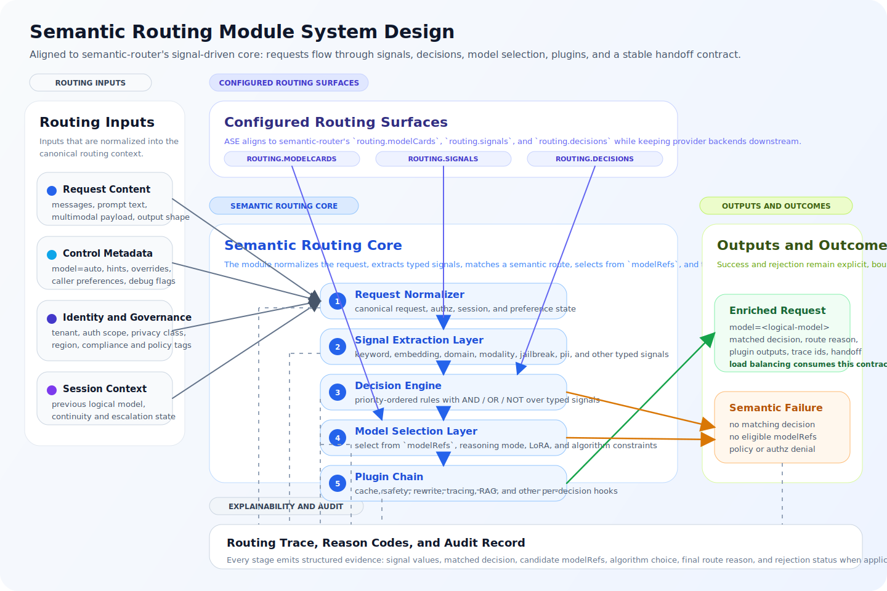

ASE Semantic Routing Module Design

Author(s): PU Yang/n000000000

Status: Intent to implement

[[_TOC_]]

Introduction
============

This document defines the design of the Semantic Routing Module in the ASE Semantic Routing and Load Balancing architecture. The Semantic Routing Module is the first decision stage in the request path and is responsible for resolving which logical model should serve a request before any backend instance is selected.

This document is not a general discussion of prompt classification. It is the governing design for the production logical-model-selection module that must convert an incoming request into an authoritative, policy-compliant, explainable model decision. Its output is a request enriched with `model=<resolved-logical-model>` plus the routing metadata required by downstream systems and operators.

Within the overall document set, this file defines the model-selection module only. System-wide architecture is defined in `architecture.md`, and instance-level dispatch is defined in `load_balancing_module.md`.

Background
==========

### Module problem

The Semantic Routing Module solves the following problem:

> Given an incoming LLM request, a set of candidate logical models, and a set of policy, capability, deployment, and business constraints, determine the most appropriate logical model for the request.

This problem is broader than intent classification. A production router must simultaneously account for request semantics, capability requirements, context limits, governance boundaries, tenant restrictions, cost and latency preferences, and multi-turn continuity. A router that ignores any of these dimensions will eventually make decisions that are either operationally unsafe or business-incorrect.

### Why this module must exist

The Semantic Routing Module exists because logical-model choice and provider-endpoint choice are different decisions.

Logical-model choice depends on request meaning and governance context. Provider-endpoint choice depends on runtime fleet state. If those concerns are collapsed into one opaque routing step, the system loses explainability and ownership boundaries. It becomes difficult to tell whether a bad outcome was caused by the wrong logical model being chosen or the right logical model being dispatched poorly.

ASE therefore isolates the Semantic Routing Module as the module that owns logical-model selection and only logical-model selection. It may constrain downstream execution by selecting a logical model and attaching route metadata, but it does not choose a machine and it does not consume per-endpoint runtime signals as part of normal logical-model resolution.

### Design objectives

The module is designed to achieve the following outcomes:

- select a logical model that is semantically appropriate and policy-compliant
- keep logical-model resolution separate from backend scheduling
- enforce governance before expensive model invocation
- produce routing outcomes that remain explainable after the fact
- support heterogeneous signals, policies, and model families without redesign
- keep decision latency bounded through selective signal computation

### Governing principles

The module follows five governing principles.

First, the Semantic Routing Module is logical-model-centric, not server-centric. Second, hard constraints and policy constraints must be applied before optimization. Third, routing should be expressed as a signal-driven decision system with explicit signal extractors, declarative decision rules, model-selection algorithms, and per-decision plugins rather than hidden heuristics embedded in code paths. Fourth, every final decision must leave a recoverable reason trail. Fifth, governance-sensitive checks must happen before the request reaches an inference backend.

ASE is aligned with the signal-driven design direction described in vLLM Semantic Router, especially its separation of `routing.signals`, `routing.decisions`, `modelRefs`, selection algorithms, and plugin execution. ASE adopts that semantic core while preserving a strict handoff to the downstream Load Balancing Module. See [R3], [R4], and [R5].

Scope
=====

### In scope

This document defines:

- request-level logical-model selection
- normalization of routing-relevant request context
- signal extraction and routing-context construction
- logical-model eligibility filtering
- policy-aware decision evaluation
- request enrichment with resolved logical-model metadata
- session continuity behavior for multi-turn routing
- explainability, audit, and routing-trace requirements
- semantic failure classification
- configuration and governance requirements specific to logical-model selection

### Out of scope

This document does not define:

- backend instance scheduling
- endpoint health checks
- queue-aware dispatch
- transport retries or redispatch mechanics
- pool-level failover
- generic API gateway concerns unrelated to logical-model selection

Those responsibilities belong to `load_balancing_module.md` or to broader ASE infrastructure outside this module.

Architecture overview
=====================

### Alignment target

ASE should treat the vLLM Semantic Router project as the primary upstream baseline for the full routing system, not merely as a source of semantic-routing ideas. The upstream project already defines a production-oriented envelope with Envoy as the traffic-management layer, a Go ExtProc service as the intelligence layer, canonical `providers/routing/global` configuration ownership, and a signal-driven routing pipeline. See [R4], [R5], [R6], [R7], and [R8].

Within ASE, that full upstream envelope is decomposed into separate design documents. This document focuses on the semantic-routing responsibilities inside that broader system, while gateway ingress, deployment shape, and downstream endpoint routing are specified in `architecture.md` and `load_balancing_module.md`.

At the semantic-routing level, the upstream project presents routing as a signal-driven pipeline centered on four concerns: Signal Extraction, Decision Engine, Model Selection, and Plugin Chain. That semantic pipeline is the core responsibility specified here.

ASE preserves that structure, but makes the module boundary stricter:

- this document owns signal extraction, routing decisions, model selection, and per-decision plugin behavior
- provider-facing deployment bindings and concrete backend resolution are intentionally outside this module document and are covered elsewhere in ASE
- endpoint choice, health, retry, and redispatch belong to `load_balancing_module.md`

This alignment matters because the Semantic Routing Module should read like a signal-driven decision engine, not like a gateway-plus-scheduler hybrid.

### Implementation basis

ASE should not stop at architectural inspiration. Where practical, the implementation should be based directly on the upstream `vllm-project/semantic-router` codebase and configuration model.

That is especially relevant because the upstream project already provides a Go implementation of the router and ExtProc service, alongside the documented production architecture. For ASE, that is a strong fit: the gateway-facing routing path needs low overhead, high concurrency, and a predictable runtime model, all of which make the Go implementation a better starting point than inventing a new semantic-routing engine from scratch. See [R6], [R7], and [R8].

### System placement

The upstream deployment shape is:

`Client -> Envoy / AI Gateway -> Semantic Router ExtProc Service -> Backend model endpoints`

ASE should preserve that mental model even when the implementation is decomposed across internal modules. In other words:

- Envoy or an equivalent gateway remains the traffic-management shell
- the semantic routing module remains the decision engine invoked on the request path
- downstream endpoint resolution may remain integrated with the upstream router, or may be delegated to ASE's separate Load Balancing Module depending on deployment mode

Two deployment modes are therefore valid:

1. `Upstream-compatible integrated mode`
   The semantic-router-based service may project both logical-model choice and endpoint-routing headers for Envoy to consume.
2. `ASE split mode`
   The semantic routing module still runs on the request path, but the normative handoff artifact is the resolved logical model and routing metadata, while final endpoint selection is delegated to `load_balancing_module.md`.

The ASE design should be able to reuse the upstream implementation while preserving the split-mode boundary as the preferred architectural contract.

### Core processing logic

The Semantic Routing Module performs one job: convert a canonical request into an authoritative logical-model decision.

That decision is produced in a fixed order:

1. Normalize the inbound request into a canonical routing context.
2. Compute the typed signals needed for the current request.
3. Evaluate `routing.decisions` in priority order.
4. From the matched decision, build the legal candidate set from `modelRefs` plus hard capability and policy constraints.
5. Run the configured selection algorithm to choose the final logical model.
6. Run per-decision plugins and emit the handoff contract.

This order is the core of the architecture and should not be inverted.

- `signals` explain the request.
- `decisions` determine which route is eligible.
- `modelRefs` determine which logical models are legal inside that route.
- `plugins` attach route-scoped post-decision behavior.
- the final output is `model=<logical-model>` plus routing metadata, not a provider endpoint

### Architecture diagram

The diagram below is the only architecture view used in this document. It is intentionally laid out in the same order as the vLLM Semantic Router routing path: inputs, configured routing surfaces, semantic routing core, outputs, and audit trail.



### How to read the diagram

Read the diagram from left to right.

1. `Traffic Shell` is the full upstream system baseline:
   - client requests enter through an OpenAI-compatible API boundary
   - Envoy or an equivalent AI gateway owns listeners, HTTP filters, timeout policy, and ExtProc invocation
2. `Semantic Routing Module` is the document scope:
   - `Canonical Routing Surface` is the semantic-routing-owned DSL under `routing.modelCards`, `routing.signals`, and `routing.decisions`
   - `Provider / Deployment Inputs` are required system dependencies under `providers`, but they are not semantically owned by this module
   - `Runtime / Shared Services` under `global` provide shared services such as observability, semantic cache, tools, and model-backed modules
3. The numbered pipeline inside the central box is the semantic execution order:
   - `1 Request Normalization`
   - `2 Signal Extraction`
   - `3 Decision Engine`
   - `4 Model Selection + Plugin Chain`
4. `Outputs and Integration` distinguishes semantic outputs from deployment-specific projections:
   - the normative semantic output is the resolved logical model plus routing metadata
   - upstream-compatible deployments may also project endpoint hints or routing headers
   - semantic rejection remains an explicit module-owned outcome
5. The bottom rule states the architectural invariant:
   logical-model selection is the semantic source of truth, even when integrated deployments also emit downstream routing hints.

### Architectural position and boundary

In the ASE request path, the module sits here:

`Client Request -> Semantic Routing Module -> Request Enrichment (logical model in model field) -> Load Balancing Module`

Its contract is:

- input: canonical request plus identity, policy, and session context
- output: request enriched with the resolved logical model in `model` and routing metadata

That contract is normative for ASE split mode. The Semantic Routing Module decides what logical model the request should use. Final endpoint choice remains downstream unless ASE is explicitly running in the upstream-compatible integrated mode described above.

To stay aligned with the vLLM Semantic Router project while preserving ASE's stronger split architecture, the boundary should be interpreted as follows:

- this module owns semantic interpretation and logical-model selection
- this module may attach tags, rationale, and plugin outputs that constrain downstream dispatch
- this module must not use endpoint health, queue depth, or retry state to choose the logical model
- if an upstream-compatible deployment projects endpoint hints or routing headers, those outputs are integration artifacts and must not be treated as a redefinition of semantic ownership
- the architectural source of truth for ASE remains: logical-model choice first, endpoint choice second

### Architectural invariants

The following invariants are mandatory for this module.

1. The Semantic Routing Module must resolve a logical model before any instance-level dispatch begins.
2. Logical-model selection must be based on explicit routing context, not implicit downstream fallback behavior.
3. Hard capability constraints and policy constraints must be evaluated before optimization among candidates.
4. The module must emit enough decision metadata to explain both acceptance and rejection outcomes.
5. Session continuity may influence optimization, but it may not override hard capability or policy constraints.

### Internal architecture

The semantic-router-aligned core is organized as a linear pipeline built around one declarative routing surface and one explicit handoff contract.

| Component | Primary responsibility | Architectural output |
| --- | --- | --- |
| Request Normalizer | convert inbound API traffic into a canonical routing object | normalized request and routing context skeleton |
| Signal Extraction Layer | execute configured detectors from `routing.signals` and invoke any required shared runtime modules to assemble typed routing state | structured signal map for decision evaluation |
| Decision Engine | evaluate priority-ordered `routing.decisions` rules over typed signals | matched decision plus candidate `modelRefs` |
| Model Selection Layer | select the final logical model from the matched decision's `modelRefs` using the configured algorithm and model-card constraints | authoritative logical-model decision plus selection rationale |
| Plugin Chain | execute decision-coupled plugins after model selection | request annotations, safety tags, cache behavior, trace signals, optional augmentation hooks |
| Handoff Contract | emit the normalized `model` assignment, routing metadata, and optional upstream-compatible routing headers | enriched request or explicit semantic rejection |

Request Normalizer
==================

The Request Normalizer converts inbound API traffic into a canonical routing object that every later stage can consume consistently. This stage is where ASE decides how much of the northbound API surface is visible to routing and how that information is represented internally.

The module consumes more than prompt text. It requires a structured routing context assembled from four input classes.

| Input class | Purpose | Representative examples |
| --- | --- | --- |
| Request Content | describe what the request is asking for | messages, prompt text, system instructions, multimodal metadata, expected output shape |
| Control Metadata | express caller intent or routing hints | `model=auto`, explicit preference hints, debug flags, route override requests |
| Identity and Governance Context | constrain what the caller is allowed to use | tenant identity, user class, authorization scope, privacy classification, compliance tags |
| Session Context | preserve continuity across turns when appropriate | session ID, previous logical model, escalation history, continuity preference |

Without this context, logical-model selection becomes guesswork. With it, routing becomes a controlled decision problem.

ASE should remain broadly compatible with OpenAI-style request shapes while exposing a narrow set of routing-aware controls.

| Field | Purpose | Constraint |
| --- | --- | --- |
| `model=auto` | request semantic logical-model selection | default path for routed traffic |
| `model=<explicit-model>` | request a specific logical model directly | still subject to policy and capability validation |
| `routing_hint` | provide a coarse semantic hint such as `code`, `reasoning`, or `extract` | advisory only; must not bypass policy |
| `route_override` | request a specific route or logical-model alias | restricted to authorized callers; must not bypass hard constraints |
| `preference` | express latency, cost, or quality bias | optimization input only |
| `input_tokens_estimate` | provide a caller-side prompt-size estimate | advisory signal that may improve token-aware routing |
| `session_id` | preserve multi-turn continuity context | optional unless continuity policy requires it |
| `debug` or `explain` | request routing diagnostics | restricted and redacted for trusted callers only |

The precedence order should be explicit. Hard capability and policy constraints are evaluated first. Authorized explicit model requests or route overrides are evaluated next. Session continuity and optimization preferences are applied only after the request is proven eligible.

ASE should route at request granularity, not by pinning an entire session to a single logical-model decision. Session context exists to improve continuity, not to suppress re-evaluation.

An illustrative northbound request shape is shown below.

```json
{
  "model": "auto",
  "messages": [
    {
      "role": "user",
      "content": "Write a C epoll example"
    }
  ],
  "routing_hint": "code",
  "preference": {
    "cost": "low",
    "latency": "medium",
    "quality": "high"
  },
  "input_tokens_estimate": 120,
  "session_id": "conv-123",
  "debug": true
}
```

Signal Extraction Layer
=======================

Signals are the intermediate representation between raw request context and final logical-model selection. In semantic-router, the route-visible detector definitions live under `routing.signals`, while some learned or model-backed capabilities may be supplied through shared runtime modules under `global.model_catalog.modules`. The important architectural rule is that signal computation remains explicit and typed; it should not dissolve into ad hoc feature logic embedded in request code paths.

The signal taxonomy should align with the semantic-router configuration surface.

| Signal family | Routing use |
| --- | --- |
| keyword | exact or approximate lexical triggers |
| embedding | semantic nearest-neighbor or similarity-driven routing |
| domain | coarse topic or workload classification |
| fact_check | factual-verification requirement |
| user_feedback | correction, clarification, or dissatisfaction follow-ups |
| preference | style or optimization bias such as terse responses |
| language | language-specific routing |
| context | long-context or context-window requirements |
| complexity | reasoning-depth escalation |
| modality | text, image, or multimodal path selection |
| authz or role binding | role-scoped or subject-scoped policy gating |
| jailbreak | prompt-injection or abuse detection |
| pii | sensitive-data detection and privacy gating |

ASE should align with this taxonomy even if not every deployment enables every family. The module should still compute only the signals needed for the current decision path. Cheap signals should remain cheap, and expensive signals should be invoked only when they materially affect the outcome. Shared services such as classifier modules, prompt guards, semantic cache, and tool catalogs may support the routing path, but they should remain subordinate to the explicit semantic decision pipeline shown in the architecture diagram.

Decision Engine
===============

The routing decision should be understood as a signal-driven staged process aligned with semantic-router, not a monolithic score.

#### Stage 1: normalize and build routing context

The module first produces a canonical routing object from the raw request and attaches tenant, policy, and session metadata. This establishes the input contract for all later stages.

#### Stage 2: execute signal extractors

The module computes the configured signal set needed to reason about semantics, capability requirements, and governance. This stage transforms request content into structured routing evidence under `routing.signals`.

#### Stage 3: match decisions

The decision engine evaluates priority-ordered `routing.decisions` rules over the typed signal set. Each decision combines AND, OR, and NOT conditions and either matches or does not match. A matched decision defines the route shape that may be used for this request.

#### Stage 4: build candidate model references

From the matched decision, the module collects the candidate `modelRefs`, reasoning options, optional LoRA bindings, and hard capability constraints that define the legal selection space. This is where model-card capabilities, context limits, modality requirements, and policy constraints eliminate impossible candidates.

This is also where the module performs most of its governance-sensitive filtering. At minimum, it must support:

- authorization-aware logical-model restrictions
- deployment-boundary restrictions
- PII-sensitive routing
- jailbreak-sensitive routing
- tenant-specific provider restrictions
- audit tagging for regulated traffic

These controls are part of the module's core purpose because they determine whether a request may be sent to a logical model at all.

Model Selection Layer
=====================

The current vLLM Semantic Router canonical contract makes the ownership boundary explicit. `routing` owns semantic routing semantics, while `providers` owns deployment bindings and execution-facing model metadata. Concretely, `routing.modelCards` and `routing.decisions[*].modelRefs` are part of the semantic routing surface, while `providers.models[*]` owns `provider_model_id`, `backend_refs`, pricing, and other deployment-facing fields. See [R5].

ASE should preserve that split. This document therefore owns the route-visible model view, not the provider-binding view. The Semantic Routing Module reasons over model capabilities, constraints, route rules, `modelRefs`, reasoning options, and optional LoRA choices. It does not own backend addresses, endpoint bindings, or provider failover state.

At the system level, the model names used by `routing.modelCards` and by `routing.decisions[*].modelRefs[*].model` must resolve consistently against the provider-defined model catalog. That cross-reference is required for the overall router to work, but the semantic decision itself should remain driven by the `routing` subtree.

This distinction is especially important because the upstream project has already migrated from older flat configuration shapes toward the canonical v0.3 contract. Legacy shapes such as top-level `model_config`, `vllm_endpoints`, and flat routing blocks are migration inputs, not the target design surface. ASE should therefore target the canonical contract directly and avoid inventing a second parallel schema. See [R5].

Each routable logical-model entry should expose, at minimum:

- logical model ID or model-card name
- human-readable description and routing tags
- supported capabilities and modalities
- context-window size
- optional quality, latency, and cost attributes or an equivalent quality score
- reasoning and optional LoRA variants that may appear in `modelRefs` or `routing.modelCards[].loras`
- governance, authz, and tenant constraints

The registry should be declarative and versioned. Adding or changing routing behavior should usually mean changing `routing.modelCards`, `routing.decisions`, or their referenced algorithm and plugin fragments, not changing routing code.

Reasoning budget is a routing concern because reasoning-oriented logical models may consume substantially more tokens, wall-clock time, and infrastructure resources than lightweight logical models. The module should therefore estimate, when useful:

- input-token volume
- requested or inferred output length
- expected reasoning depth
- likely tool-use or structured-output overhead
- caller latency preference and cost preference

These signals exist to improve optimization, not to bypass hard constraints. More compute is not automatically better.

In semantic-router terms, this is the input to the model-selection layer. A matched decision may use a simple static selector or a richer algorithm such as latency-aware, confidence-based, ratings-based, RouterDC, AutoMix, ReMoM, Elo, or hybrid selection. Regardless of algorithm choice, optimization must remain bounded by the matched decision and by hard policy constraints. The module may optimize over model quality and inter-model cost, but it should not optimize over concrete provider endpoints.

Session continuity is an optimization concern with architectural consequences. The module should preserve the previous logical model when doing so remains semantically valid and policy-safe. It may escalate to a stronger logical model when a later turn exceeds the capability or context limits of the current logical model. Downgrades should be conservative and should require explicit policy support.

Useful session metadata includes the previous logical model, the last escalation reason, continuity preference, and any conversation classification history that materially affects routing.

Plugin Chain and Handoff Contract
=================================

After the logical-model decision is made, the module executes per-decision plugins such as safety tagging, audit annotation, semantic cache hooks, rewrite steps, tracing, or retrieval augmentation. It then emits the normalized `model` assignment and routing metadata required for downstream execution.

The output of the Semantic Routing Module is the formal handoff artifact to the downstream Load Balancing Module and to operators who need to understand what decision was made.

| Field | Requirement level | Purpose |
| --- | --- | --- |
| `model` | required | authoritative logical-model identifier consumed by the Load Balancing Module |
| `request_id` | required | stable request identity across routing, dispatch, and observability |
| `route_decision_status` | required | distinguish successful routing from semantic rejection paths |
| `matched_decision` | optional | identify which semantic decision rule produced the candidate route |
| `route_reason` | optional | preserve human- and operator-readable routing rationale |
| `policy_tags` | optional | carry governance annotations that may matter to downstream handling and audit |
| `debug_trace_id` | optional | correlate routing decisions with internal traces and debug artifacts |
| `continuity_metadata` | optional | preserve session-related context such as continuity or escalation state |
| `destination_hint` or projected route header such as `x-vsr-destination-endpoint` | optional | upstream-compatible deployment artifact for Envoy or gateway integration; not the semantic source of truth in ASE split mode |
| ranking or confidence detail | optional | support diagnostics where ranked-candidate output is useful |

At this module boundary, the normalized `model` field denotes a logical model, not a provider endpoint and not a concrete provider-specific SKU. Any mapping from that logical model to provider endpoints belongs to the Load Balancing Module.

An illustrative output shape is shown below.

```json
{
  "model": "code-high-capacity",
  "matched_decision": "computer_science_reasoning",
  "route_reason": "domain=code;complexity=high;policy=allowed",
  "policy_tags": ["tenant:default", "privacy:standard"],
  "messages": [
    {
      "role": "user",
      "content": "Write a C epoll example"
    }
  ]
}
```

Explainability is not optional for this module. Since the Semantic Routing Module is the point where logical-model choice is made, it must leave enough evidence for debugging, audit, and policy review.

For each request, the module should be able to recover at least:

- request ID
- session ID when present
- selected logical model
- candidate set after eligibility filtering
- exclusion reasons for removed logical models
- final route reason

Core metrics should include routing decision count, selected-logical-model distribution, no-eligible-model count, policy-denial count, signal extraction latency, total routing latency, session continuity preservation count, and escalation count.

Interaction between the Semantic Routing Module and the Load Balancing Module
============================================================================

The interaction with the downstream Load Balancing Module is intentionally narrow and explicit.

- The Semantic Routing Module must emit the resolved logical model in `model`.
- The Load Balancing Module must consume that logical model directly rather than reconstructing it from prompt content.
- Policy tags and route metadata may constrain dispatch, but they must not reopen logical-model selection under normal operation.

Failure semantics must also preserve the boundary.

| Failure class | Meaning | Typical cause |
| --- | --- | --- |
| No Matching Decision | no configured semantic route matched the request signal set | missing fallback route, insufficient signal confidence, unsupported workload shape |
| No Eligible Model | no logical model satisfies hard capability or deployment constraints | insufficient context window, missing modality support, unavailable deployment zone |
| Policy Denial | one or more logical models are technically capable, but all are forbidden by policy | tenant restriction, private-boundary rule, provider allowlist |
| Invalid Routing Request | the request is malformed or missing required routing context | malformed payload, missing required metadata, unsupported request shape |
| Decision Engine Failure | the module itself failed unexpectedly during routing | internal evaluation failure, policy engine error, signal extraction failure |
| Deferred Infrastructure Failure | the Semantic Routing Module succeeded, but downstream execution later failed | endpoint unavailable, dispatch failure, retry exhaustion in the Load Balancing Module |

When debug mode is authorized, ASE may return controlled routing detail such as the chosen logical model, high-level reason codes, and a trace identifier. It must not expose raw internal policy rules or sensitive model metadata to unauthorized callers.

Configuration
=============

The module should be configured declaratively rather than through code changes. This is necessary both for operational agility and for policy reviewability.

The current vLLM Semantic Router canonical YAML contract is:

```yaml
version:
listeners:
providers:
routing:
global:
```

For this module, the important point is ownership:

- `routing` is the semantic-routing-owned surface
- `providers` is a required system dependency, but it is not owned by this module
- `global` contains sparse router-wide runtime overrides and is also not owned by this module

This document therefore specifies the `routing` subtree in detail and references `providers` only where model-name consistency matters.

If ASE vendors or forks the upstream implementation, it should keep the upstream canonical YAML contract as the source of truth. Local wrappers, CRDs, Helm values, or UI editors may project into that contract, but they should not replace it.

Notation
--------

ASE uses declarative YAML or JSON configuration for semantic routing. The XML-specific notation in the generic template does not apply to this module.

canonical-config
----------------

| Element | Possible values | Description |
| --- | --- | --- |
| `version:` | string | Canonical schema version. In current vLLM Semantic Router documentation this is `v0.3`. |
| `listeners:` | list | Router listener and timeout configuration. Outside this module's ownership. |
| `providers:` | object | Deployment bindings, provider defaults, and executable model metadata. Required by the full router, but outside this module's ownership. |
| `routing:` | object | Semantic-routing-owned DSL surface described by this document. |
| `global:` | object | Sparse router-wide runtime overrides. Outside this module's ownership. |

routing
-------

| Element | Possible values | Description |
| --- | --- | --- |
| `routing.modelCards:` | list | Route-visible logical-model capability definitions owned by semantic routing |
| `routing.modelCards[].loras:` | list | Optional LoRA choices that may be selected from semantic decisions |
| `routing.signals:` | object | Typed signal detector configuration |
| `routing.decisions:` | list | Priority-ordered route rules, `modelRefs`, algorithms, and plugins |

routing.decisions
-----------------

| Element | Possible values | Description |
| --- | --- | --- |
| `name` | string | Stable identifier for the decision rule |
| `priority` | integer | Evaluation order where larger or earlier values indicate stronger precedence according to implementation policy |
| `rules` | object | Typed AND, OR, and NOT conditions over extracted signals |
| `modelRefs` | list | Candidate logical models or variants allowed for selection |
| `algorithm` | object | Model-selection strategy applied inside the matched route |
| `plugins` | list | Post-selection plugins such as audit, safety, tracing, or prompt augmentation |

An illustrative canonical configuration excerpt is shown below. It keeps the full top-level contract visible, but only the `routing` subtree is semantically owned by this module.

```yaml
version: v0.3

listeners:
  - name: http-8899
    address: 0.0.0.0
    port: 8899
    timeout: 300s

providers:
  defaults:
    default_model: general-small
    default_reasoning_effort: medium
  models:
    - name: general-small
      provider_model_id: general-small
      backend_refs:
        - name: primary
          endpoint: llm-gateway.internal:8000
          protocol: http
    - name: code-large
      provider_model_id: code-large
      backend_refs:
        - name: primary
          endpoint: code-gateway.internal:8000
          protocol: http

routing:
  modelCards:
    - name: general-small
      modality: text
      capabilities: [chat, tools]
      loras:
        - name: concise-adapter
          description: Adapter for terse instruction following.
    - name: code-large
      modality: text
      capabilities: [chat, reasoning, long-context]
      loras:
        - name: code-review-adapter
          description: Adapter for code review and design prompts.
  signals:
    keywords:
      - name: code_terms
        operator: OR
        keywords: ["code", "api", "debug", "refactor"]
    complexity:
      - name: needs_reasoning
        threshold: 0.75
        description: Multi-step synthesis or design-heavy prompts.
  decisions:
    - name: computer_science_reasoning
      description: Route software engineering requests to reasoning-capable models.
      priority: 170
      rules:
        operator: AND
        conditions:
          - type: keyword
            name: code_terms
          - type: complexity
            name: needs_reasoning
      modelRefs:
        - model: general-small
          use_reasoning: false
          weight: 0.2
        - model: code-large
          use_reasoning: true
          reasoning_effort: high
          lora_name: code-review-adapter
          weight: 0.8
      algorithm:
        type: latency_aware
      plugins:
        - type: system_prompt
          configuration:
            enabled: true
            mode: insert
            system_prompt: You are a senior software architect.

global:
  router:
    config_source: file
```

The architectural requirement is that semantic routing remain declarative, reviewable, and versioned under the canonical `routing` surface. Provider `backend_refs`, endpoint weights, and execution failover remain outside this module's ownership even though they exist in the full router configuration under `providers` or downstream execution systems.

When ASE is implemented directly on top of the upstream repository, it should also preserve the upstream fragment taxonomy around `config/signal/`, `config/decision/`, `config/algorithm/`, and `config/plugin/` rather than re-embedding those fragments into application code. That layout is part of how the upstream project keeps routing behavior reviewable and testable. See [R5] and [R7].

Testing
=======

The automated testing strategy for this module should verify both correctness of logical-model selection and preservation of the module boundary.

The testing plan should include:

- request-normalization tests for OpenAI-compatible request shapes, explicit overrides, and malformed input handling
- signal-extraction tests that validate typed outputs, selective execution of expensive signals, and redaction behavior for sensitive inputs
- decision-engine tests that cover rule precedence, no-match behavior, hard-constraint filtering, and policy denial
- model-selection tests for static and algorithmic selectors, continuity preservation, escalation, and conservative downgrade behavior
- contract tests that verify the exact handoff fields emitted to the Load Balancing Module
- observability tests that prove routing traces preserve matched decision, selected logical model, exclusion reasons, and failure code

Existing unit and integration harnesses are sufficient if they can validate the staged pipeline end-to-end. If not, a dedicated semantic-routing harness should be added so the module can be tested independently of backend dispatch.

Task breakdown
==============

The work should be broken down into mergeable tasks that preserve a working routing path after each step.

| Task | Time Estimate | Tracker |
| --- | --- | --- |
| Establish upstream semantic-router adoption strategy | 3 days | |
| Implement request normalization and routing-context assembly | 4 days | |
| Implement typed signal extraction and decision-rule evaluation | 1 week | |
| Implement `routing.modelCards` and model-selection algorithms | 1 week | |
| Implement plugin execution, output contract, and audit trace | 4 days | |
| Add semantic-routing test coverage and policy regression validation | 3 days | |

## Establish upstream semantic-router adoption strategy

Decide whether ASE will vendor, fork, or wrap the upstream Go ExtProc service, and lock down how canonical YAML, Envoy integration, and repository config fragments will be carried forward without schema drift.

## Implement request normalization and routing-context assembly

Add the canonical request shape, override precedence handling, and session-context ingestion so later routing stages operate on one stable internal contract.

## Implement typed signal extraction and decision-rule evaluation

Implement configured signal detectors and priority-ordered decision matching with explicit hard-constraint and policy filtering.

## Implement routing.modelCards and model-selection algorithms

Implement declarative `routing.modelCards` metadata plus the bounded selectors used to choose among candidate `modelRefs`.

## Implement plugin execution, output contract, and audit trace

Add post-selection plugin execution and emit the normalized handoff fields, route reasons, and routing trace required by downstream systems and operators.

## Add semantic-routing test coverage and policy regression validation

Add automated tests that protect routing behavior, policy enforcement, and explainability output from regressions.

References
==========

R1. `architecture.md`, ASE Semantic Routing and Load Balancing Architecture

R2. `load_balancing_module.md`, ASE Load Balancing Module Design

R3. vLLM Semantic Router: Signal Driven Decision Routing for Mixture-of-Modality Models, https://arxiv.org/abs/2603.04444

R4. vLLM Semantic Router documentation, https://vllm-semantic-router.com/docs/intro/

R5. vLLM Semantic Router configuration documentation, https://vllm-semantic-router.com/docs/installation/configuration/

R6. vLLM Semantic Router system architecture documentation, https://vllm-semantic-router.com/docs/overview/architecture/system-architecture/

R7. `vllm-project/semantic-router` GitHub repository, https://github.com/vllm-project/semantic-router

R8. vLLM Semantic Router Envoy ExtProc integration documentation, https://vllm-semantic-router.com/docs/overview/architecture/envoy-extproc
