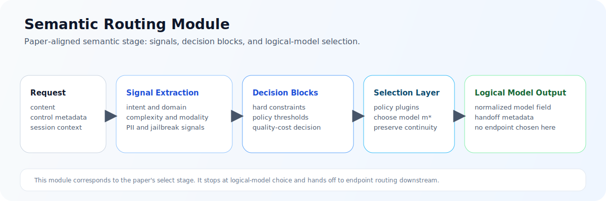

ASE Semantic Routing Module Design

Author(s): PU Yang/n000000000

Status: Intent to implement

[[_TOC_]]

Introduction
============

This document defines the design of the Semantic Routing Module in the ASE Semantic Routing and Load Balancing architecture. The Semantic Routing Module is the first decision stage in the request path and is responsible for resolving which logical model should serve a request before any backend instance is selected.

This document is not a general discussion of prompt classification. It is the governing design for the production logical-model-selection module that must convert an incoming request into an authoritative, policy-compliant, explainable model decision. Its output is a request enriched with `model=<resolved-logical-model>` plus the routing metadata required by downstream systems and operators.

Within the overall document set, this file defines the model-selection module only. System-wide architecture is defined in `architecture.md`, and instance-level dispatch is defined in `load_balancing_module.md`.

Background
==========

### Module problem

The Semantic Routing Module solves the following problem:

> Given an incoming LLM request, a set of candidate logical models, and a set of policy, capability, deployment, and business constraints, determine the most appropriate logical model for the request.

This problem is broader than intent classification. A production router must simultaneously account for request semantics, capability requirements, context limits, governance boundaries, tenant restrictions, cost and latency preferences, and multi-turn continuity. A router that ignores any of these dimensions will eventually make decisions that are either operationally unsafe or business-incorrect.

### Why this module must exist

The Semantic Routing Module exists because logical-model choice and provider-endpoint choice are different decisions.

Logical-model choice depends on request meaning and governance context. Provider-endpoint choice depends on runtime fleet state. If those concerns are collapsed into one opaque routing step, the system loses explainability and ownership boundaries. It becomes difficult to tell whether a bad outcome was caused by the wrong logical model being chosen or the right logical model being dispatched poorly.

ASE therefore isolates the Semantic Routing Module as the module that owns logical-model selection and only logical-model selection. It may constrain downstream execution by selecting a logical model and attaching route metadata, but it does not choose a machine and it does not consume per-endpoint runtime signals as part of normal logical-model resolution.

### Design objectives

The module is designed to achieve the following outcomes:

- select a logical model that is semantically appropriate and policy-compliant
- keep logical-model resolution separate from backend scheduling
- enforce governance before expensive model invocation
- produce routing outcomes that remain explainable after the fact
- support heterogeneous signals, policies, and model families without redesign
- keep decision latency bounded through selective signal computation

### Governing principles

The module follows five governing principles.

First, the Semantic Routing Module is logical-model-centric, not server-centric. Second, hard constraints and policy constraints must be applied before optimization. Third, routing should be expressed as a signal-driven decision system with explicit signal extractors, declarative decision rules, model-selection algorithms, and per-decision plugins rather than hidden heuristics embedded in code paths. Fourth, every final decision must leave a recoverable reason trail. Fifth, governance-sensitive checks must happen before the request reaches an inference backend.

ASE is aligned with the signal-driven design direction described in vLLM Semantic Router, especially its separation of `routing.signals`, `routing.decisions`, `modelRefs`, selection algorithms, and plugin execution. ASE adopts that semantic core while preserving a strict handoff to the downstream Load Balancing Module. See [R3], [R4], and [R5].

Scope
=====

### In scope

This document defines:

- request-level logical-model selection
- normalization of routing-relevant request context
- signal extraction and routing-context construction
- logical-model eligibility filtering
- policy-aware decision evaluation
- request enrichment with resolved logical-model metadata
- session continuity behavior for multi-turn routing
- explainability, audit, and routing-trace requirements
- semantic failure classification
- configuration and governance requirements specific to logical-model selection

### Out of scope

This document does not define:

- backend instance scheduling
- endpoint health checks
- queue-aware dispatch
- transport retries or redispatch mechanics
- pool-level failover
- generic API gateway concerns unrelated to logical-model selection

Those responsibilities belong to `load_balancing_module.md` or to broader ASE infrastructure outside this module.

Architecture overview
=====================

### Module summary

The Semantic Routing Module is the authoritative logical-model-selection module in ASE. It receives a normalized request plus tenant, policy, and session context; evaluates that request against the routable logical-model universe; and produces an explicit logical-model decision that the downstream Load Balancing Module must honor.

The key property of the module is that it resolves a logical model, not an endpoint. In semantic-router terms, this module owns the signal-driven intelligence core: it extracts signals from the request, evaluates decision rules, selects among configured `modelRefs` using a model-selection algorithm, and runs per-decision plugins before handoff. Its value comes from making that decision explicit, policy-safe, and observable.

### Role in the two-stage process

ASE follows a `select -> route` process.

- The Semantic Routing Module owns `signals -> decisions -> model selection -> plugins`.
- The selected artifact is a logical model or logical-model alias carried in the normalized `model` field.
- The downstream Load Balancing Module owns backend and endpoint routing for that already selected logical model.

This means the Semantic Routing Module is primarily a request-understanding and policy-matching module. In semantic-router-aligned terms, it covers the routing core rather than the full deployment envelope. Envoy or ExtProc-style ingress is a system-boundary choice, and provider `backend_refs` belong to the downstream Load Balancing Module. This document therefore aligns ASE with semantic-router's semantic core without collapsing load balancing back into this module.

### Module at a glance

The diagram below summarizes the Semantic Routing Module before the more detailed internal design diagram.



### System design diagram

The diagram below shows the module in the same shape as semantic-router's signal-driven core: normalized requests feed configured signal extractors, priority-ordered decisions match routes, `modelRefs` are resolved through a model-selection layer, and plugins execute before the explicit handoff.


### Architectural position

The Semantic Routing Module appears in the request path as follows:

`Client Request -> Semantic Routing Module -> Request Enrichment (logical model in model field) -> Load Balancing Module`

Its contract is:

- input: canonical request plus identity, policy, and session context
- output: request enriched with the resolved logical model in `model` and routing metadata

That contract is normative. The Semantic Routing Module may decide what logical model the request should use, but it may not decide where that logical model runs.

### Architectural invariants

The following invariants are mandatory for this module.

1. The Semantic Routing Module must resolve a logical model before any instance-level dispatch begins.
2. Logical-model selection must be based on explicit routing context, not implicit downstream fallback behavior.
3. Hard capability constraints and policy constraints must be evaluated before optimization among candidates.
4. The module must emit enough decision metadata to explain both acceptance and rejection outcomes.
5. Session continuity may influence optimization, but it may not override hard capability or policy constraints.

### Internal architecture

The semantic-router-aligned core is organized as four routing layers, preceded by request normalization and followed by an explicit handoff contract.

| Component | Primary responsibility | Architectural output |
| --- | --- | --- |
| Request Normalizer | convert inbound API traffic into a canonical routing object | normalized request and routing context skeleton |
| Signal Extraction Layer | execute configured detectors from `routing.signals` and assemble typed routing state | structured signal map for decision evaluation |
| Decision Engine | evaluate priority-ordered `routing.decisions` rules over typed signals | matched decision plus candidate `modelRefs` |
| Model Selection Layer | select the final logical model from the matched decision's `modelRefs` using the configured algorithm and model-card constraints | authoritative logical-model decision plus selection rationale |
| Plugin Chain | execute decision-coupled plugins after model selection | request annotations, safety tags, cache behavior, trace signals, optional augmentation hooks |
| Handoff Contract | emit the normalized `model` assignment and routing metadata | enriched request or explicit semantic rejection |

Request Normalizer
==================

The Request Normalizer converts inbound API traffic into a canonical routing object that every later stage can consume consistently. This stage is where ASE decides how much of the northbound API surface is visible to routing and how that information is represented internally.

The module consumes more than prompt text. It requires a structured routing context assembled from four input classes.

| Input class | Purpose | Representative examples |
| --- | --- | --- |
| Request Content | describe what the request is asking for | messages, prompt text, system instructions, multimodal metadata, expected output shape |
| Control Metadata | express caller intent or routing hints | `model=auto`, explicit preference hints, debug flags, route override requests |
| Identity and Governance Context | constrain what the caller is allowed to use | tenant identity, user class, authorization scope, privacy classification, compliance tags |
| Session Context | preserve continuity across turns when appropriate | session ID, previous logical model, escalation history, continuity preference |

Without this context, logical-model selection becomes guesswork. With it, routing becomes a controlled decision problem.

ASE should remain broadly compatible with OpenAI-style request shapes while exposing a narrow set of routing-aware controls.

| Field | Purpose | Constraint |
| --- | --- | --- |
| `model=auto` | request semantic logical-model selection | default path for routed traffic |
| `model=<explicit-model>` | request a specific logical model directly | still subject to policy and capability validation |
| `routing_hint` | provide a coarse semantic hint such as `code`, `reasoning`, or `extract` | advisory only; must not bypass policy |
| `route_override` | request a specific route or logical-model alias | restricted to authorized callers; must not bypass hard constraints |
| `preference` | express latency, cost, or quality bias | optimization input only |
| `input_tokens_estimate` | provide a caller-side prompt-size estimate | advisory signal that may improve token-aware routing |
| `session_id` | preserve multi-turn continuity context | optional unless continuity policy requires it |
| `debug` or `explain` | request routing diagnostics | restricted and redacted for trusted callers only |

The precedence order should be explicit. Hard capability and policy constraints are evaluated first. Authorized explicit model requests or route overrides are evaluated next. Session continuity and optimization preferences are applied only after the request is proven eligible.

ASE should route at request granularity, not by pinning an entire session to a single logical-model decision. Session context exists to improve continuity, not to suppress re-evaluation.

An illustrative northbound request shape is shown below.

```json
{
  "model": "auto",
  "messages": [
    {
      "role": "user",
      "content": "Write a C epoll example"
    }
  ],
  "routing_hint": "code",
  "preference": {
    "cost": "low",
    "latency": "medium",
    "quality": "high"
  },
  "input_tokens_estimate": 120,
  "session_id": "conv-123",
  "debug": true
}
```

Signal Extraction Layer
=======================

Signals are the intermediate representation between raw request context and final logical-model selection. In semantic-router, they are configured detectors under `routing.signals`, not ad hoc features embedded in code. They should remain explicit, inspectable, and typed closely enough that decision logic can consume them predictably.

The signal taxonomy should align with the semantic-router configuration surface.

| Signal family | Routing use |
| --- | --- |
| keyword | exact or approximate lexical triggers |
| embedding | semantic nearest-neighbor or similarity-driven routing |
| domain | coarse topic or workload classification |
| fact_check | factual-verification requirement |
| user_feedback | correction, clarification, or dissatisfaction follow-ups |
| preference | style or optimization bias such as terse responses |
| language | language-specific routing |
| context | long-context or context-window requirements |
| complexity | reasoning-depth escalation |
| modality | text, image, or multimodal path selection |
| authz or role binding | role-scoped or subject-scoped policy gating |
| jailbreak | prompt-injection or abuse detection |
| pii | sensitive-data detection and privacy gating |

ASE should align with this taxonomy even if not every deployment enables every family. The module should still compute only the signals needed for the current decision path. Cheap signals should remain cheap, and expensive signals should be invoked only when they materially affect the outcome.

Decision Engine
===============

The routing decision should be understood as a signal-driven staged process aligned with semantic-router, not a monolithic score.

#### Stage 1: normalize and build routing context

The module first produces a canonical routing object from the raw request and attaches tenant, policy, and session metadata. This establishes the input contract for all later stages.

#### Stage 2: execute signal extractors

The module computes the configured signal set needed to reason about semantics, capability requirements, and governance. This stage transforms request content into structured routing evidence under `routing.signals`.

#### Stage 3: match decisions

The decision engine evaluates priority-ordered `routing.decisions` rules over the typed signal set. Each decision combines AND, OR, and NOT conditions and either matches or does not match. A matched decision defines the route shape that may be used for this request.

#### Stage 4: build candidate model references

From the matched decision, the module collects the candidate `modelRefs`, reasoning options, optional LoRA bindings, and hard capability constraints that define the legal selection space. This is where model-card capabilities, context limits, modality requirements, and policy constraints eliminate impossible candidates.

This is also where the module performs most of its governance-sensitive filtering. At minimum, it must support:

- authorization-aware logical-model restrictions
- deployment-boundary restrictions
- PII-sensitive routing
- jailbreak-sensitive routing
- tenant-specific provider restrictions
- audit tagging for regulated traffic

These controls are part of the module's core purpose because they determine whether a request may be sent to a logical model at all.

Model Selection Layer
=====================

The semantic-router reference design separates provider-facing model definitions from route-facing model cards. `providers.models` describes executable provider models and backend-facing identifiers, while `routing.modelCards` captures the route-visible capability envelope used during semantic decision making. In ASE, that split maps cleanly onto the module boundary: this document owns the model-card view, while provider and backend resolution belong to `load_balancing_module.md`.

Each routable logical-model entry should expose, at minimum:

- logical model ID or model-card name
- human-readable description and routing tags
- supported capabilities and modalities
- context-window size
- quality, latency, and cost attributes or an equivalent quality score
- reasoning and optional LoRA variants that may appear in `modelRefs`
- governance, authz, and tenant constraints

The registry should be declarative and versioned. Adding a new logical model should usually mean changing model cards and routing decisions, not changing routing code.

Reasoning budget is a routing concern because reasoning-oriented logical models may consume substantially more tokens, wall-clock time, and infrastructure resources than lightweight logical models. The module should therefore estimate, when useful:

- input-token volume
- requested or inferred output length
- expected reasoning depth
- likely tool-use or structured-output overhead
- caller latency preference and cost preference

These signals exist to improve optimization, not to bypass hard constraints. More compute is not automatically better.

In semantic-router terms, this is the input to the model-selection layer. A matched decision may use a simple static selector or a richer algorithm such as latency-aware, confidence-based, ratings-based, RouterDC, AutoMix, ReMoM, Elo, or hybrid selection. Regardless of algorithm choice, optimization must remain bounded by the matched decision and by hard policy constraints. The module may optimize over model quality and inter-model cost, but it should not optimize over concrete provider endpoints.

Session continuity is an optimization concern with architectural consequences. The module should preserve the previous logical model when doing so remains semantically valid and policy-safe. It may escalate to a stronger logical model when a later turn exceeds the capability or context limits of the current logical model. Downgrades should be conservative and should require explicit policy support.

Useful session metadata includes the previous logical model, the last escalation reason, continuity preference, and any conversation classification history that materially affects routing.

Plugin Chain and Handoff Contract
=================================

After the logical-model decision is made, the module executes per-decision plugins such as safety tagging, audit annotation, semantic cache hooks, rewrite steps, tracing, or retrieval augmentation. It then emits the normalized `model` assignment and routing metadata required for downstream execution.

The output of the Semantic Routing Module is the formal handoff artifact to the downstream Load Balancing Module and to operators who need to understand what decision was made.

| Field | Requirement level | Purpose |
| --- | --- | --- |
| `model` | required | authoritative logical-model identifier consumed by the Load Balancing Module |
| `request_id` | required | stable request identity across routing, dispatch, and observability |
| `route_decision_status` | required | distinguish successful routing from semantic rejection paths |
| `matched_decision` | optional | identify which semantic decision rule produced the candidate route |
| `route_reason` | optional | preserve human- and operator-readable routing rationale |
| `policy_tags` | optional | carry governance annotations that may matter to downstream handling and audit |
| `debug_trace_id` | optional | correlate routing decisions with internal traces and debug artifacts |
| `continuity_metadata` | optional | preserve session-related context such as continuity or escalation state |
| ranking or confidence detail | optional | support diagnostics where ranked-candidate output is useful |

At this module boundary, the normalized `model` field denotes a logical model, not a provider endpoint and not a concrete provider-specific SKU. Any mapping from that logical model to provider endpoints belongs to the Load Balancing Module.

An illustrative output shape is shown below.

```json
{
  "model": "code-high-capacity",
  "matched_decision": "computer_science_reasoning",
  "route_reason": "domain=code;complexity=high;policy=allowed",
  "policy_tags": ["tenant:default", "privacy:standard"],
  "messages": [
    {
      "role": "user",
      "content": "Write a C epoll example"
    }
  ]
}
```

Explainability is not optional for this module. Since the Semantic Routing Module is the point where logical-model choice is made, it must leave enough evidence for debugging, audit, and policy review.

For each request, the module should be able to recover at least:

- request ID
- session ID when present
- selected logical model
- candidate set after eligibility filtering
- exclusion reasons for removed logical models
- final route reason

Core metrics should include routing decision count, selected-logical-model distribution, no-eligible-model count, policy-denial count, signal extraction latency, total routing latency, session continuity preservation count, and escalation count.

Interaction between the Semantic Routing Module and the Load Balancing Module
============================================================================

The interaction with the downstream Load Balancing Module is intentionally narrow and explicit.

- The Semantic Routing Module must emit the resolved logical model in `model`.
- The Load Balancing Module must consume that logical model directly rather than reconstructing it from prompt content.
- Policy tags and route metadata may constrain dispatch, but they must not reopen logical-model selection under normal operation.

Failure semantics must also preserve the boundary.

| Failure class | Meaning | Typical cause |
| --- | --- | --- |
| No Matching Decision | no configured semantic route matched the request signal set | missing fallback route, insufficient signal confidence, unsupported workload shape |
| No Eligible Model | no logical model satisfies hard capability or deployment constraints | insufficient context window, missing modality support, unavailable deployment zone |
| Policy Denial | one or more logical models are technically capable, but all are forbidden by policy | tenant restriction, private-boundary rule, provider allowlist |
| Invalid Routing Request | the request is malformed or missing required routing context | malformed payload, missing required metadata, unsupported request shape |
| Decision Engine Failure | the module itself failed unexpectedly during routing | internal evaluation failure, policy engine error, signal extraction failure |
| Deferred Infrastructure Failure | the Semantic Routing Module succeeded, but downstream execution later failed | endpoint unavailable, dispatch failure, retry exhaustion in the Load Balancing Module |

When debug mode is authorized, ASE may return controlled routing detail such as the chosen logical model, high-level reason codes, and a trace identifier. It must not expose raw internal policy rules or sensitive model metadata to unauthorized callers.

Configuration
=============

The module should be configured declaratively rather than through code changes. This is necessary both for operational agility and for policy reviewability.

The configuration surface should at least cover:

- provider-model catalog and defaults
- routing model cards
- routing signal definitions
- routing decisions with `priority`, `rules`, `modelRefs`, `algorithm`, and `plugins`
- northbound routing extension policy
- session continuity policy
- debug verbosity and trace controls

Notation
--------

ASE uses declarative YAML or JSON configuration for semantic routing. The XML-specific notation in the generic template does not apply to this module.

semantic_routing
----------------

| Element | Possible values | Description |
| --- | --- | --- |
| `semantic_routing:` | object | Top-level Semantic Routing Module configuration |
| `  providers:` | object | Provider-model catalog and default logical-model bindings |
| `  routing:` | object | Semantic-router-aligned routing policy subtree |
| `    modelCards:` | list | Route-visible logical-model capability definitions |
| `    signals:` | object | Typed signal detector configuration |
| `    decisions:` | list | Priority-ordered route rules and candidate `modelRefs` |
| `  session_policy:` | object | Continuity, escalation, and downgrade rules |
| `  debug_policy:` | object | Explainability visibility and trace redaction controls |

routing.decisions
-----------------

| Element | Possible values | Description |
| --- | --- | --- |
| `name` | string | Stable identifier for the decision rule |
| `priority` | integer | Evaluation order where larger or earlier values indicate stronger precedence according to implementation policy |
| `rules` | object | Typed AND, OR, and NOT conditions over extracted signals |
| `modelRefs` | list | Candidate logical models or variants allowed for selection |
| `algorithm` | object | Model-selection strategy applied inside the matched route |
| `plugins` | list | Post-selection plugins such as audit, safety, tracing, or prompt augmentation |

An illustrative logical configuration is shown below.

```yaml
semantic_routing:
  providers:
    defaults:
      default_model: general-small
    models:
      - name: general-small
        provider_model_id: general-small
      - name: code-large
        provider_model_id: code-large
  routing:
    modelCards:
      - name: general-small
        description: Fast default text model.
        capabilities: [chat, tools]
        context_window_size: 32000
        quality_score: 0.82
        tags: [default, fast]
      - name: code-large
        description: Higher-quality reasoning model for software design.
        capabilities: [chat, reasoning, long-context]
        context_window_size: 128000
        quality_score: 0.95
        tags: [premium, analysis]
    signals:
      domains:
        - name: "computer science"
          description: Computer science and engineering prompts.
      complexity:
        - name: needs_reasoning
          threshold: 0.75
          description: Multi-step synthesis or design-heavy prompts.
      context:
        - name: long_context
          min_tokens: 32K
          max_tokens: 256K
    decisions:
      - name: computer_science_reasoning
        priority: 170
        rules:
          operator: AND
          conditions:
            - type: domain
              name: "computer science"
            - type: complexity
              name: needs_reasoning
        modelRefs:
          - model: general-small
            use_reasoning: true
            weight: 0.2
          - model: code-large
            use_reasoning: true
            reasoning_effort: high
            weight: 0.8
        algorithm:
          type: latency_aware
        plugins:
          - type: system_prompt
            configuration:
              enabled: true
              mode: insert
              system_prompt: You are a senior software architect.
  session_policy:
    preserve_previous_logical_model: true
    allow_escalation: true
    allow_downgrade: conservative
```

The exact DSL is implementation-specific. The architectural requirement is that routing policy remain declarative, reviewable, and versioned. In ASE, provider `backend_refs`, endpoint weights, and execution failover are intentionally omitted from this module configuration because they belong to the Load Balancing Module, not to semantic routing.

Testing
=======

The automated testing strategy for this module should verify both correctness of logical-model selection and preservation of the module boundary.

The testing plan should include:

- request-normalization tests for OpenAI-compatible request shapes, explicit overrides, and malformed input handling
- signal-extraction tests that validate typed outputs, selective execution of expensive signals, and redaction behavior for sensitive inputs
- decision-engine tests that cover rule precedence, no-match behavior, hard-constraint filtering, and policy denial
- model-selection tests for static and algorithmic selectors, continuity preservation, escalation, and conservative downgrade behavior
- contract tests that verify the exact handoff fields emitted to the Load Balancing Module
- observability tests that prove routing traces preserve matched decision, selected logical model, exclusion reasons, and failure code

Existing unit and integration harnesses are sufficient if they can validate the staged pipeline end-to-end. If not, a dedicated semantic-routing harness should be added so the module can be tested independently of backend dispatch.

Task breakdown
==============

The work should be broken down into mergeable tasks that preserve a working routing path after each step.

| Task | Time Estimate | Tracker |
| --- | --- | --- |
| Implement request normalization and routing-context assembly | 4 days | |
| Implement typed signal extraction and decision-rule evaluation | 1 week | |
| Implement model-card registry and model-selection algorithms | 1 week | |
| Implement plugin execution, output contract, and audit trace | 4 days | |
| Add semantic-routing test coverage and policy regression validation | 3 days | |

## Implement request normalization and routing-context assembly

Add the canonical request shape, override precedence handling, and session-context ingestion so later routing stages operate on one stable internal contract.

## Implement typed signal extraction and decision-rule evaluation

Implement configured signal detectors and priority-ordered decision matching with explicit hard-constraint and policy filtering.

## Implement model-card registry and model-selection algorithms

Implement declarative logical-model metadata plus the bounded selectors used to choose among candidate `modelRefs`.

## Implement plugin execution, output contract, and audit trace

Add post-selection plugin execution and emit the normalized handoff fields, route reasons, and routing trace required by downstream systems and operators.

## Add semantic-routing test coverage and policy regression validation

Add automated tests that protect routing behavior, policy enforcement, and explainability output from regressions.

References
==========

R1. `architecture.md`, ASE Semantic Routing and Load Balancing Architecture

R2. `load_balancing_module.md`, ASE Load Balancing Module Design

R3. vLLM Semantic Router: Signal Driven Decision Routing for Mixture-of-Modality Models, https://arxiv.org/abs/2603.04444

R4. vLLM Semantic Router documentation, https://vllm-semantic-router.com/docs/intro/

R5. `vllm-project/semantic-router` reference configuration, https://raw.githubusercontent.com/vllm-project/semantic-router/main/config/config.yaml
